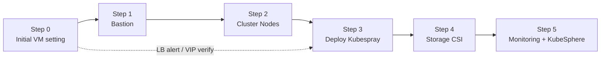

# DKS Cluster Setup

Xi'an DKS 클러스터 구축 절차를 단계별로 정리한 로컬 허브입니다.

> [!warning] SCS 환경
> SCS 환경은 HQ와 다를 수 있으므로 Node Pre-setting 단계(Step 1, 2)에서 예상치 못한 오류가 발생할 수 있습니다.

> [!info] 문서 배치 원칙
> - `00`~`05`는 실제 구축 순서에 따른 메인 절차입니다.
> - `00.1`은 환경 협의, 방화벽, 스토리지 요청처럼 절차를 지원하는 보조 문서입니다.
> - `Host 클러스터/`와 `Member 클러스터/`는 Step 5 아래의 하위 절차를 모아둔 폴더 허브입니다.

## 메인 절차

- \[\[00. DKS Cluster Setup Guide|00. DKS Cluster Setup Guide\]\] — 마스터 가이드 (전체 절차 인덱스 + Step 0 상세)
- \[\[01. Bastion Node Pre-setting|01. Bastion Node Pre-setting\]\] — Bastion VM 설정 + Nameserver/Hosts/YUM/Python/Kubespray prep
- \[\[02. K8S Cluster Nodes Pre-setting|02. K8S Cluster Nodes Pre-setting\]\] — Ansible로 모든 노드 일괄 설정 (SSH key, 패키지, SWAP, CA, sysctl)
- \[\[03. Deploy DKS Cluster|03. Deploy DKS Cluster\]\] — Kubespray로 K8S 배포 + post-cluster 설정 + 검증
- \[\[04. Install Storage Components|04. Install Storage Components\]\] — External Snapshotter, Trident CSI driver
- \[\[05. Monitoring & KubeSphere|05. Monitoring & KubeSphere\]\] — Prometheus, Grafana, KubeSphere
  - \[\[30. 구축 및 전환/Member 클러스터/개요|05.2 Member Cluster 설치\]\] — Prometheus 선행 설치, Member KubeSphere, Host Join, Daily Mon script

## 보조 문서

- \[\[00.1 SCS 환경 협의 및 요청 사항|00.1 SCS 환경 협의 및 요청 사항\]\] — SCS 환경의 firewall / VM / NetApp / vServer 협의 현황
- \[\[30. 구축 및 전환/Host 클러스터/개요|05.1 Host Cluster\]\] — Host cluster 설치 하위 절차 허브

## 단계별 진행 흐름

## Version History

| 버전 | 날짜 | 변경 내용 |
|------|------|-----------|
| 0.1 | 2026-07-03 | 초기 생성, 1~5단계 문서 분리 |
| 0.2 | 2026-07-03 | 00 가이드에 Step 0 상세 절차 추가, 01에 Bastion VM 디스크/사용자 절차 통합, 01~03 본문 채움 |
| 0.3 | 2026-07-07 | 보조 문서를 00.1로 정리하고 05.1 Host Cluster를 폴더 허브 구조로 재배치 |
