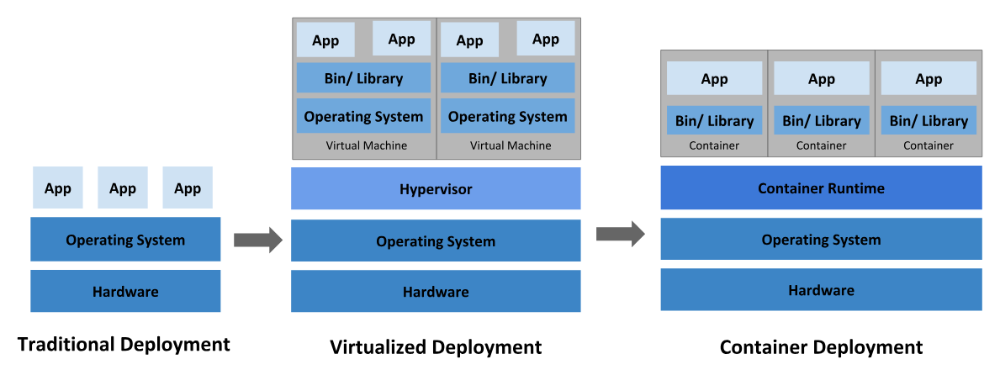
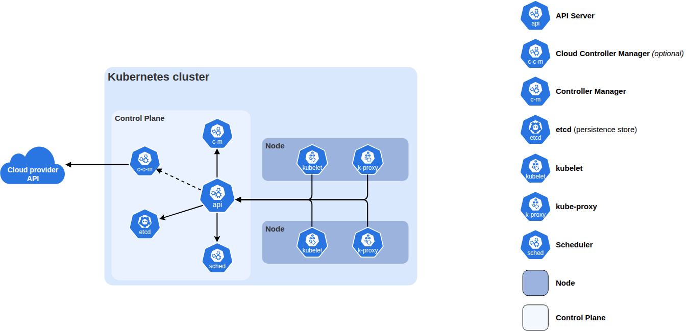
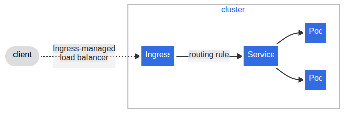
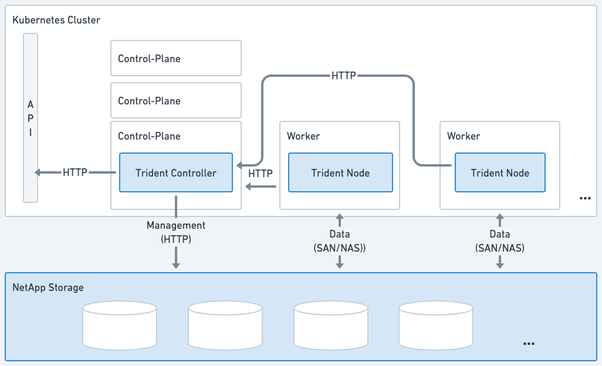
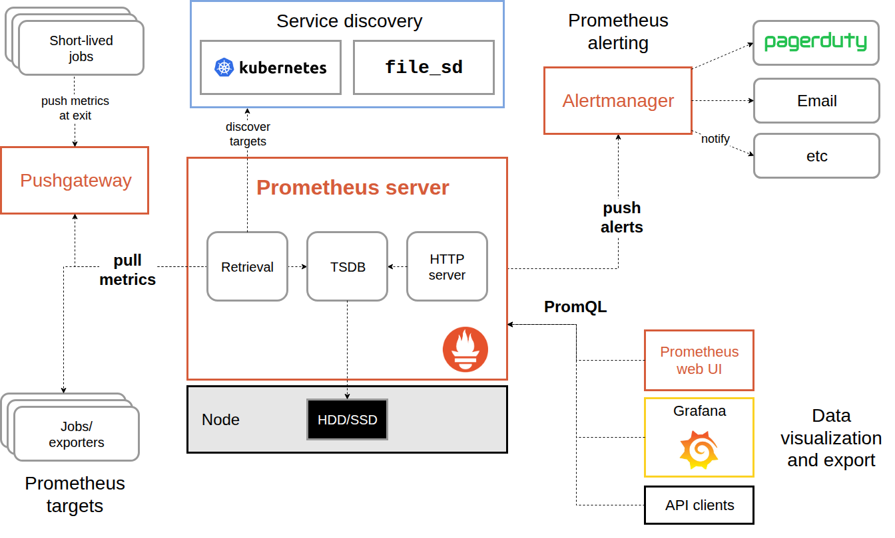
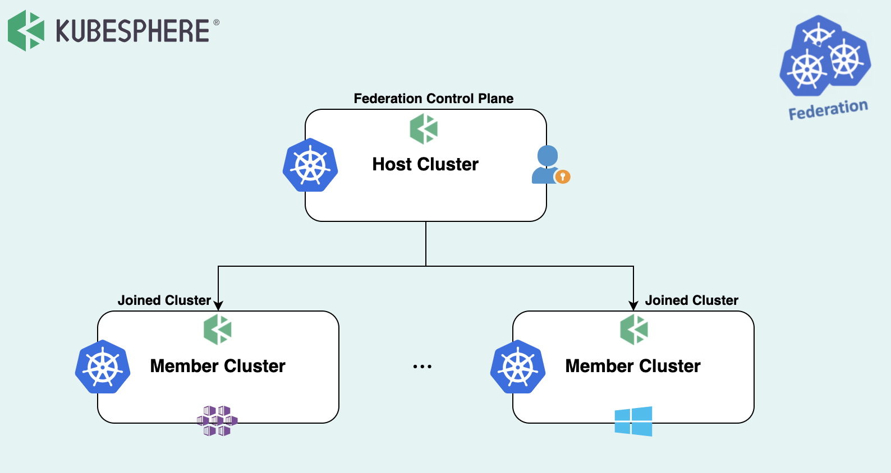

# Kubernetes & DKS Architecture
## Xi'an 현지 기술 전수 교육 교재

**교육일:** 2026-08-25  
**대상:** Kubernetes 사전 지식이 없는 Xi'an 현지 운영 담당자  
**목적:** 이후 KubeSphere 운영 교육과 Member Cluster 구축 과정을 이해하기 위한 공통 기술 기반 확보

---

# Part 1. Kubernetes

## 1. 애플리케이션 운영 방식의 변화

### 1.1 서버에서의 운영

가장 단순한 애플리케이션 운영은 한 대의 서버 또는 VM에 애플리케이션을 설치하고 실행하는 방식이다.

서비스가 작고 서버 수가 적을 때는 이 방식만으로도 충분할 수 있다. 그러나 애플리케이션과 서버가 늘어나면 운영해야 할 대상도 함께 늘어난다.

- 어떤 서버에서 어떤 애플리케이션이 실행되는지 관리해야 한다.
- 서버별로 같은 설치 절차와 설정을 반복해야 한다.
- 애플리케이션이 중단되면 사람이 다시 실행해야 할 수 있다.
- 트래픽이 증가하면 서버 또는 애플리케이션 실행 수를 늘려야 한다.
- 서버가 고장 나면 다른 서버에서 서비스를 다시 구성해야 한다.
- 여러 서버의 Network, Storage, 접근 경로를 함께 관리해야 한다.

즉, 서버를 한 대씩 관리하는 문제보다 **여러 서버에서 많은 애플리케이션을 계속 원하는 상태로 유지하는 문제**가 더 커진다.

### 1.2 VM이 제공하는 것

VM(Virtual Machine)은 물리 서버 위에서 독립적인 OS 환경을 제공한다. VM을 사용하면 물리 서버 한 대에 여러 독립 실행환경을 만들 수 있고, 애플리케이션과 서버 자원을 논리적으로 분리할 수 있다.

VM의 주요 장점은 다음과 같다.

- OS 단위 격리
- 표준 Template 기반 생성
- 비교적 빠른 서버 증설과 교체
- 물리 서버와 애플리케이션 운영 경계 분리

그러나 VM을 사용하더라도 애플리케이션 배포와 복구, 여러 서버에 대한 일관된 운영은 여전히 별도의 문제다.

### 1.3 Container가 제공하는 것

Container는 애플리케이션과 실행에 필요한 파일을 하나의 Image로 묶고, 동일한 Image를 여러 환경에서 일관된 방식으로 실행할 수 있게 한다.

| 용어 | 의미 |
|---|---|
| Container Image | 애플리케이션과 실행에 필요한 파일을 묶은 실행 원본 |
| Container | Image를 기반으로 실제 실행된 프로세스 환경 |
| Container Runtime | Container를 실제로 생성하고 실행하는 Software |
| Registry | Container Image를 저장하고 배포하는 저장소 |

예를 들어 Web Application의 Image가 하나 만들어지면 같은 Image를 개발, 테스트, 운영 환경에서 사용할 수 있다.

```text
Application Source
→ Container Image
→ Registry에 저장
→ 필요한 Server에서 Image Pull
→ Container 실행
```

Container는 애플리케이션 실행환경을 표준화한다. 하지만 Container가 많아지면 다음 문제가 생긴다.

- 어떤 서버에서 Container를 실행할 것인가?
- Container가 중단되면 누가 다시 실행할 것인가?
- 동일한 Container를 3개, 10개로 늘릴 때 누가 관리할 것인가?
- 서버 한 대가 중단되면 Container를 다른 서버로 어떻게 이동할 것인가?
- Container끼리 어떻게 통신할 것인가?
- 사용자는 계속 바뀌는 Container 주소에 어떻게 접근할 것인가?

이 문제를 다루는 것이 Kubernetes의 핵심 역할이다.

### 1.4 Kubernetes가 필요한 이유

Kubernetes는 여러 Server/VM을 하나의 Cluster로 묶고 Container 기반 애플리케이션을 **배포, 배치, 연결, 복구, 확장**할 수 있는 공통 제어 구조를 제공한다.

```text
여러 Server / VM
        ↓
Kubernetes Cluster
        ↓
Container Application 배포·상태 유지·Network·Storage 연결
```

Kubernetes는 Container 자체를 대신하는 기술이 아니다. **Container는 애플리케이션 실행 단위이고, Kubernetes는 여러 Server에서 많은 Container를 원하는 상태로 유지하는 플랫폼이다.**



*참고: Kubernetes 공식 문서의 Traditional / Virtualized / Container Deployment 비교 — [출처](https://kubernetes.io/docs/concepts/overview/)*

---

# Part 2. Kubernetes의 핵심 동작 원리

## 2. Cluster, Node, Pod

### 2.1 Cluster

Kubernetes Cluster는 여러 Node와 Kubernetes 구성요소를 하나의 운영 단위로 묶은 것이다.

```text
Kubernetes Cluster
├─ Control Plane
├─ Worker Node 1
├─ Worker Node 2
└─ Worker Node ...
```

Cluster를 구성하는 각각의 서버 또는 VM을 **Node**라고 한다.



*참고: Kubernetes 공식 Cluster Architecture — [출처](https://kubernetes.io/docs/concepts/architecture/)*

### 2.2 Control Plane과 Worker Node

Kubernetes Cluster의 Node는 크게 두 역할로 이해할 수 있다.

| 영역 | 역할 |
|---|---|
| Control Plane | Cluster의 요청을 받고 상태를 판단·조정 |
| Worker Node | 실제 애플리케이션 Pod 실행 |

Control Plane은 전체 Cluster를 제어하는 영역이고, Worker Node는 실제 Workload가 실행되는 영역이다.

### 2.3 Pod

Pod는 Kubernetes에서 Container가 실행되는 기본 단위다.

```text
Container Image
→ Container
→ Pod 내부에서 실행
→ Pod가 Worker Node에 배치됨
```

Pod는 고정된 서버처럼 생각하면 안 된다. 장애, 배포, 확장 과정에서 Pod는 삭제되고 새로 생성될 수 있다.

예를 들어 Worker 1에서 실행되던 Web Pod가 Worker 1 장애로 사라지더라도, 조건이 갖춰진 경우 Kubernetes는 다른 Worker에 새로운 Pod를 생성할 수 있다.

```text
Before
Worker 1 → Web Pod
Worker 2 → -

Worker 1 장애

After
Worker 1 → Down
Worker 2 → 새로운 Web Pod
```

따라서 Kubernetes에서는 개별 Pod 자체보다 **원하는 상태를 정의하고 유지하는 구조**가 중요하다.

## 3. Control Plane

Control Plane에는 Kubernetes Cluster를 제어하기 위한 주요 구성요소가 있다.

### 3.1 API Server

API Server는 Kubernetes 관리 요청의 중심 진입점이다. `kubectl`, KubeSphere 같은 관리 도구도 결국 Kubernetes API와 연결된다.

```text
운영자 / 관리도구
       ↓
 Kubernetes API
       ↓
   API Server
```

새로운 Deployment 생성, Pod 조회, Service 변경과 같은 대부분의 관리 요청은 API Server를 통해 처리된다.

### 3.2 Scheduler

Scheduler는 새로 실행해야 하는 Pod를 어느 Node에 배치할지 결정한다.

예를 들어 Worker Node가 3대 있고 새로운 Pod가 필요하다면 Scheduler는 Node의 상태와 배치 조건을 고려해 적절한 Node를 선택한다.

```text
새 Pod 필요
   ↓
Scheduler
   ↓
적절한 Worker Node 선택
```

### 3.3 Controller Manager

Controller Manager는 사용자가 선언한 **원하는 상태(Desired State)** 와 현재 **실제 상태(Actual State)** 를 비교하며 필요한 조정을 수행한다.

예를 들어 Web Pod 3개를 유지하도록 선언했는데 실제로 2개만 실행 중이라면, 부족한 1개를 다시 생성하는 방향으로 상태를 조정한다.

```text
Desired State = Web Pod 3개
Actual State  = Web Pod 2개

차이 = 1개 부족
        ↓
새 Pod 생성이 필요함
```

이러한 구조 때문에 Kubernetes는 단순한 실행 도구가 아니라 **상태를 지속적으로 조정하는 플랫폼**이라고 할 수 있다.

### 3.4 ETCD

ETCD는 Kubernetes Cluster 상태를 저장하는 분산 Key-Value Store다.

Kubernetes가 알고 있어야 하는 다음과 같은 정보가 ETCD에 저장된다.

- 어떤 Node가 Cluster에 있는가
- 어떤 Deployment와 Service가 존재하는가
- 사용자가 원하는 상태는 무엇인가
- Cluster 구성과 리소스 정보

ETCD는 일반 애플리케이션 데이터를 저장하는 DB가 아니다. **Kubernetes Cluster 자체의 상태를 저장하는 핵심 데이터 계층**이다.

### 3.5 Pod 하나가 만들어질 때의 전체 흐름

사용자가 Web Application Pod 3개를 실행하도록 요청했다고 가정한다.

```text
1. 사용자 또는 관리도구가 요청
          ↓
2. API Server가 요청 수신
          ↓
3. 원하는 상태가 Cluster에 반영됨
          ↓
4. Scheduler가 Pod를 실행할 Node 선택
          ↓
5. 선택된 Node의 kubelet이 Pod 실행
          ↓
6. Controller가 원하는 상태와 실제 상태를 계속 비교
```

## 4. Worker Node

Worker Node는 실제 애플리케이션 Pod를 실행한다.

### 4.1 kubelet

kubelet은 각 Worker Node에서 동작하며 해당 Node에서 실행되어야 할 Pod의 상태를 관리한다. Control Plane에서 전달된 상태를 바탕으로 필요한 Pod가 실행되는지 확인한다.

### 4.2 Container Runtime

Container Runtime은 Container를 실제로 실행한다. Xi'an DKS에서는 Container Runtime으로 **containerd**를 사용한다.

```text
Kubernetes
→ kubelet
→ containerd
→ Container 실행
```

### 4.3 Node와 Pod의 관계

Worker Node에는 여러 Pod가 동시에 실행될 수 있다.

```text
Worker Node
├─ Pod A
├─ Pod B
└─ Pod C
```

하지만 무한히 실행할 수 있는 것은 아니다. 실제 실행 가능한 Workload 수는 Node의 CPU, Memory, Disk, 예약 자원, Pod 요구량, 운영 정책 등에 영향을 받는다.

따라서 **Node 개수만으로 Cluster의 실제 처리 용량을 판단할 수 없다.**

---

# Part 3. Kubernetes 워크로드와 서비스 제공

## 5. Pod를 직접 관리하지 않는 이유

Pod는 삭제되거나 재생성될 수 있는 실행 단위다. 운영에서는 개별 Pod를 직접 하나씩 만들기보다 Deployment 같은 상위 객체를 이용해 원하는 상태를 정의한다.

### 5.1 Deployment

Deployment는 애플리케이션을 어떤 Image로 몇 개의 Pod로 실행할 것인지 관리한다.

예를 들어 다음과 같은 요구사항이 있다고 가정한다.

```text
Application = web-app
Image       = web-app:v1
Replica     = 3
```

Deployment를 생성하면 Kubernetes는 Web Pod 3개가 유지되도록 관리한다.

```text
Deployment
├─ Web Pod 1
├─ Web Pod 2
└─ Web Pod 3
```

Pod 하나가 중단되면 Deployment가 원하는 상태를 유지할 수 있도록 Kubernetes가 새로운 Pod를 생성한다.

### 5.2 Replica의 의미

Replica는 동일한 Workload를 여러 개 실행하는 개념이다.

Replica를 여러 개 두는 이유는 다음과 같다.

- 여러 요청을 여러 Pod에 분산
- 특정 Pod 장애 시 나머지 Pod로 서비스 지속
- 배포와 확장에 유연하게 대응

다만 Replica가 여러 개라는 것만으로 완전한 고가용성이 보장되는 것은 아니다. 여러 Replica가 동일 Node에 배치되거나 Storage·Network 등 공통 의존성에 장애가 발생하면 서비스에 영향이 생길 수 있다.

## 6. Label과 Selector

Kubernetes에서는 Pod가 계속 생성되고 삭제될 수 있기 때문에 고정 IP나 고정 이름만으로 애플리케이션을 연결하기 어렵다. 이를 위해 Label과 Selector를 사용한다.

```text
Pod 1 → label: app=web
Pod 2 → label: app=web
Pod 3 → label: app=web

Service → selector: app=web
```

Service는 특정 IP를 가진 Pod 하나만 보는 것이 아니라 조건에 맞는 Pod 집합을 선택해 트래픽을 전달할 수 있다.

## 7. Service가 필요한 이유

Pod는 재생성되면서 IP가 바뀔 수 있다. 사용자가 Pod IP를 직접 기억해 접근한다면 Pod가 새로 생성될 때마다 접속 주소가 바뀌는 문제가 발생한다.

Service는 Pod 앞에 안정적인 접근점을 제공한다.

```text
              ┌─ Pod 1
Client → Service ─ Pod 2
              └─ Pod 3
```

Service는 Selector를 이용해 대상 Pod를 찾고 요청을 전달한다.

### 7.1 Pod와 Service의 차이

| 구분 | Pod | Service |
|---|---|---|
| 목적 | 실제 Container 실행 | Pod 집합에 안정적인 접근점 제공 |
| 수명 | 삭제·재생성될 수 있음 | 서비스 접근점으로 유지 |
| IP | 재생성 시 변경될 수 있음 | 내부 접근점 역할 |

### 7.2 Pod Running과 Service 구분

Pod가 `Running` 상태라고 해서 사용자가 정상적으로 접속할 수 있다는 의미는 아니다.

```text
사용자
→ Load Balancer
→ Ingress
→ Service
→ Pod
→ Application
```

따라서 Pod Running은 전체 서비스 정상 여부 중 한 단계의 증거일 뿐이다.

## 8. Namespace

Namespace는 하나의 Kubernetes Cluster 안에서 리소스를 논리적으로 구분하기 위한 경계다.

예를 들어 하나의 Cluster에 여러 Team 또는 Application이 존재할 때 다음처럼 분리할 수 있다.

```text
Kubernetes Cluster
├─ Namespace A
│  ├─ Deployment
│  ├─ Service
│  └─ PVC
└─ Namespace B
   ├─ Deployment
   ├─ Service
   └─ PVC
```

Xi'an DKS에서 **KubeSphere Project는 Kubernetes Namespace와 연결되는 운영 단위**다.

## 9. ConfigMap과 Secret

애플리케이션은 Image 자체 외에도 환경별 설정값이나 인증 정보가 필요할 수 있다. Kubernetes는 이러한 설정을 Workload와 분리해 관리할 수 있는 객체를 제공한다.

| 객체 | 용도 |
|---|---|
| ConfigMap | 일반 설정값이나 Configuration Data 관리 |
| Secret | Password, Token, Certificate 등 민감한 Data 관리 |

예를 들어 Application Image를 변경하지 않고 환경별 설정을 ConfigMap이나 Secret으로 전달할 수 있다.

```text
Application Image
       +
ConfigMap / Secret
       ↓
      Pod
```

---

# Part 4. 외부 사용자가 서비스에 접근하는 과정

## 10. Ingress가 필요한 이유

Service는 Kubernetes 내부에서 Pod에 안정적으로 접근할 수 있는 기반을 제공한다. 그러나 외부 사용자가 Domain을 이용해 HTTP/HTTPS 서비스에 접근하려면 추가적인 진입 구조가 필요하다.

Ingress는 HTTP/HTTPS 요청을 적절한 Service로 전달하기 위한 Routing 규칙을 제공한다.

```text
example.company.com
        ↓
      Ingress
        ↓
      Service
        ↓
        Pod
```

Ingress 규칙을 실제로 처리하는 구성요소가 **Ingress Controller**다.

DKS에서는 Ingress Nginx를 사용하고, Router 역할의 Node가 외부 트래픽 처리 영역으로 사용된다.

### 10.1 DKS 사용자 요청 경로

Xi'an DKS에서 사용자 서비스 접근은 개념적으로 다음 경로로 이해할 수 있다.

```text
사용자
→ Service Domain / Ingress VIP
→ External Load Balancer
→ Router Node의 Ingress Controller
→ Kubernetes Service
→ Pod
→ Application
```



*참고: Kubernetes 공식 Ingress 구조 — [출처](https://kubernetes.io/docs/concepts/services-networking/ingress/)*

### 10.2 Load Balancer와 Router 분리

External Load Balancer는 외부에서 들어오는 요청을 여러 Router Node 중 사용 가능한 대상으로 전달한다. Router Node는 Kubernetes 내부에서 Ingress Controller를 통해 요청을 적절한 Service로 연결한다.

```text
External Load Balancer
      ↓       ↓       ↓
   Router1 Router2 Router3
          ↓
      Ingress
          ↓
      Service
          ↓
        Pod
```

하나의 Router Node 주소에만 사용자가 직접 의존하는 것보다 여러 Router와 Load Balancer를 이용하면 단일 Node 장애에 대한 위험을 줄일 수 있다.

---

# Part 5. Kubernetes 네트워크의 기본 개념

## 11. Pod Network

Pod는 여러 Worker Node에 분산되어 실행될 수 있다. 서로 다른 Node의 Pod가 통신하기 위해 Cluster Network가 필요하다.

DKS에서는 Pod Network 구현에 **Calico**를 사용한다.

## 12. Service Network

Service는 Pod 집합에 대한 논리적 접근점을 제공한다. Kubernetes는 Service를 위한 별도의 논리 Network 범위를 사용한다.

```text
Pod Network
= 실제 Pod들이 사용하는 주소 영역

Service Network
= Service가 제공하는 논리적 접근 주소 영역
```

Pod Network와 Service Network는 역할이 다르며 Cluster 구축 시 서로 겹치지 않도록 설계해야 한다.

## 13. CoreDNS

Cluster 내부에서도 사람이 모든 Service IP를 직접 기억할 수 없다. CoreDNS는 Kubernetes 내부의 Service 이름을 해석하는 DNS 기능을 제공한다.

```text
Application Pod
→ my-service.my-namespace
→ CoreDNS
→ Service 주소
```

즉 Kubernetes 내부에서도 **이름 기반 서비스 접근**을 가능하게 한다.

---

# Part 6. 스토리지

## 14. Pod와 데이터 수명 구분

Pod는 배포나 장애 처리 과정에서 삭제되고 새로 생성될 수 있다. Application Data가 Pod 내부에만 존재한다면 Pod가 사라질 때 데이터도 함께 사라질 수 있다.

따라서 운영 데이터는 Pod의 수명과 분리해야 한다.

```text
Pod는 교체될 수 있음
       ↓
Data는 계속 유지되어야 함
       ↓
External / Persistent Storage 필요
```

### 14.1 PersistentVolume(PV)

PV는 Kubernetes에서 사용 가능한 Storage Volume을 표현하는 객체다.

### 14.2 PersistentVolumeClaim(PVC)

PVC는 Application이 필요한 Storage를 요청하는 객체다. Application 입장에서는 특정 Storage 장비를 직접 다루기보다 필요한 조건의 Storage를 요청하는 구조를 사용할 수 있다.

### 14.3 StorageClass

StorageClass는 어떤 Storage 정책과 방식으로 Volume을 공급할 것인지 정의한다.

```text
Application / Pod
       ↓
      PVC
       ↓
 StorageClass
       ↓
Storage Provisioning
       ↓
      PV
```

### 14.4 CSI와 Trident

Kubernetes는 CSI(Container Storage Interface)를 통해 외부 Storage System과 연계할 수 있다. Xi'an DKS에서는 NetApp Storage와 Kubernetes를 연결하기 위해 **NetApp Trident**를 사용한다.

```text
Pod
→ PVC
→ StorageClass
→ Trident
→ NetApp Storage
```



*참고: NetApp 공식 Trident Architecture — [출처](https://docs.netapp.com/us-en/trident-2510/trident-get-started/architecture.html)*

---

# Part 7. 컨테이너 레지스트리와 Harbor

## 15. Container Image

Kubernetes가 Pod를 실행하려면 Container Image를 가져올 수 있어야 한다. Image는 Registry에 저장되고, Worker Node의 Container Runtime이 필요한 Image를 Pull해 Container를 실행한다.

```text
Image Build
→ Registry에 Push
→ Kubernetes가 Workload 생성
→ Worker Node가 Image Pull
→ Pod 실행
```

## 16. Harbor

Harbor는 DKS에서 사용하는 Private Container Registry다.

Harbor의 주요 역할은 다음과 같다.

- Container Image 저장
- Project와 Repository 관리
- 사용자와 권한 관리
- Image Push / Pull
- Private Registry 운영

### 16.1 Harbor Project와 KubeSphere Project

두 시스템 모두 “Project”라는 용어를 사용하지만 목적은 다르다.

| 구분 | KubeSphere Project | Harbor Project |
|---|---|---|
| 연결 대상 | Kubernetes Namespace | Container Image Repository |
| 주요 목적 | Workload와 Kubernetes Resource 운영 | Image 저장·접근 권한 관리 |
| 주요 사용자 작업 | Deployment, Service, PVC 등 관리 | Image Push, Pull, Repository 관리 |

같은 이름의 Project가 존재하더라도 서로 같은 객체는 아니다.

### 16.2 Private Image 사용

Private Registry의 Image를 사용하려면 Kubernetes가 Registry에 인증할 수 있어야 한다.

인증, Repository, Image 이름, Tag 등에 문제가 있으면 Pod가 Image를 가져오지 못하고 `ImagePullBackOff`와 같은 상태가 발생할 수 있다.

---

# Part 8. 모니터링

## 17. 왜 Monitoring이 필요한가

Cluster와 Application의 정상 여부를 확인하려면 현재 상태를 관측할 수 있어야 한다.

운영에서는 다음과 같은 질문에 답해야 한다.

- Node CPU와 Memory는 충분한가?
- Pod가 정상적으로 실행되는가?
- Application Resource 사용량은 어떻게 변하고 있는가?
- ETCD나 Kubernetes 주요 Component는 정상인가?
- 장애 징후가 발생하고 있는가?

Monitoring은 이러한 상태를 Metric으로 수집하고 분석할 수 있는 기반을 제공한다.

## 18. Prometheus, Grafana, Alertmanager

| 구성요소 | 역할 |
|---|---|
| Prometheus | Metric 수집 및 Time Series Data 저장 |
| Grafana | Metric Data 시각화 |
| Alertmanager | Alert 전달 및 처리 |

```text
Node / Kubernetes Component / Workload
              ↓
          Prometheus
          ↙       ↘
      Grafana   Alertmanager
```



*참고: Prometheus 공식 Architecture — [출처](https://prometheus.io/docs/introduction/overview/)*

---

# Part 9. DKS 아키텍처

## 19. DKS란

DKS는 Kubernetes를 대체하는 별도 Container Orchestrator가 아니다.

Kubernetes를 기반으로 Node 역할, 설치 도구, Network, Storage, Monitoring, Registry, Multi-Cluster 운영 구조를 정해진 방식으로 구성하는 **표준 아키텍처**로 이해할 수 있다.

```text
Kubernetes
= Container Workload 실행·조정 기반

DKS
= Kubernetes를 표준 Node 역할과 Platform 구성으로 배포·운영하는 Architecture
```

## 20. DKS 주요 소프트웨어 구성

| 구성요소 | 역할 |
|---|---|
| Git | Cluster 배포 Source 및 Configuration 관리 |
| Python | Ansible 실행 등에 필요한 기반 Package |
| Ansible | 여러 Linux Node 설정 자동화 |
| Kubespray | Kubernetes Cluster 자동 설치 |
| kubectl | Kubernetes API CLI |
| Helm | Kubernetes Application Package 관리 |
| containerd | Container Runtime |
| Kubernetes | Workload Scheduling & Orchestration |
| ETCD | Kubernetes Cluster 상태 저장 |
| CoreDNS | Cluster 내부 DNS |
| Calico | Pod Network |
| Ingress Nginx | 외부 HTTP/HTTPS 요청 Routing |
| Trident | Kubernetes와 NetApp Storage 연결 |
| Prometheus / Grafana | Monitoring과 시각화 |
| KubeSphere | Kubernetes 및 Multi-Cluster 운영 계층 |
| Harbor | Private Container Registry |

## 21. DKS Node 역할

DKS는 여러 기능을 하나의 Node에 모두 배치하지 않고 역할별로 Node를 분리한다.

| DKS 역할 | 주요 목적 | 대표 기능 |
|---|---|---|
| Bastion | 설치·관리 작업 진입점 | Ansible, Kubespray, kubectl, Git, Helm |
| Control Plane | Kubernetes Cluster 제어 | API Server, Scheduler, Controller Manager |
| External ETCD | Cluster 상태 저장 | ETCD |
| Router | 외부 사용자 Traffic 처리 | Ingress Controller |
| Infra | Platform·Monitoring 구성요소 배치 | Prometheus, Grafana, Dashboard 등 |
| Worker | 실제 사용자 Application 실행 | Deployment, Pod, Business Workload |

### 21.1 Bastion

Bastion은 Cluster 설치와 운영 작업을 수행하기 위한 관리 진입점이다.

```text
운영자
→ Bastion
→ Ansible / Kubespray / kubectl
→ Cluster Node
```

Bastion은 일반 사용자 Application Pod를 실행하는 Worker와 역할이 다르다.

### 21.2 Control Plane

Control Plane은 Kubernetes API와 Cluster 제어 기능을 제공한다. DKS에서는 여러 Control Plane Node와 External Load Balancer를 이용해 API 접근 경로의 단일 장애 위험을 줄인다.

### 21.3 External ETCD

DKS는 Kubernetes 상태 저장 계층인 ETCD를 별도 Node 역할로 구성한다. 이를 통해 Cluster 상태 저장 영역을 일반 Workload 실행 영역과 분리한다.

### 21.4 Router

Router Node에는 외부 HTTP/HTTPS Traffic을 Kubernetes 내부 Service로 전달하는 Ingress Controller가 배치된다. 외부 Load Balancer와 함께 사용자 요청의 진입 영역을 구성한다.

### 21.5 Infra

Infra Node는 Monitoring, Dashboard 등 Platform 운영 성격의 Workload가 배치되는 영역이다. 사용자 Business Workload와 Platform 운영 Workload를 분리하면 자원 영향과 운영 책임을 구분하기 쉬워진다.

### 21.6 Worker

Worker Node는 실제 사용자 Application Workload가 실행되는 영역이다.

실제 Workload 수용량은 Worker의 수량뿐 아니라 다음 요소를 함께 봐야 한다.

- CPU
- Memory
- Disk
- Kubernetes 예약 자원
- Application Resource Request / Limit
- Replica 수
- Storage 요구량
- Network 요구사항
- 운영 정책

---

# Part 10. 설계 방식

## 22. DKS의 주요 설계 선택

DKS 구조는 제품을 나열하기 위한 것이 아니라 장애 영향, 관리 영역, 용량, 운영 책임을 분리하기 위한 설계다.

| 설계 선택 | 목적 |
|---|---|
| VM 기반 Node | 표준화된 생성·증설·교체와 인프라 관리 경계 확보 |
| 역할별 Node 분리 | 제어·Traffic·Platform·사용자 Workload 영향 분리 |
| External ETCD | Cluster 상태 저장 계층 분리 |
| External Load Balancer | 여러 Control Plane·Router에 진입 요청 분산 |
| External Storage | Pod 수명과 Application Data 수명 분리 |
| Harbor 분리 | Image 공급과 Kubernetes Resource 운영 분리 |
| Host·Member 분리 | 중앙 관리와 실제 Workload 실행 영역 분리 |

## 23. 역할 분리의 효과

역할을 분리하면 특정 영역의 부하나 장애가 다른 영역에 직접 영향을 주는 범위를 줄일 수 있다.

```text
API Traffic          User HTTP/HTTPS Traffic
    ↓                         ↓
Control Plane               Router
    ↓                         ↓
Cluster 관리               Service / Pod
```

두 역할을 구분하면 운영자는 “사용자 서비스 Traffic 문제인가”, “Kubernetes API 문제인가”를 구조적으로 나누어 생각할 수 있다.

---

# Part 11. KubeSphere

## 24. KubeSphere와 Kubernetes의 관계

KubeSphere는 Kubernetes를 대체하지 않는다. Kubernetes API와 Resource를 Web UI와 사용자 관리 구조를 통해 운영할 수 있도록 제공하는 Platform 계층이다.

```text
KubeSphere
   ↓
Kubernetes API / Resource
   ↓
Namespace / Deployment / Service / PVC / Pod
```

| KubeSphere 관점 | Kubernetes 관점 |
|---|---|
| Project | Namespace |
| Workload | Deployment, StatefulSet, Pod 등 |
| Service | Kubernetes Service |
| Storage | PVC, PV, StorageClass |
| 사용자 Role | Kubernetes 권한 구조와 연결 |

## 25. Workspace, Project, 사용자와 권한

Xi'an DKS 운영에서는 KubeSphere를 통해 Workspace, Project, 사용자, Role, Quota를 관리한다.

```text
Workspace
   ↓
Project / Namespace
   ↓
User + Role
   ↓
Resource / Quota
```

- **Workspace:** Project를 관리하는 상위 운영 영역
- **Project:** Kubernetes Namespace와 연결되는 Application 운영 단위
- **User:** KubeSphere에 접근하는 사용자
- **Role:** 사용자가 수행할 수 있는 권한 범위
- **Quota:** 사용할 수 있는 CPU, Memory 등 Resource 범위

세부 생성·초대·권한 부여 절차는 다음날 KubeSphere Operation 교육에서 다룬다.

---

# Part 12. Multi-Cluster

## 26. 하나의 Cluster와 여러 Cluster

하나의 Kubernetes Cluster만 운영한다면 해당 Cluster를 직접 관리하면 된다.

하지만 Production, Development, 관리 영역 등 여러 Cluster를 운영하면 Cluster별 상태와 사용자를 각각 관리해야 한다. Multi-Cluster 구조는 여러 Kubernetes Cluster를 중앙에서 관리·관측할 수 있는 운영 기반을 제공한다.

## 27. Host Cluster와 Member Cluster

KubeSphere Multi-Cluster에서 Host와 Member 역할을 구분한다.

| 구분 | 주요 역할 |
|---|---|
| Host Cluster | 중앙 관리, 사용자·Workspace·Project 운영 관점 제공 |
| Member Cluster | 실제 Application Workload 실행 및 Cluster Resource 운영 |

```text
               KubeSphere Host
                 /        \
                /          \
       Member Cluster A   Member Cluster B
```

Member가 Host에 Join된다는 것은 **중앙 관리·관측 대상에 편입되는 것**을 의미한다.

Member Cluster의 Kubernetes 자체가 Host Cluster 내부에 합쳐지는 것은 아니다. 각각 독립된 Kubernetes Cluster로 존재하면서 관리 관계를 연결한다.



*참고: KubeSphere 공식 Multi-Cluster 구조 — [출처](https://www.kubesphere.io/docs/v3.3/multicluster-management/)*

## 28. Host와 Member를 분리하는 이유

- 중앙 사용자·운영 관리와 실제 Business Workload 실행 영역 분리
- 환경별 Cluster 독립성 유지
- Production / Development 등 운영 목적에 따른 분리
- 장애 범위와 Resource 영향 분리
- 여러 Cluster를 하나의 관리 화면에서 확인

---

# Part 13. Xi'an DKS 아키텍처

## 29. Xi'an 전체 구성

현재 Xi'an 기준 환경은 다음 영역으로 구분해서 이해할 수 있다.

| 영역 | Cluster / System | 역할 |
|---|---|---|
| Host | `prd-host-pa01-xas` | KubeSphere Multi-Cluster 중앙 관리 |
| Production Member | `prd-apps-pa01-xas` | 운영 Application Workload 실행 |
| Development Member | `dev-apps-pa01-xas` | 개발 Application Workload 실행 |
| Private Registry | `prd-harbor-xas` | Container Image 저장·Push·Pull |

## 30. Xi'an Node 배치

현재 Cluster 카탈로그 기준 Node 역할 배치는 다음과 같다.

| 영역 | Bastion | Control Plane | External ETCD | Router | Infra | Worker | 합계 |
|---|---:|---:|---:|---:|---:|---:|---:|
| `prd-host-pa01-xas` | 1 | 3 | 3 | 3 | 3 | 0 | 13 |
| `prd-apps-pa01-xas` | 1 | 3 | 3 | 3 | 3 | 4 | 17 |
| `dev-apps-pa01-xas` | 1 | 3 | 3 | 3 | 3 | 2 | 15 |
| `prd-harbor-xas` | Harbor Server 1 | — | — | — | — | — | 1 |

Node 수량은 역할 배치를 보여주는 값이다. 실제 Workload 수용량은 Worker의 CPU, Memory, Disk, 예약 자원, Application Request/Limit, Replica, Storage·Network 요구사항과 운영 정책을 함께 확인해야 한다.

> 실제 신규 구축 대상의 Cluster identity와 환경값은 현장 확인 결과를 우선한다.

