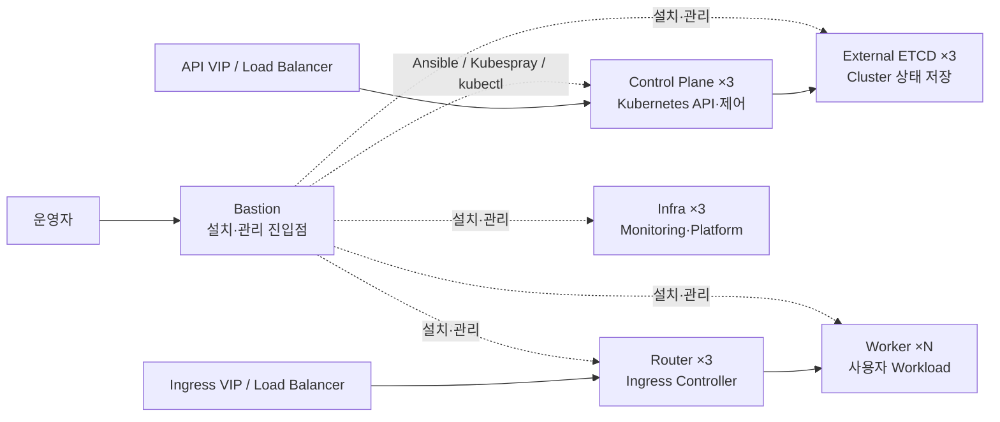
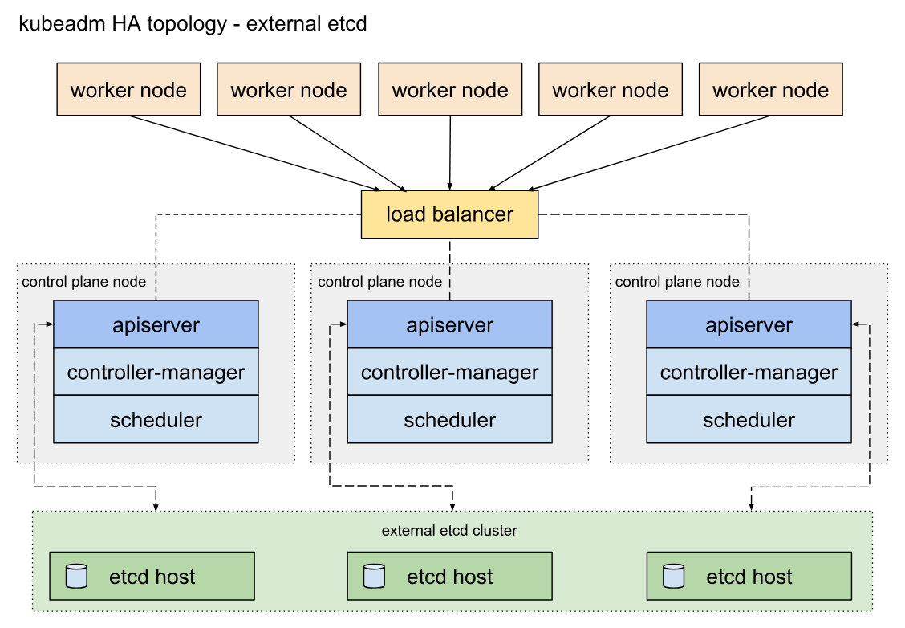
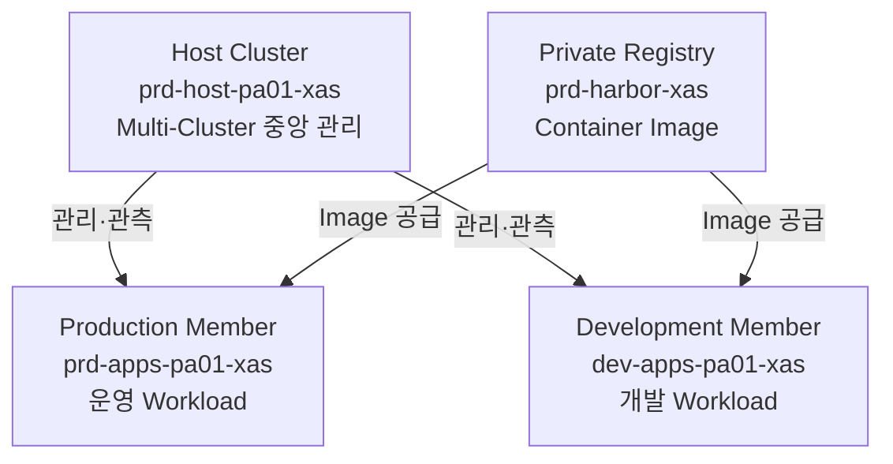
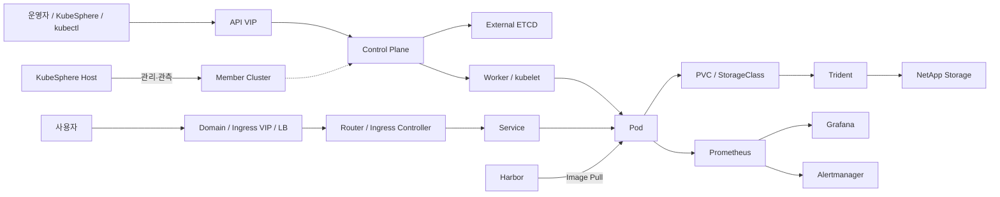

# Kubernetes & DKS Architecture
## Xi'an 현지 기술 전수 교육 교재

**교육일:** 2026-08-25  
**대상:** Kubernetes 사전 지식이 없는 Xi'an 현지 운영 담당자  
**목적:** 이후 KubeSphere 운영 교육과 신규 Member Cluster 구축 과정을 이해하기 위한 공통 기술 기반 확보  
**배포 형식:** PDF 또는 본 Markdown과 `assets/2026-08-25/` 디렉터리를 함께 배포  
**열람 조건:** Markdown 배포 시 Mermaid를 지원하는 Obsidian 등 렌더러 사용

---

## 교육 목표

이 교육의 목적은 Kubernetes의 모든 기능이나 명령어를 하루 안에 학습하는 것이 아니다. 이후 운영 및 구축 과정에서 보게 될 용어와 화면, Node 역할, Network·Storage·Registry·Monitoring의 관계를 이해할 수 있도록 **전체 시스템의 구조를 하나의 그림으로 연결하는 것**이 목표다.

교육 종료 후 다음 질문에 큰 수준에서 답할 수 있어야 한다.

1. Kubernetes Cluster는 무엇이며 Control Plane과 Worker Node는 어떤 역할을 하는가?
2. Container Image가 어떻게 Pod로 실행되고 사용자에게 서비스되는가?
3. Service와 Ingress는 왜 필요한가?
4. Pod가 다시 생성될 수 있는데 데이터는 어떻게 유지하는가?
5. Harbor, Trident, Prometheus/Grafana는 각각 무엇을 담당하는가?
6. DKS는 일반 Kubernetes 위에 어떤 표준 구조를 적용하는가?
7. Bastion, Control Plane, External ETCD, Router, Infra, Worker는 왜 역할을 나누는가?
8. KubeSphere Host Cluster와 Member Cluster는 어떤 관계인가?
9. Xi'an의 Host, Production Member, Development Member, Harbor는 각각 어떤 역할을 하는가?
10. 장애가 발생했을 때 Kubernetes 내부와 Load Balancer·DNS·Storage·Registry 같은 외부 영역을 어떻게 구분해서 생각해야 하는가?

## 하루 교육 구성

| 세션 | 권장 시간 | 관련 범위 | 주요 내용 | 교육 종료 시 확인할 것 |
|---|---:|---|---|---|
| 1 | 09:00~10:00 | Part 1 | VM·Container·Kubernetes의 관계 | Kubernetes가 필요한 이유 |
| 2 | 10:00~12:00 | Part 2~4 | Cluster·Control Plane·Worker·Deployment·Service·Ingress | 애플리케이션이 실행되고 사용자에게 연결되는 과정 |
| 3 | 13:00~14:00 | Part 5~8 | Network·Storage·Harbor·Monitoring | Kubernetes 주변 기능의 역할 |
| 4 | 14:00~15:10 | Part 9~12 | DKS Node 역할·설계 선택·고가용성 | DKS가 역할을 분리한 이유 |
| 5 | 15:20~16:10 | Part 13~15 | KubeSphere·Multi-Cluster·Xi'an 구성 | Host·Member·Harbor 관계 |
| 6 | 16:10~17:00 | Part 16~21 | 운영 경계·정상 판정·대표 사례·전체 정리 | 문제 발생 시 첫 확인 영역을 구분하는 방법 |

## 자료를 읽는 세 가지 수준

이 교재에는 서로 다른 수준의 설명이 함께 나온다. 세 수준을 구분해야 일반 Kubernetes 개념과 Xi'an 실제 구성을 혼동하지 않는다.

| 수준               | 의미                                  | 예시                                    |
| ---------------- | ----------------------------------- | ------------------------------------- |
| Kubernetes 공통 개념 | Kubernetes 일반 동작 원리                 | Pod, Deployment, Service, Ingress     |
| DKS 표준 아키텍처      | DKS가 선택한 역할·구성 방식                   | Bastion, External ETCD, Router, Infra |
| Xi'an 실제 기준      | Cluster 카탈로그와 승인된 Manual에 기록된 환경 사실 | Cluster 이름, Node 역할 수량, VIP·CIDR      |

> [!important] 그림 해석 기준
> 공개 이미지는 개념 이해를 위한 참고 자료다. **Xi'an의 실제 Node 배치, Network, Storage, Version과 이번 구축 대상은 Cluster 카탈로그·승인된 Manual·현장 조회 결과를 우선한다.**

---

# Part 1. Kubernetes를 이해하기 전에

## 1. 애플리케이션 운영 방식의 변화

### 1.1 한 대의 서버에서 시작하는 운영

- [ ] 가장 단순한 애플리케이션 운영은 한 대의 서버 또는 VM에 애플리케이션을 설치하고 실행하는 방식이다.

```text
Server / VM
└─ Application
```

서비스가 작고 서버 수가 적을 때는 이 방식만으로도 충분할 수 있다. 그러나 애플리케이션과 서버가 늘어나면 운영해야 할 대상도 함께 늘어난다.

- 어떤 서버에서 어떤 애플리케이션이 실행되는지 관리해야 한다.
- 서버별로 같은 설치 절차와 설정을 반복해야 한다.
- 애플리케이션이 중단되면 사람이 다시 실행해야 할 수 있다.
- 트래픽이 증가하면 서버 또는 애플리케이션 실행 수를 늘려야 한다.
- 서버가 고장 나면 다른 서버에서 서비스를 다시 구성해야 한다.
- 여러 서버의 Network, Storage, 접근 경로를 함께 관리해야 한다.

즉, 서버를 한 대씩 관리하는 문제보다 **여러 서버에서 많은 애플리케이션을 계속 원하는 상태로 유지하는 문제**가 더 커진다.

### 1.2 VM이 제공하는 것

VM(Virtual Machine)은 물리 서버 위에서 독립적인 OS 환경을 제공한다. VM을 사용하면 물리 서버 한 대에 여러 독립 실행환경을 만들 수 있고, 애플리케이션과 서버 자원을 논리적으로 분리할 수 있다.

VM은 다음과 같은 장점을 제공한다.

- OS 단위 격리
- 표준 Template 기반 생성
- 비교적 빠른 서버 증설과 교체
- 물리 서버와 애플리케이션 운영 경계 분리

그러나 VM을 사용하더라도 애플리케이션 배포와 복구, 여러 서버에 대한 일관된 운영은 여전히 별도의 문제다.

### 1.3 Container가 제공하는 것

Container는 애플리케이션과 실행에 필요한 파일을 하나의 Image로 묶고, 동일한 Image를 여러 환경에서 일관된 방식으로 실행할 수 있게 한다.

| 용어 | 의미 |
|---|---|
| Container Image | 애플리케이션과 실행에 필요한 파일을 묶은 실행 원본 |
| Container | Image를 기반으로 실제 실행된 프로세스 환경 |
| Container Runtime | Container를 실제로 생성하고 실행하는 Software |
| Registry | Container Image를 저장하고 배포하는 저장소 |

예를 들어 Web Application의 Image가 하나 만들어지면 같은 Image를 개발, 테스트, 운영 환경에서 사용할 수 있다.

```text
Application Source
→ Container Image
→ Registry에 저장
→ 필요한 Server에서 Image Pull
→ Container 실행
```

Container는 애플리케이션 실행환경을 표준화한다. 하지만 Container가 많아지면 또 다른 문제가 생긴다.

- 어떤 서버에서 Container를 실행할 것인가?
- Container가 중단되면 누가 다시 실행할 것인가?
- 동일한 Container를 3개, 10개로 늘릴 때 누가 관리할 것인가?
- 서버 한 대가 중단되면 Container를 다른 서버로 어떻게 이동할 것인가?
- Container끼리 어떻게 통신할 것인가?
- 사용자는 계속 바뀌는 Container 주소에 어떻게 접근할 것인가?

이 문제를 다루는 것이 Kubernetes의 핵심 역할이다.

### 1.4 Kubernetes가 필요한 이유

Kubernetes는 여러 Server/VM을 하나의 Cluster로 묶고 Container 기반 애플리케이션을 **배포, 배치, 연결, 복구, 확장**할 수 있는 공통 제어 구조를 제공한다.

```text
여러 Server / VM
        ↓
Kubernetes Cluster
        ↓
Container Application 배포·상태 유지·Network·Storage 연결
```

Kubernetes는 Container 자체를 대신하는 기술이 아니다.

> Container는 애플리케이션 실행 단위이고, Kubernetes는 여러 Server에서 많은 Container를 원하는 상태로 유지하는 플랫폼이다.


*참고 이미지: Kubernetes 공식 문서의 Traditional / Virtualized / Container deployment 비교 — [출처](https://kubernetes.io/docs/concepts/overview/)*

---

# Part 2. Kubernetes의 핵심 동작 원리

## 2. Cluster, Node, Pod

### 2.1 Cluster

Kubernetes Cluster는 여러 Node와 Kubernetes 구성요소를 하나의 운영 단위로 묶은 것이다.

```text
Kubernetes Cluster
├─ Control Plane
├─ Worker Node 1
├─ Worker Node 2
└─ Worker Node ...
```

Cluster를 구성하는 각각의 서버 또는 VM을 **Node**라고 한다.

### 2.2 Control Plane과 Worker Node

Kubernetes Cluster의 Node는 크게 두 역할로 이해할 수 있다.

| 영역 | 역할 |
|---|---|
| Control Plane | Cluster의 요청을 받고 상태를 판단·조정 |
| Worker Node | 실제 애플리케이션 Pod 실행 |

Control Plane은 전체 Cluster를 제어하는 영역이고, Worker Node는 실제 Workload가 실행되는 영역이다.


*참고 이미지: Kubernetes 공식 Cluster Architecture — [출처](https://kubernetes.io/docs/concepts/architecture/)*

### 2.3 Pod

Pod는 Kubernetes에서 Container가 실행되는 기본 단위다.

일반적인 애플리케이션을 생각하면 다음과 같이 연결할 수 있다.

```text
Container Image
→ Container
→ Pod 내부에서 실행
→ Pod가 Worker Node에 배치됨
```

Pod는 고정된 서버처럼 생각하면 안 된다. 장애, 배포, 확장 과정에서 Pod는 삭제되고 새로 생성될 수 있다.

예를 들어 Web Pod 하나가 Worker 1에서 실행되고 있다가 Worker 1에 문제가 생기면, 조건이 갖춰진 경우 Kubernetes는 다른 Worker에 새로운 Pod를 생성할 수 있다.

```text
Before
Worker 1 → Web Pod
Worker 2 → -

Worker 1 장애

After
Worker 1 → Down
Worker 2 → 새로운 Web Pod
```

따라서 Kubernetes에서는 **개별 Pod 자체보다 원하는 상태를 정의하고 유지하는 구조**가 중요하다.

---

## 3. Control Plane은 무엇을 하는가

Control Plane에는 Kubernetes Cluster를 제어하기 위한 주요 구성요소가 있다.

### 3.1 API Server

API Server는 Kubernetes 관리 요청의 중심 진입점이다.

`kubectl`, KubeSphere 같은 관리 도구도 결국 Kubernetes API와 연결된다.

```text
운영자 / 관리도구
       ↓
 Kubernetes API
       ↓
   API Server
```

새로운 Deployment 생성, Pod 조회, Service 변경과 같은 대부분의 관리 요청은 API Server를 통해 처리된다.

### 3.2 Scheduler

Scheduler는 새로 실행해야 하는 Pod를 어느 Node에 배치할지 결정한다.

예를 들어 Worker Node가 3대 있고 새로운 Pod가 필요하다면 Scheduler는 Node의 상태와 배치 조건을 고려해 적절한 Node를 선택한다.

```text
새 Pod 필요
   ↓
Scheduler
   ↓
적절한 Worker Node 선택
```

### 3.3 Controller Manager

Controller Manager는 사용자가 선언한 **원하는 상태(Desired State)** 와 현재 **실제 상태(Actual State)** 를 비교하며 필요한 조정을 수행한다.

예를 들어 사용자가 Web Pod 3개를 유지하도록 선언했다고 가정한다.

```text
Desired State = Web Pod 3개
Actual State  = Web Pod 2개

차이 = 1개 부족
        ↓
새 Pod 생성이 필요함
```

이러한 구조 때문에 Kubernetes는 단순한 실행 도구가 아니라 **상태를 지속적으로 조정하는 플랫폼**이라고 할 수 있다.

### 3.4 ETCD

ETCD는 Kubernetes Cluster 상태를 저장하는 분산 Key-Value Store다.

Kubernetes가 알고 있어야 하는 Cluster의 중요한 상태 정보가 ETCD에 저장된다.

- 어떤 Node가 Cluster에 있는가
- 어떤 Deployment와 Service가 존재하는가
- 사용자가 원하는 상태는 무엇인가
- Cluster 구성과 리소스 정보

ETCD는 일반 애플리케이션 데이터를 저장하는 DB가 아니다. **Kubernetes Cluster 자체의 상태를 저장하는 핵심 데이터 계층**이다.

### 3.5 Pod 하나가 만들어질 때의 전체 흐름

사용자가 Web Application Pod 3개를 실행하도록 요청했다고 가정한다.

```text
1. 사용자 또는 관리도구가 요청
          ↓
2. API Server가 요청 수신
          ↓
3. 원하는 상태가 Cluster에 반영됨
          ↓
4. Scheduler가 Pod를 실행할 Node 선택
          ↓
5. 선택된 Node의 kubelet이 Pod 실행
          ↓
6. Controller가 원하는 상태와 실제 상태를 계속 비교
```

> [!note] 앞의 Kubernetes Cluster 구성도에서 API Server·Scheduler·kubelet의 위치를 다시 확인할 수 있다.

---

## 4. Worker Node는 무엇을 하는가

Worker Node는 실제 애플리케이션 Pod를 실행한다.

### 4.1 kubelet

kubelet은 각 Worker Node에서 동작하며 해당 Node에서 실행되어야 할 Pod의 상태를 관리한다.

Control Plane에서 전달된 상태를 바탕으로 필요한 Pod가 실행되는지 확인한다.

### 4.2 Container Runtime

Container Runtime은 Container를 실제로 실행한다.

Xi'an DKS에서는 Container Runtime으로 **containerd**를 사용한다.

```text
Kubernetes
→ kubelet
→ containerd
→ Container 실행
```

### 4.3 Node와 Pod의 관계

Worker Node에는 여러 Pod가 동시에 실행될 수 있다.

```text
Worker Node
├─ Pod A
├─ Pod B
└─ Pod C
```

하지만 무한히 실행할 수 있는 것은 아니다. 실제 실행 가능한 Workload 수는 Node의 CPU, Memory, Disk, 예약 자원, Pod 요구량, 운영 정책 등에 영향을 받는다.

따라서 **Node 개수만으로 Cluster의 실제 처리 용량을 판단할 수 없다.**

---

# Part 3. Kubernetes 워크로드와 서비스 제공

## 5. Pod를 직접 관리하지 않는 이유

Pod는 삭제되거나 재생성될 수 있는 실행 단위다. 운영에서는 개별 Pod를 직접 하나씩 만들기보다 Deployment 같은 상위 객체를 이용해 원하는 상태를 정의한다.

### 5.1 Deployment

Deployment는 애플리케이션을 어떤 Image로 몇 개의 Pod로 실행할 것인지 관리한다.

예를 들어 다음과 같은 요구사항이 있다고 가정한다.

```text
Application = web-app
Image       = web-app:v1
Replica     = 3
```

Deployment를 생성하면 Kubernetes는 Web Pod 3개가 유지되도록 관리한다.

```text
Deployment
├─ Web Pod 1
├─ Web Pod 2
└─ Web Pod 3
```

Pod 하나가 중단되면 Deployment가 원하는 상태를 유지할 수 있도록 Kubernetes가 새로운 Pod를 생성한다.

### 5.2 Replica의 의미

Replica는 동일한 Workload를 여러 개 실행하는 개념이다.

Replica를 여러 개 두는 이유는 다음과 같다.

- 여러 요청을 여러 Pod에 분산
- 특정 Pod 장애 시 나머지 Pod로 서비스 지속
- 배포와 확장에 유연하게 대응

다만 Replica가 여러 개라는 것만으로 완전한 고가용성이 보장되는 것은 아니다. 여러 Replica가 동일 Node에 배치되거나 Storage·Network 등 공통 의존성이 장애가 나면 서비스에 영향이 발생할 수 있다.

---

## 6. Label과 Selector

Kubernetes에서는 Pod가 계속 생성되고 삭제될 수 있기 때문에 고정 IP나 고정 이름만으로 애플리케이션을 연결하기 어렵다.

이를 위해 Label과 Selector 개념을 사용한다.

```text
Pod 1 → label: app=web
Pod 2 → label: app=web
Pod 3 → label: app=web

Service → selector: app=web
```

Service는 특정 IP를 가진 Pod 하나만 보는 것이 아니라 조건에 맞는 Pod 집합을 선택해 트래픽을 전달할 수 있다.

이 개념은 Service, 배치 정책, 운영 조회 등 Kubernetes 전반에서 자주 사용된다.

---

## 7. Service가 필요한 이유

Pod는 재생성되면서 IP가 바뀔 수 있다. 사용자가 Pod IP를 직접 기억해 접근한다면 Pod가 새로 생성될 때마다 접속 주소가 바뀌는 문제가 발생한다.

Service는 Pod 앞에 안정적인 접근점을 제공한다.

```text
              ┌─ Pod 1
Client → Service ─ Pod 2
              └─ Pod 3
```

Service는 Selector를 이용해 대상 Pod를 찾고 요청을 전달한다.

### 7.1 Pod와 Service의 차이

| 구분 | Pod | Service |
|---|---|---|
| 목적 | 실제 Container 실행 | Pod 집합에 안정적인 접근점 제공 |
| 수명 | 삭제·재생성될 수 있음 | 서비스 접근점으로 유지 |
| IP | 재생성 시 변경될 수 있음 | 내부 접근점 역할 |

### 7.2 Pod Running과 Service 정상은 다르다

Pod가 `Running` 상태라고 해서 사용자가 정상적으로 접속할 수 있다는 의미는 아니다.

사용자 요청은 여러 단계를 통과한다.

```text
사용자
→ Load Balancer
→ Ingress
→ Service
→ Pod
→ Application
```

따라서 Pod Running은 전체 서비스 정상 여부 중 한 단계의 증거일 뿐이다.

---

## 8. Namespace

Namespace는 하나의 Kubernetes Cluster 안에서 리소스를 논리적으로 구분하기 위한 경계다.

예를 들어 하나의 Cluster에 여러 Team 또는 Application이 존재할 때 다음처럼 분리할 수 있다.

```text
Kubernetes Cluster
├─ Namespace A
│  ├─ Deployment
│  ├─ Service
│  └─ PVC
└─ Namespace B
   ├─ Deployment
   ├─ Service
   └─ PVC
```

Xi'an DKS에서 **KubeSphere Project는 Kubernetes Namespace와 연결되는 운영 단위**다.

이후 KubeSphere 운영교육에서는 Namespace 위에 사용자, Role, Quota 등의 운영 개념을 연결해서 보게 된다.

---

## 9. ConfigMap과 Secret

애플리케이션은 Image 자체 외에도 환경별 설정값이나 인증 정보가 필요할 수 있다.

Kubernetes는 이러한 설정을 Workload와 분리해 관리할 수 있는 객체를 제공한다.

| 객체 | 용도 |
|---|---|
| ConfigMap | 일반 설정값이나 Configuration Data 관리 |
| Secret | Password, Token, Certificate 등 민감한 Data 관리 |

예를 들어 Application Image를 변경하지 않고 환경별 설정을 ConfigMap으로 전달할 수 있다.

```text
Application Image
       +
ConfigMap / Secret
       ↓
      Pod
```

ConfigMap과 Secret은 영속 Application Data를 저장하는 Storage와는 목적이 다르다.

> [!note] Secret의 보호 범위
> Secret은 민감정보를 다루기 위한 Kubernetes 객체지만 값이 자동으로 완전 암호화된다는 의미는 아니다. 실제 보호 수준은 RBAC, ETCD 암호화, 접근·출력 통제 같은 운영 설정에 함께 의존한다.

---

# Part 4. 외부 사용자가 서비스에 접근하는 과정

## 10. Ingress가 필요한 이유

Service는 Kubernetes 내부에서 Pod에 안정적으로 접근할 수 있는 기반을 제공한다. 그러나 외부 사용자가 Domain을 이용해 HTTP/HTTPS 서비스에 접근하려면 추가적인 진입 구조가 필요하다.

Ingress는 HTTP/HTTPS 요청을 적절한 Service로 전달하기 위한 Routing 규칙을 제공한다.

```text
example.company.com
        ↓
      Ingress
        ↓
      Service
        ↓
        Pod
```

Ingress 규칙을 실제로 처리하는 구성요소가 Ingress Controller다.

DKS에서는 Ingress Nginx를 사용하고, Router 역할의 Node가 외부 트래픽 처리 영역으로 사용된다.

### 10.1 DKS 사용자 요청 경로

Xi'an DKS에서 사용자 서비스 접근은 개념적으로 다음 경로로 이해할 수 있다.

```text
사용자
→ Service Domain / Ingress VIP
→ External Load Balancer
→ Router Node의 Ingress Controller
→ Kubernetes Service
→ Pod
→ Application
```


*참고 이미지: Kubernetes 공식 Ingress 구조. Xi'an에서는 외부 Load Balancer 뒤의 Router Node에서 Ingress Controller가 동작하는 구조로 연결해 이해한다 — [출처](https://kubernetes.io/docs/concepts/services-networking/ingress/)*

### 10.2 왜 Load Balancer와 Router를 분리하는가

External Load Balancer는 외부에서 들어오는 요청을 여러 Router Node 중 사용 가능한 대상으로 전달한다.

Router Node는 Kubernetes 내부에서 Ingress Controller를 통해 요청을 적절한 Service로 연결한다.

```text
External Load Balancer
      ↓       ↓       ↓
   Router1 Router2 Router3
          ↓
      Ingress
          ↓
      Service
          ↓
        Pod
```

하나의 Router Node 주소에만 사용자가 직접 의존하는 것보다 여러 Router와 Load Balancer를 이용하면 단일 Node 장애에 대한 위험을 줄일 수 있다.

### 10.3 DNS의 역할

사용자는 일반적으로 IP 주소보다 Domain 이름으로 서비스에 접근한다.

```text
Application Domain
       ↓ DNS
Ingress VIP
       ↓
Load Balancer
```

따라서 사용자 접속 문제는 Kubernetes Pod만 확인해서는 충분하지 않다.

- DNS가 올바른 주소를 반환하는가?
- Load Balancer가 정상인가?
- Router Node가 정상인가?
- Ingress Rule이 올바른가?
- Service가 올바른 Pod를 선택하는가?
- Pod Application이 실제로 응답하는가?

이러한 식으로 전체 경로를 순서대로 생각해야 한다.

---

# Part 5. Kubernetes 네트워크의 기본 개념

## 11. Pod Network

Pod는 여러 Worker Node에 분산되어 실행될 수 있다. 서로 다른 Node의 Pod가 통신하기 위해 Cluster Network가 필요하다.

DKS에서는 Pod Network 구현에 **Calico**를 사용한다.

8/25 교육에서는 Calico 내부 설정 방식보다 역할을 이해하는 것이 중요하다.

> Calico는 Kubernetes Pod가 Cluster 안에서 통신할 수 있도록 Network 기반을 제공하는 구성요소다.

## 12. Service Network

Service는 Pod 집합에 대한 논리적 접근점을 제공한다. Kubernetes는 Service를 위한 별도의 논리 Network 범위를 사용한다.

```text
Pod Network
= 실제 Pod들이 사용하는 주소 영역

Service Network
= Service가 제공하는 논리적 접근 주소 영역
```

Pod Network와 Service Network는 역할이 다르며 Cluster 구축 시 서로 겹치지 않도록 설계해야 한다.

## 13. CoreDNS

Cluster 내부에서도 사람이 모든 Service IP를 직접 기억할 수 없다.

CoreDNS는 Kubernetes 내부의 Service 이름을 해석하는 DNS 기능을 제공한다.

```text
Application Pod
→ my-service.my-namespace
→ CoreDNS
→ Service 주소
```

즉 Kubernetes 내부에서도 **이름 기반 서비스 접근**을 가능하게 한다.

---

# Part 6. 영속 스토리지

## 14. Pod와 데이터 수명은 다르다

Pod는 배포나 장애 처리 과정에서 삭제되고 새로 생성될 수 있다. Application Data가 Pod 내부에만 존재한다면 Pod가 사라질 때 데이터도 함께 사라질 수 있다.

따라서 운영 데이터는 Pod의 수명과 분리해야 한다.

```text
Pod는 교체될 수 있음
       ↓
Data는 계속 유지되어야 함
       ↓
External / Persistent Storage 필요
```

### 14.1 PersistentVolume(PV)

PV는 Kubernetes에서 사용 가능한 Storage Volume을 표현하는 객체다.

### 14.2 PersistentVolumeClaim(PVC)

PVC는 Application이 필요한 Storage를 요청하는 객체다.

Application 입장에서는 특정 Storage 장비를 직접 다루기보다 “이 정도 조건의 Storage가 필요하다”고 요청하는 구조를 사용할 수 있다.

### 14.3 StorageClass

StorageClass는 어떤 Storage 정책과 방식으로 Volume을 공급할 것인지 정의한다.

```text
Application / Pod
       ↓
      PVC
       ↓
 StorageClass
       ↓
Storage Provisioning
       ↓
      PV
```

### 14.4 CSI와 Trident

Kubernetes는 CSI(Container Storage Interface)를 통해 외부 Storage System과 연계할 수 있다.

Xi'an DKS에서는 NetApp Storage와 Kubernetes를 연결하기 위해 **NetApp Trident**를 사용한다.

```text
Pod
→ PVC
→ StorageClass
→ Trident
→ NetApp Storage
```


*참고 이미지: NetApp 공식 Trident Architecture. Kubernetes Cluster의 Trident Controller/Node와 NetApp Storage가 연결되는 위치를 확인한다 — [출처](https://docs.netapp.com/us-en/trident-2510/trident-get-started/architecture.html)*

### 14.5 PVC Bound의 의미

PVC가 `Bound` 상태가 되면 Kubernetes에서 PVC와 Volume의 연결이 이루어졌다는 중요한 증거가 된다.

그러나 실제 Application이 Storage를 정상 사용할 수 있는지 확인하려면 추가 단계가 필요하다.

```text
PVC 생성
→ PVC Bound
→ Node에서 Volume Mount
→ Pod에서 파일 접근
→ 실제 Read / Write
```

따라서 다음 두 문장은 같은 의미가 아니다.

```text
PVC Bound = 성공
```

```text
Application에서 Storage Read/Write 정상 = 실제 사용 성공
```

Storage 검증에서는 Provisioning과 실제 사용을 구분해야 한다.

---

# Part 7. 컨테이너 레지스트리와 Harbor

## 15. Container Image는 어디에서 오는가

Kubernetes가 Pod를 실행하려면 Container Image를 가져올 수 있어야 한다.

Image는 Registry에 저장되고, Worker Node의 Container Runtime이 필요한 Image를 Pull해 Container를 실행한다.

```text
Image Build
→ Registry에 Push
→ Kubernetes가 Workload 생성
→ Worker Node가 Image Pull
→ Pod 실행
```

## 16. Harbor

Harbor는 DKS에서 사용하는 Private Container Registry다.

Harbor의 주요 역할은 다음과 같다.

- Container Image 저장
- Project와 Repository 관리
- 사용자와 권한 관리
- Image Push / Pull
- Private Registry 운영

### 16.1 Harbor Project와 KubeSphere Project

두 시스템 모두 “Project”라는 용어를 사용하지만 목적은 다르다.

| 구분 | KubeSphere Project | Harbor Project |
|---|---|---|
| 연결 대상 | Kubernetes Namespace | Container Image Repository |
| 주요 목적 | Workload와 Kubernetes Resource 운영 | Image 저장·접근 권한 관리 |
| 주요 사용자 작업 | Deployment, Service, PVC 등 관리 | Image Push, Pull, Repository 관리 |

같은 이름의 Project가 존재하더라도 서로 같은 객체는 아니다.

### 16.2 Private Image 사용

Private Registry의 Image를 사용하려면 Kubernetes가 Registry에 인증할 수 있어야 한다.

인증이나 Repository, Image 이름, Tag 등에 문제가 있으면 Pod가 Image를 가져오지 못하고 `ImagePullBackOff`와 같은 상태가 발생할 수 있다.

이 상태는 Container Application 자체가 실행된 이후의 문제라기보다 **Pod 실행 전에 필요한 Image 공급 경로의 문제**일 수 있다는 점을 이해해야 한다.

---

# Part 8. 모니터링

## 17. 왜 Monitoring이 필요한가

Cluster와 Application의 정상 여부를 확인하려면 현재 상태를 관측할 수 있어야 한다.

운영에서는 다음과 같은 질문에 답해야 한다.

- Node CPU와 Memory는 충분한가?
- Pod가 정상적으로 실행되는가?
- Application Resource 사용량은 어떻게 변하고 있는가?
- ETCD나 Kubernetes 주요 Component는 정상인가?
- 장애 징후가 발생하고 있는가?

Monitoring은 이러한 상태를 Metric으로 수집하고 분석할 수 있는 기반을 제공한다.

## 18. Prometheus, Grafana, Alertmanager

| 구성요소 | 역할 |
|---|---|
| Prometheus | Metric 수집 및 Time Series Data 저장 |
| Grafana | Metric Data 시각화 |
| Alertmanager | Alert 전달 및 처리 |

```text
Node / Kubernetes Component / Workload
              ↓
          Prometheus
          ↙       ↘
      Grafana   Alertmanager
```


*참고 이미지: Prometheus 공식 Architecture. Target 수집, Prometheus Server, Alertmanager, Grafana 연결을 한 번에 확인한다 — [출처](https://prometheus.io/docs/introduction/overview/)*

### 18.1 Monitoring에서 중요한 관점

Dashboard가 열리는 것만으로 Monitoring 전체가 정상이라는 의미는 아니다.

- Prometheus가 Target을 실제로 수집하는가?
- 필요한 Metric이 존재하는가?
- Grafana Datasource가 올바른 Prometheus를 바라보는가?
- Alert Rule과 Alertmanager 연결이 정상인가?

운영에서는 화면 존재 여부보다 **데이터가 실제로 수집되고 연결되어 있는지**를 확인해야 한다.

---

# Part 9. DKS 아키텍처

## 19. DKS란 무엇인가

DKS는 Kubernetes를 대체하는 별도 Container Orchestrator가 아니다.

Kubernetes를 기반으로 Node 역할, 설치 도구, Network, Storage, Monitoring, Registry, Multi-Cluster 운영 구조를 정해진 방식으로 구성하는 표준 아키텍처로 이해할 수 있다.

```text
Kubernetes
= Container Workload 실행·조정 기반

DKS
= Kubernetes를 표준 Node 역할과 Platform 구성으로 배포·운영하는 Architecture
```

## 20. DKS 주요 소프트웨어 구성

| 구성요소 | 역할 |
|---|---|
| Git | Cluster 배포 Source 및 Configuration 관리 |
| Python | Ansible 실행 등에 필요한 기반 Package |
| Ansible | 여러 Linux Node 설정 자동화 |
| Kubespray | Kubernetes Cluster 자동 설치 |
| kubectl | Kubernetes API CLI |
| Helm | Kubernetes Application Package 관리 |
| containerd | Container Runtime |
| Kubernetes | Workload Scheduling & Orchestration |
| ETCD | Kubernetes Cluster 상태 저장 |
| CoreDNS | Cluster 내부 DNS |
| Calico | Pod Network |
| Ingress Nginx | 외부 HTTP/HTTPS 요청 Routing |
| Trident | Kubernetes와 NetApp Storage 연결 |
| Prometheus / Grafana | Monitoring과 시각화 |
| KubeSphere | Kubernetes 및 Multi-Cluster 운영 계층 |
| Harbor | Private Container Registry |

이 모든 제품의 내부 구조를 이해하는 것이 첫날의 목표는 아니다. 중요한 것은 **각 제품이 전체 서비스 흐름에서 어느 역할을 담당하는지** 이해하는 것이다.

---

## 21. DKS Node 역할

DKS는 여러 기능을 하나의 Node에 모두 배치하지 않고 역할별로 Node를 분리한다.

| DKS 역할 | 주요 목적 | 대표 기능 |
|---|---|---|
| Bastion | 설치·관리 작업 진입점 | Ansible, Kubespray, kubectl, Git, Helm |
| Control Plane | Kubernetes Cluster 제어 | API Server, Scheduler, Controller Manager |
| External ETCD | Cluster 상태 저장 | ETCD |
| Router | 외부 사용자 Traffic 처리 | Ingress Controller |
| Infra | Platform·Monitoring 구성요소 배치 | Prometheus, Grafana, Dashboard 등 |
| Worker | 실제 사용자 Application 실행 | Deployment, Pod, Business Workload |



### 21.1 Bastion

Bastion은 Cluster 설치와 운영 작업을 수행하기 위한 관리 진입점이다.

```text
운영자
→ Bastion
→ Ansible / Kubespray / kubectl
→ Cluster Node
```

Bastion은 일반 사용자 Application Pod를 실행하는 Worker와 역할이 다르다.

### 21.2 Control Plane

Control Plane은 Kubernetes API와 Cluster 제어 기능을 제공한다.

DKS에서는 여러 Control Plane Node와 External Load Balancer를 이용해 API 접근 경로의 단일 장애 위험을 줄인다.

### 21.3 External ETCD

DKS는 Kubernetes 상태 저장 계층인 ETCD를 별도 Node 역할로 구성한다.

이를 통해 Cluster 상태 저장 영역을 일반 Workload 실행 영역과 분리한다.

### 21.4 Router

Router Node에는 외부 HTTP/HTTPS Traffic을 Kubernetes 내부 Service로 전달하는 Ingress Controller가 배치된다.

외부 Load Balancer와 함께 사용자 요청의 진입 영역을 구성한다.

### 21.5 Infra

Infra Node는 Monitoring, Dashboard 등 Platform 운영 성격의 Workload가 배치되는 영역이다.

사용자 Business Workload와 Platform 운영 Workload를 분리하면 자원 영향과 운영 책임을 구분하기 쉬워진다.

### 21.6 Worker

Worker Node는 실제 사용자 Application Workload가 실행되는 영역이다.

실제 Workload 수용량은 Worker의 수량뿐 아니라 다음 요소를 함께 봐야 한다.

- CPU
- Memory
- Disk
- Kubernetes 예약 자원
- Application Resource Request / Limit
- Replica 수
- Storage 요구량
- Network 요구사항
- 운영 정책

---

# Part 10. 왜 이렇게 설계하는가

## 22. DKS의 주요 설계 선택

DKS 구조는 제품을 나열하기 위한 것이 아니라 장애 영향, 관리 영역, 용량, 운영 책임을 분리하기 위한 설계다.

| 설계 선택 | 목적 | 잘못 이해하면 생기는 문제 |
|---|---|---|
| VM 기반 Node | 표준화된 생성·증설·교체와 인프라 관리 경계 확보 | Kubernetes가 물리 인프라까지 모두 관리한다고 오해 |
| 역할별 Node 분리 | 제어·트래픽·플랫폼·사용자 Workload 영향 분리 | 모든 Node를 동일 Worker처럼 이해 |
| External ETCD | Cluster 상태 저장 계층 분리 | ETCD를 일반 Application DB로 이해 |
| External Load Balancer | 여러 Control Plane·Router에 진입 요청 분산 | 특정 Node IP가 Cluster의 영구 진입점이라고 오해 |
| External Storage | Pod 수명과 Application Data 수명 분리 | Pod 재생성 시 Data가 자동 보존된다고 오해 |
| Harbor 분리 | Image 공급과 Kubernetes Resource 운영 분리 | Harbor Project와 KubeSphere Project를 같은 객체로 이해 |
| Host·Member 분리 | 중앙 관리와 실제 Workload 실행 영역 분리 | Member Cluster가 Host 내부에 합쳐진다고 오해 |

## 23. 역할 분리의 효과

역할을 분리하면 특정 영역의 부하나 장애가 다른 영역에 직접 영향을 주는 범위를 줄일 수 있다.

예를 들어 Router는 외부 사용자 Traffic을 처리하고, Control Plane은 Kubernetes API를 처리한다.

```text
API Traffic          User HTTP/HTTPS Traffic
    ↓                         ↓
Control Plane               Router
    ↓                         ↓
Cluster 관리               Service / Pod
```

두 역할을 구분하면 운영자는 “사용자 서비스 Traffic 문제인가”, “Kubernetes API 문제인가”를 구조적으로 나누어 생각할 수 있다.

---

# Part 11. 고가용성의 기본 개념

## 24. 단일 장애 지점을 줄이는 구조

운영 환경에서는 하나의 Node 장애가 전체 서비스 중단으로 바로 이어지지 않도록 중요 기능을 여러 Node에 분산한다.

DKS의 주요 구조는 다음과 같이 이해할 수 있다.

```text
API 요청
→ External Load Balancer
→ Control Plane 1 / 2 / 3

사용자 HTTP/HTTPS 요청
→ External Load Balancer
→ Router 1 / 2 / 3

Cluster 상태 저장
→ ETCD Member 1 / 2 / 3
```



*참고 이미지: Kubernetes 공식 kubeadm External ETCD 고가용성 토폴로지. 여러 Control Plane, Load Balancer, 별도 ETCD Cluster의 관계를 보여주며 DKS의 Control Plane·External ETCD 분리 원리를 이해하는 데 사용한다 — [출처](https://kubernetes.io/docs/setup/production-environment/tools/kubeadm/ha-topology/)*

### 24.1 Control Plane Node 하나가 중단된 경우

Control Plane이 여러 Node로 구성되고 Load Balancer가 정상적인 Node로 요청을 전달할 수 있다면 하나의 Control Plane Node 장애가 곧바로 전체 API 중단으로 이어지지 않도록 설계할 수 있다.

### 24.2 Router Node 하나가 중단된 경우

Router가 여러 Node로 구성되고 Load Balancer Health Check가 정상적으로 동작한다면 사용 가능한 Router로 Traffic을 전달할 수 있다.

### 24.3 Worker Node 하나가 중단된 경우

Worker Node가 중단되면 해당 Node의 Pod가 영향을 받는다. Kubernetes는 조건이 갖춰진 경우 다른 Worker Node에서 필요한 Pod를 다시 생성할 수 있다.

하지만 Application 구조, Replica 수, Storage 연결, 다른 Worker의 가용 Resource 등에 따라 실제 서비스 영향은 달라질 수 있다.

### 24.4 “3대가 있으면 무조건 HA”는 아니다

Node를 여러 대 구성하는 것은 HA를 위한 중요한 조건이지만 충분조건은 아니다.

- Load Balancer가 한 곳에서 장애가 나지 않는가?
- Replica가 실제 여러 Node에 분산되어 있는가?
- Storage가 정상인가?
- DNS가 정상인가?
- Network가 정상인가?
- Application 자체가 여러 Replica를 지원하는가?

즉 HA는 **Node 수뿐 아니라 전체 의존성 경로**를 함께 봐야 한다.

---

# Part 12. DKS에서 기억해야 할 다섯 가지 경로

## 25. Kubernetes 관리 요청 경로

```text
운영자 / kubectl / 관리도구
→ API VIP
→ External Load Balancer
→ Control Plane
→ Kubernetes API
```

이 경로는 Cluster Resource를 조회하거나 변경하는 관리 요청에 사용된다.

## 26. 사용자 서비스 요청 경로

```text
사용자
→ Domain / Ingress VIP
→ External Load Balancer
→ Router / Ingress Controller
→ Service
→ Pod
→ Application
```

사용자 서비스 장애를 볼 때는 이 순서를 따라 어디까지 요청이 전달되는지 확인해야 한다.

## 27. 컨테이너 이미지 공급 경로

```text
Developer / CI
→ Harbor에 Image Push
→ Kubernetes Workload 생성
→ Worker의 containerd가 Image Pull
→ Pod 실행
```

## 28. 영속 데이터 경로

```text
Pod
→ PVC
→ StorageClass
→ Trident
→ NetApp Storage
→ Node Mount
→ Container Read / Write
```

## 29. 모니터링 데이터 경로

```text
Node / Kubernetes / Workload Metric
→ Prometheus
→ Grafana
→ Alertmanager
```

---

# Part 13. KubeSphere

## 30. KubeSphere는 Kubernetes와 어떤 관계인가

KubeSphere는 Kubernetes를 대체하지 않는다.

Kubernetes API와 Resource를 Web UI와 사용자 관리 구조를 통해 운영할 수 있도록 제공하는 Platform 계층이다.

```text
KubeSphere
   ↓
Kubernetes API / Resource
   ↓
Namespace / Deployment / Service / PVC / Pod
```

KubeSphere에서 보는 많은 Resource는 실제 Kubernetes Resource와 연결된다.

| KubeSphere 관점 | Kubernetes 관점 |
|---|---|
| Project | Namespace |
| Workload | Deployment, StatefulSet, Pod 등 |
| Service | Kubernetes Service |
| Storage | PVC, PV, StorageClass |
| 사용자 Role | Kubernetes 권한 구조와 연결 |

## 31. Workspace, Project, 사용자와 권한

Xi'an DKS 운영에서는 KubeSphere를 통해 Workspace, Project, 사용자, Role, Quota를 관리한다.

```text
Workspace
   ↓
Project / Namespace
   ↓
User + Role
   ↓
Resource / Quota
```

- Workspace: Project를 관리하는 상위 운영 영역
- Project: Kubernetes Namespace와 연결되는 Application 운영 단위
- User: KubeSphere에 접근하는 사용자
- Role: 사용자가 수행할 수 있는 권한 범위
- Quota: 사용할 수 있는 CPU, Memory 등 Resource 범위

세부 생성·초대·권한 부여 절차는 다음날 KubeSphere Operation 교육에서 다룬다.

---

# Part 14. Multi-Cluster

## 32. 하나의 Cluster와 여러 Cluster

하나의 Kubernetes Cluster만 운영한다면 해당 Cluster를 직접 관리하면 된다.

하지만 Production, Development, 관리 영역 등 여러 Cluster를 운영하면 Cluster별 상태와 사용자를 각각 관리해야 한다.

Multi-Cluster 구조는 여러 Kubernetes Cluster를 중앙에서 관리·관측할 수 있는 운영 기반을 제공한다.

## 33. Host Cluster와 Member Cluster

KubeSphere Multi-Cluster에서 Host와 Member 역할을 구분한다.

| 구분 | 주요 역할 |
|---|---|
| Host Cluster | 중앙 관리, 사용자·Workspace·Project 운영 관점 제공 |
| Member Cluster | 실제 Application Workload 실행 및 Cluster Resource 운영 |

```text
               KubeSphere Host
                 /        \
                /          \
       Member Cluster A   Member Cluster B
```

Member가 Host에 Join된다는 것은 **중앙 관리·관측 대상에 편입되는 것**을 의미한다.

Member Cluster의 Kubernetes 자체가 Host Cluster 내부에 합쳐지는 것은 아니다. 각각 독립된 Kubernetes Cluster로 존재하면서 관리 관계를 연결한다.


*참고 이미지: KubeSphere 공식 Multi-Cluster 구조. Host Cluster가 여러 Member Cluster를 중앙 관리하는 관계만 확인하며, Xi'an의 제품 Version이나 세부 구성값을 나타내는 그림으로 해석하지 않는다 — [출처](https://www.kubesphere.io/docs/v3.3/multicluster-management/)*

## 34. Host와 Member를 분리하는 이유

- 중앙 사용자·운영 관리와 실제 Business Workload 실행 영역 분리
- 환경별 Cluster 독립성 유지
- Production / Development 등 운영 목적에 따른 분리
- 장애 범위와 Resource 영향 분리
- 여러 Cluster를 하나의 관리 화면에서 확인

---

# Part 15. Xi'an DKS 아키텍처

## 35. Xi'an 전체 논리 구성

현재 Xi'an 기준 환경은 다음 영역으로 구분해서 이해할 수 있다.

| 영역 | Cluster / System | 역할 |
|---|---|---|
| Host | `prd-host-pa01-xas` | KubeSphere Multi-Cluster 중앙 관리 |
| Production Member | `prd-apps-pa01-xas` | 운영 Application Workload 실행 |
| Development Member | `dev-apps-pa01-xas` | 개발 Application Workload 실행 |
| Private Registry | `prd-harbor-xas` | Container Image 저장·Push·Pull |

> [!important] 기준 시점과 구축 대상
> 아래 구성은 현재 Cluster 카탈로그에 기록된 Xi'an 기준 아키텍처다. **이번 출장에서 실제로 신규 구축할 Member의 identity와 현재 상태는 8/31 환경 확인에서 다시 확정**하며, 현장 조회 결과가 본 교재의 예시보다 우선한다.



> [!note] 위 그림은 Cluster 간 논리 관계를 나타낸다. 실제 Node 수량·VIP·CIDR과 이번 구축 대상은 아래 표와 Cluster 카탈로그, 현장 조회 결과를 기준으로 확인한다.

## 36. Xi'an Node 배치

현재 Cluster 카탈로그 기준 Node 역할 배치는 다음과 같다.

| 영역 | Bastion | Control Plane | External ETCD | Router | Infra | Worker | 합계 |
|---|---:|---:|---:|---:|---:|---:|---:|
| `prd-host-pa01-xas` | 1 | 3 | 3 | 3 | 3 | 0 | 13 |
| `prd-apps-pa01-xas` | 1 | 3 | 3 | 3 | 3 | 4 | 17 |
| `dev-apps-pa01-xas` | 1 | 3 | 3 | 3 | 3 | 2 | 15 |
| `prd-harbor-xas` | Harbor Server 1 | — | — | — | — | — | 1 |

### 36.1 Host Cluster에서 읽어야 할 것

Host Cluster는 Multi-Cluster 중앙 관리 역할을 담당한다.

현재 카탈로그 기준 사용자 Business Workload용 Worker가 없으므로 Production Member처럼 일반 Application 실행 영역으로 해석하면 안 된다.

### 36.2 Production Member에서 읽어야 할 것

Production Member에는 Control Plane, External ETCD, Router, Infra와 함께 실제 사용자 Workload 실행을 위한 Worker가 존재한다.

Production Application은 이 Member Cluster의 Worker 영역에서 실행되는 구조로 이해할 수 있다.

### 36.3 Development Member에서 읽어야 할 것

Development Member도 독립된 Kubernetes Cluster이며 개발용 Application Workload 실행을 위한 Worker를 가진다.

Production과 Development는 서로 다른 Cluster로 분리되어 Pod·Service Network와 운영 Resource를 각각 관리한다.

### 36.4 Harbor에서 읽어야 할 것

Harbor는 Kubernetes Cluster와 별도의 Private Registry 영역이다.

Production과 Development Member는 Workload 실행 시 필요한 Image를 Harbor에서 가져올 수 있다.

---

## 37. Node 수량과 Workload 수용량

Node 수량표는 **각 역할이 어떻게 배치되어 있는지**를 보여준다.

하지만 실제 Workload 수용량은 Node 개수만으로 판단할 수 없다.

예를 들어 Worker가 4대라고 해도 다음 항목에 따라 실행 가능한 Application 수와 규모는 달라진다.

- 각 Worker CPU
- 각 Worker Memory
- 사용 가능한 Disk
- Kubernetes System Resource 사용량
- Application Request / Limit
- Replica 수
- Storage 사용량
- Network 요구량
- 운영 Reserve 정책

따라서 다음 해석은 잘못된 접근이다.

> “Node가 17대이므로 13대 Cluster보다 무조건 더 성능이 좋다.”

Node의 역할과 실제 자원 사양을 함께 봐야 한다.

또한 Host Cluster처럼 Node 수가 많더라도 Worker가 없다면 일반 Business Workload 실행 영역으로 판단하지 않는다.

---

# Part 16. 외부 시스템과 운영 경계

## 38. Kubernetes만 정상이라고 서비스가 정상인 것은 아니다

실제 DKS 서비스는 Kubernetes Cluster만으로 구성되지 않는다.

다음과 같은 외부 시스템과 연결된다.

- External Load Balancer
- DNS
- Network / Firewall
- NetApp Storage
- Harbor Registry
- 사용자 인증 System

따라서 운영에서는 문제가 어느 영역에 있는지 나누어 확인해야 한다.

## 39. 주요 접근·연계 경계

| 목적 | 진입점·연계 대상 | 주요 확인 영역 |
|---|---|---|
| Cluster 설치·관리 | Bastion | 계정, Network 접근, Kubespray/Ansible, kubeconfig |
| Kubernetes 관리 API | API VIP → Load Balancer → Control Plane | LB Health, API Server, 인증·권한 |
| 사용자 HTTP/HTTPS | DNS → Ingress VIP → LB → Router → Service → Pod | DNS, Firewall, LB, Ingress, Service, Application |
| KubeSphere Web 운영 | KubeSphere | 사용자 인증, Workspace, Project, Role, Quota |
| Image Push/Pull | Harbor | Registry 인증, Project, Repository, Image, Certificate |
| Persistent Storage | Trident → NetApp | PVC, PV, Backend, Network, Mount, Read/Write |
| Monitoring | Prometheus / Grafana | Target, Metric, Datasource, Dashboard, Alert |

## 40. 운영 책임을 생각하는 방법

실제 담당 조직 이름은 환경별 운영 체계에 따라 달라질 수 있다. 하지만 기술적으로는 다음과 같은 영역으로 나누어 생각할 수 있다.

```text
Infrastructure
VM / Network / LB / DNS
        ↓
Kubernetes Platform
Control Plane / Worker / Service / Ingress
        ↓
Platform Services
KubeSphere / Harbor / Storage / Monitoring
        ↓
Application
Deployment / Pod / Application Process
```

문제가 생겼을 때 처음부터 모든 영역을 동시에 보지 않고 **어느 층까지 정상인지** 확인하면 원인을 빠르게 좁힐 수 있다.

---

# Part 17. 정상 상태를 판단하는 방법

## 41. “정상”은 한 단계가 아니다

Kubernetes에서는 한 명령이나 한 화면만 보고 전체 서비스가 정상이라고 판단하면 안 된다.

### 41.1 Cluster 구축 성공

Kubespray가 `exit 0`으로 끝났다고 해서 Cluster의 모든 기능이 정상이라는 의미는 아니다.

추가로 확인해야 할 영역이 있다.

```text
Kubespray 완료
→ Kubernetes API 응답
→ Node Ready
→ System Pod 정상
→ Network / DNS 정상
→ 실제 Workload 실행 가능
```

### 41.2 Pod Running

```text
Pod Running
≠ Service 정상
≠ Ingress 정상
≠ 사용자 접속 정상
```

### 41.3 PVC Bound

```text
PVC Bound
≠ Node Mount 정상
≠ Pod Mount 정상
≠ Application Read/Write 정상
```

### 41.4 Monitoring Dashboard

```text
Grafana 화면 Open
≠ Prometheus Target 정상
≠ Metric 수집 정상
≠ Alert 정상
```

이러한 구분은 이후 구축과 Troubleshooting 교육에서도 반복해서 사용한다.

---

# Part 18. 아키텍처 이해를 위한 사례

## 42. 사례 1 — Pod는 Running인데 사용자가 접속하지 못한다

현재 상태:

```text
Pod = Running
Application Process = 실행 중
사용자 = 접속 실패
```

이 경우 Pod만 계속 재시작하기보다 전체 요청 경로를 본다.

```text
DNS
→ Ingress VIP
→ External Load Balancer
→ Router / Ingress
→ Service
→ Pod
→ Application Port
```

Pod가 Running이라는 것은 이 경로의 마지막 일부만 확인된 것이다.

## 43. 사례 2 — ImagePullBackOff

현재 상태:

```text
Deployment 생성
→ Pod 생성 시도
→ ImagePullBackOff
```

이 경우 Application 자체가 실행되기 전에 Image 공급 단계에서 실패했을 수 있다.

확인 영역:

```text
Image Name / Tag
→ Harbor Repository
→ Harbor 인증·권한
→ Registry Certificate / Trust
→ Worker에서 Registry 접근
```

## 44. 사례 3 — PVC는 Bound인데 Pod가 Storage를 사용하지 못한다

현재 상태:

```text
PVC = Bound
Pod = Mount 실패
```

PVC가 Bound라는 이유만으로 Storage 전체를 정상이라고 판단하면 안 된다.

확인 영역:

```text
PVC / PV
→ StorageClass
→ Trident
→ Storage Backend
→ Node Network
→ Volume Mount
```

## 45. 사례 4 — KubeSphere에서 Project가 보이지 않는다

가능한 영역을 구분한다.

```text
Project 존재 여부
→ 대상 Workspace
→ 사용자 초대 여부
→ User Role
→ Project Permission
```

이 문제는 Pod Network나 Storage부터 확인하는 문제가 아니라 사용자·권한 영역에서 시작하는 것이 적절하다.

## 46. 사례 5 — Kubernetes API에 접속할 수 없다

확인 경로:

```text
운영자 Network
→ API VIP
→ External Load Balancer
→ Control Plane Node
→ kube-apiserver
→ 인증 / kubeconfig
```

API 문제와 사용자 Application Ingress 문제는 서로 다른 경로다.

## 47. 사례 6 — Worker Node 하나가 중단되었다

확인해야 할 질문:

1. 해당 Node에 어떤 Pod가 있었는가?
2. Application Replica가 여러 개였는가?
3. 다른 Worker에 충분한 Resource가 있는가?
4. 새 Pod가 다른 Worker에 Scheduling되는가?
5. Persistent Storage가 다른 Node에서도 연결 가능한가?
6. Service Endpoint가 정상 Pod로 갱신되는가?

이 사례를 통해 HA는 단순 Node 개수보다 **Application과 전체 의존성의 조합**이라는 점을 이해할 수 있다.

---

# Part 19. 이번 현지 교육과 아키텍처의 연결

## 48. 8/26 — KubeSphere Operation

8/25에 배운 다음 개념을 실제 KubeSphere 화면과 운영 Manual에서 확인한다.

- Workspace
- Project / Namespace
- 사용자 초대
- Role
- Quota
- RBAC
- kubectl 사용자 접근
- ConfigMap

## 49. 8/27 — Operations Manual / Harbor

Kubernetes Cluster를 운영하면서 필요한 관리 작업과 Harbor Image Registry 운영을 연결한다.

- Worker Node 추가
- taint / label
- Kubernetes Native API
- API Server Certificate
- Harbor Project
- Harbor 사용자·권한

## 50. 8/28 — User Manual / Troubleshooting

사용자 입장에서 DKS, Harbor, KubeSphere를 이용하는 흐름과 대표적인 장애 시작점을 확인한다.

```text
사용자 관점
→ 어디에 로그인하는가
→ 어떤 Project에서 작업하는가
→ Image는 어디에서 가져오는가
→ Application은 어느 Member에서 실행되는가
→ 문제 발생 시 어느 영역부터 확인하는가
```

## 51. 8/31~9/3 — 실제 Cluster 구축

이론에서 본 Architecture를 실제 구축 순서로 만든다.

```text
8/31
VM / Bastion / Node 준비
        ↓
9/1
Kubespray로 Kubernetes Cluster 구축
        ↓
9/2
Storage / Trident 구성 및 검증
        ↓
9/3
Monitoring / KubeSphere 구성
        ↓
기존 Host에 Member Join
        ↓
Multi-Cluster 확인
```

즉 8/25 교육에서 보는 각각의 Box는 다음 주 실제 작업 대상이 된다.

---

# Part 20. 전체 구조 다시 보기

## 52. 애플리케이션 하나가 사용자에게 제공되기까지

지금까지 배운 구조를 하나의 흐름으로 연결한다.

```text
1. Application Image 생성
        ↓
2. Harbor에 Image 저장
        ↓
3. KubeSphere 또는 Kubernetes API에서 Deployment 생성
        ↓
4. Scheduler가 Worker Node 결정
        ↓
5. kubelet / containerd가 Image Pull 후 Pod 실행
        ↓
6. Service가 Pod 집합에 안정적인 접근점 제공
        ↓
7. Ingress가 HTTP/HTTPS Routing 제공
        ↓
8. External Load Balancer가 Router로 Traffic 전달
        ↓
9. 사용자가 Domain을 통해 Application 접근
```

데이터가 필요하다면 Storage 경로가 추가된다.

```text
Pod
→ PVC
→ StorageClass
→ Trident
→ NetApp
```

운영 상태는 Monitoring 경로로 확인한다.

```text
Node / Kubernetes / Pod
→ Prometheus
→ Grafana / Alertmanager
```

여러 Cluster는 KubeSphere Multi-Cluster 구조로 연결된다.

```text
Host Cluster
→ Production Member
→ Development Member

Harbor
→ 각 Member에 Image 공급
```



---

# Part 21. 핵심 정리

## 53. 반드시 기억할 15가지

1. Kubernetes는 여러 Node에서 Container 기반 Application을 배포·연결·유지하는 Platform이다.
2. Control Plane은 Cluster를 제어하고 Worker Node는 실제 Pod를 실행한다.
3. Pod는 교체될 수 있는 실행 단위이며 고정 Server처럼 생각하면 안 된다.
4. Deployment는 원하는 Pod 개수와 배포 상태를 유지한다.
5. Service는 바뀔 수 있는 Pod 앞에 안정적인 접근점을 제공한다.
6. Ingress와 External Load Balancer는 외부 사용자를 Service와 Pod까지 연결한다.
7. Namespace는 Cluster 내부 Resource의 논리적 경계다.
8. Pod Data와 Pod 수명은 분리되어야 하며 PVC·StorageClass·Trident를 통해 External Storage와 연결한다.
9. PVC Bound와 실제 Pod Mount·Read/Write는 서로 다른 성공 단계다.
10. Harbor는 Container Image를 저장·공급하는 Private Registry다.
11. Prometheus는 Metric을 수집하고 Grafana는 이를 시각화한다.
12. DKS는 Bastion·Control Plane·ETCD·Router·Infra·Worker 역할을 구분한다.
13. KubeSphere Host는 중앙 관리, Member Cluster는 실제 Workload 실행 영역이다.
14. Node 수량만으로 실제 Workload 수용량을 판단할 수 없다.
15. 정상 여부는 Pod 하나가 아니라 API·Network·Storage·Registry·Monitoring을 포함한 전체 경로로 판단해야 한다.

---

# Appendix A. 핵심 용어

| 용어 | 정의 |
|---|---|
| Cluster | 여러 Node와 Kubernetes 구성요소를 하나로 관리하는 단위 |
| Node | Kubernetes Cluster에 참여하는 Server 또는 VM |
| Control Plane | Kubernetes API와 Cluster 상태 조정을 담당하는 영역 |
| Worker Node | 실제 Application Pod가 실행되는 Node |
| Pod | Kubernetes에서 Container가 실행되는 기본 단위 |
| Deployment | Pod의 배포 상태와 원하는 Replica를 유지하는 객체 |
| Replica | 동일 Workload를 실행하는 Pod의 목표 개수 |
| Label | Kubernetes Resource에 부여하는 Key-Value 식별 정보 |
| Selector | Label을 이용해 대상 Resource를 선택하는 조건 |
| Service | Pod 집합에 안정적인 접근점을 제공하는 Kubernetes 객체 |
| Ingress | 외부 HTTP/HTTPS 요청을 Service로 Routing하는 규칙 |
| Ingress Controller | Ingress 규칙을 실제 Traffic에 적용하는 구성요소 |
| Namespace | 하나의 Cluster에서 Resource를 논리적으로 분리하는 경계 |
| ConfigMap | 일반 Configuration Data를 저장하는 Kubernetes 객체 |
| Secret | Password, Token, Certificate 등 민감 Data를 저장하는 Kubernetes 객체 |
| PV | Kubernetes에서 사용 가능한 Persistent Volume을 표현하는 객체 |
| PVC | Application이 Persistent Storage를 요청하는 객체 |
| StorageClass | Storage Provisioning 정책을 정의하는 객체 |
| CSI | Kubernetes와 External Storage System을 연결하는 표준 Interface |
| Trident | Kubernetes와 NetApp Storage를 연결하는 CSI 구성요소 |
| Registry | Container Image를 저장하고 공급하는 System |
| Harbor | DKS에서 사용하는 Private Container Registry |
| Prometheus | Metric 수집 및 Time Series 저장 System |
| Grafana | Metric과 운영 Data 시각화 System |
| Alertmanager | Prometheus Alert를 전달·처리하는 구성요소 |
| Bastion | DKS 설치 및 운영 작업의 관리 진입 Server |
| ETCD | Kubernetes Cluster 상태를 저장하는 분산 Key-Value Store |
| API VIP | Kubernetes API 접근을 위한 Load Balancer 진입점 |
| Ingress VIP | 사용자 HTTP/HTTPS 접근을 위한 Load Balancer 진입점 |
| Host Cluster | KubeSphere Multi-Cluster 중앙 관리 영역 |
| Member Cluster | Host에 연결되어 관리되는 독립 Kubernetes Cluster |
| Workspace | KubeSphere에서 Project를 관리하는 상위 운영 영역 |
| KubeSphere Project | Kubernetes Namespace와 연결되는 KubeSphere 운영 단위 |
| Harbor Project | Container Image Repository와 접근 권한을 관리하는 Registry 단위 |

---

# Appendix B. 구조 비교

## B.1 Control Plane vs Worker

| 항목 | Control Plane | Worker Node |
|---|---|---|
| 주 역할 | Cluster 제어 | Workload 실행 |
| 대표 Component | API Server, Scheduler, Controller Manager | kubelet, containerd, Pod |
| 사용자 Application | 일반적으로 실행 영역이 아님 | 실제 실행 영역 |
| 주요 장애 영향 | Cluster 관리·API 영향 | 해당 Node의 Workload 영향 |

## B.2 Service vs Ingress

| 항목 | Service | Ingress |
|---|---|---|
| 목적 | Pod 집합에 안정적인 접근점 | HTTP/HTTPS 요청 Routing |
| 주요 대상 | Cluster 내부 Pod | 외부 사용자 요청 |
| Pod 선택 | Selector 사용 | Service를 대상으로 Routing |

## B.3 KubeSphere vs Harbor

| 항목 | KubeSphere | Harbor |
|---|---|---|
| 목적 | Kubernetes Resource와 사용자 운영 | Container Image 운영 |
| Project 의미 | Namespace 연결 | Registry Repository/권한 단위 |
| 주요 작업 | Workload, Role, Quota, Storage | Image Push/Pull, User, Repository |

## B.4 Host vs Member

| 항목 | Host Cluster | Member Cluster |
|---|---|---|
| 목적 | Multi-Cluster 중앙 관리 | 실제 Cluster Workload 실행 |
| 관계 | Member를 관리·관측 | Host에 Join |
| 독립성 | 자체 Kubernetes Cluster | 자체 Kubernetes Cluster |

---

# Appendix C. Xi'an 상세 기준 문서

상세 IP, VIP, Node hostname, CPU·Memory·Disk, Pod/Service CIDR 등의 실제값은 아래 기준 문서에서 확인한다.

- [[10. 기준 및 설계/클러스터 카탈로그/01. prd-host-pa01-xas|prd-host-pa01-xas]]
- [[10. 기준 및 설계/클러스터 카탈로그/02. prd-harbor-xas|prd-harbor-xas]]
- [[10. 기준 및 설계/클러스터 카탈로그/03. prd-apps-pa01-xas|prd-apps-pa01-xas]]
- [[10. 기준 및 설계/클러스터 카탈로그/04. dev-apps-pa01-xas|dev-apps-pa01-xas]]
- [[30. 구축 및 전환/구축 마스터 Runbook|구축 마스터 Runbook]]
- [[50. 운영/01. Operations Overview/운영 안내|운영 안내]]

> 실제 구축 시에는 본 교육 교재의 예시보다 현장 Cluster 카탈로그, 승인된 Manual, 실제 Cluster 조회 결과를 우선한다.
