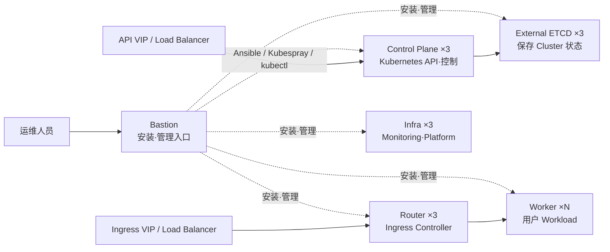
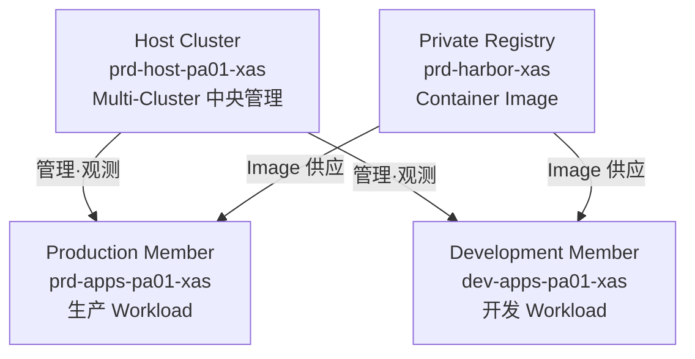
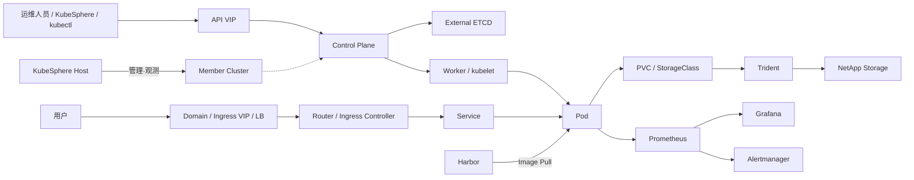

# Kubernetes & DKS Architecture
## Xi'an 现场技术传授培训教材

**培训日期：** 2026-08-25  
**对象：** 无 Kubernetes 前置知识的 Xi'an 当地运维人员  
**目的：** 建立共同技术基础，以便理解后续 KubeSphere 运维培训和新 Member Cluster 构建过程  
**分发形式：** PDF，或将本 Markdown 与 `assets/2026-08-25/` 目录一并分发  
**阅读条件：** 分发 Markdown 时，使用支持 Mermaid 的 Obsidian 等渲染器

---

## 培训目标

本次培训并不是要在一天内学习 Kubernetes 的全部功能或命令。目标是让学员能够理解后续运维和构建过程中会看到的术语、界面、Node 角色，以及 Network·Storage·Registry·Monitoring 之间的关系，并能够**把整个系统的结构连接成一张完整的图**。

培训结束后，应能够从整体层面回答以下问题。

1. Kubernetes Cluster 是什么，Control Plane 和 Worker Node 分别承担什么角色？
2. Container Image 如何以 Pod 形式运行，并最终向用户提供服务？
3. 为什么需要 Service 和 Ingress？
4. Pod 可能被重新创建，那么数据如何持续保留？
5. Harbor、Trident、Prometheus/Grafana 分别负责什么？
6. DKS 在通用 Kubernetes 之上应用了怎样的标准结构？
7. 为什么要区分 Bastion、Control Plane、External ETCD、Router、Infra、Worker 等角色？
8. KubeSphere Host Cluster 与 Member Cluster 是什么关系？
9. Xi'an 的 Host、Production Member、Development Member、Harbor 分别承担什么角色？
10. 发生故障时，应该如何区分 Kubernetes 内部区域与 Load Balancer·DNS·Storage·Registry 等外部区域？

## 一日培训安排

| Session | 建议时间 | 相关范围 | 主要内容 | 培训结束时应确认的内容 |
|---|---:|---|---|---|
| 1 | 09:00~10:00 | Part 1 | VM·Container·Kubernetes 的关系 | 为什么需要 Kubernetes |
| 2 | 10:00~12:00 | Part 2~4 | Cluster·Control Plane·Worker·Deployment·Service·Ingress | 应用如何运行并连接到用户 |
| 3 | 13:00~14:00 | Part 5~8 | Network·Storage·Harbor·Monitoring | Kubernetes 周边功能的角色 |
| 4 | 14:00~15:10 | Part 9~12 | DKS Node 角色·设计选择·高可用 | DKS 为什么拆分角色 |
| 5 | 15:20~16:10 | Part 13~15 | KubeSphere·Multi-Cluster·Xi'an 构成 | Host·Member·Harbor 的关系 |
| 6 | 16:10~17:00 | Part 16~21 | 运维边界·正常判定·典型案例·整体总结 | 出现问题时如何区分最先检查的区域 |

## 阅读本资料时要区分的三个层级

本教材中会同时出现不同层级的说明。只有区分这三个层级，才不会把通用 Kubernetes 概念与 Xi'an 的实际配置混在一起。

| 层级 | 含义 | 示例 |
|---|---|---|
| Kubernetes 通用概念 | Kubernetes 的一般运行原理 | Pod, Deployment, Service, Ingress |
| DKS 标准架构 | DKS 所选择的角色与构成方式 | Bastion, External ETCD, Router, Infra |
| Xi'an 实际基准 | Cluster Catalog 与已批准 Manual 中记录的环境事实 | Cluster 名称、Node 角色数量、VIP·CIDR |

> [!important] 图示解读原则
> 公开图片仅用于帮助理解概念。**Xi'an 实际的 Node 布置、Network、Storage、Version 以及本次构建对象，应以 Cluster Catalog、已批准 Manual 和现场查询结果为优先依据。**

---

# Part 1. 在理解 Kubernetes 之前

## 1. 应用运维方式的变化

### 1.1 从单台服务器开始的运维

最简单的应用运维方式，是在一台 Server 或 VM 上安装并运行 Application。

```text
Server / VM
└─ Application
```

当服务规模较小、Server 数量不多时，这种方式也许足够。但随着 Application 和 Server 数量增加，需要管理的对象也会随之增加。

- 需要管理哪个 Server 上运行哪个 Application。
- 需要在不同 Server 上重复相同的安装步骤和配置。
- Application 停止时，可能需要人工重新启动。
- Traffic 增加时，需要增加 Server 或 Application 实例数量。
- 某台 Server 发生故障时，需要在其他 Server 上重新构建服务。
- 还需要同时管理多台 Server 的 Network、Storage 和访问路径。

也就是说，与逐台管理 Server 相比，**如何让许多 Application 在多台 Server 上持续保持期望状态**会变成更大的问题。

### 1.2 VM 提供什么

VM（Virtual Machine）在物理 Server 之上提供独立的 OS 环境。使用 VM 后，可以在一台物理 Server 上创建多个独立运行环境，并在逻辑上分离 Application 与 Server 资源。

VM 具有以下优点。

- OS 级隔离
- 基于标准 Template 创建
- 相对快速地扩容和替换 Server
- 分离物理 Server 与 Application 的运维边界

但是，即使使用 VM，Application 的部署、恢复，以及对多台 Server 进行一致化运维仍然是另一个问题。

### 1.3 Container 提供什么

Container 将 Application 与运行所需文件打包为一个 Image，使同一个 Image 能够在多个环境中以一致方式运行。

| 术语 | 含义 |
|---|---|
| Container Image | 将 Application 与运行所需文件打包后的可运行镜像 |
| Container | 基于 Image 实际运行起来的进程环境 |
| Container Runtime | 实际创建并运行 Container 的 Software |
| Registry | 保存和分发 Container Image 的存储库 |

例如，当一个 Web Application 的 Image 制作完成后，可以在开发、测试、生产环境中使用同一个 Image。

```text
Application Source
→ Container Image
→ 保存到 Registry
→ 在需要的 Server 上 Pull Image
→ 运行 Container
```

Container 对 Application 运行环境进行了标准化。但当 Container 数量增加后，又会出现新的问题。

- 应该在哪一台 Server 上运行 Container？
- Container 停止时，谁负责重新运行？
- 当同一个 Container 需要扩展到 3 个、10 个时，谁来管理？
- 某台 Server 停止时，如何把 Container 转移到其他 Server？
- Container 之间如何通信？
- 用户如何访问地址会不断变化的 Container？

处理这些问题，正是 Kubernetes 的核心作用。

### 1.4 为什么需要 Kubernetes

Kubernetes 将多台 Server/VM 组合成一个 Cluster，为基于 Container 的 Application 提供统一的**部署、调度、连接、恢复、扩展**控制结构。

```text
多台 Server / VM
        ↓
Kubernetes Cluster
        ↓
Container Application 部署·状态维持·Network·Storage 连接
```

Kubernetes 并不是替代 Container 本身的技术。

> Container 是 Application 的运行单元，而 Kubernetes 是在多台 Server 上让大量 Container 持续保持期望状态的平台。


*参考图片：Kubernetes 官方文档中的 Traditional / Virtualized / Container deployment 对比 — [来源](https://kubernetes.io/docs/concepts/overview/)*

---

# Part 2. Kubernetes 的核心运行原理

## 2. Cluster, Node, Pod

### 2.1 Cluster

Kubernetes Cluster 是将多个 Node 与 Kubernetes 组件作为一个整体进行运维的单位。

```text
Kubernetes Cluster
├─ Control Plane
├─ Worker Node 1
├─ Worker Node 2
└─ Worker Node ...
```

组成 Cluster 的每一台 Server 或 VM 都称为 **Node**。

### 2.2 Control Plane 与 Worker Node

Kubernetes Cluster 的 Node 可以大体理解为两种角色。

| 区域 | 角色 |
|---|---|
| Control Plane | 接收 Cluster 请求，并判断、协调状态 |
| Worker Node | 实际运行 Application Pod |

Control Plane 是控制整个 Cluster 的区域，而 Worker Node 是实际运行 Workload 的区域。


*参考图片：Kubernetes 官方 Cluster Architecture — [来源](https://kubernetes.io/docs/concepts/architecture/)*

### 2.3 Pod

Pod 是 Kubernetes 中运行 Container 的基本单元。

从一般 Application 的角度，可以这样连接理解。

```text
Container Image
→ Container
→ 在 Pod 内部运行
→ Pod 被调度到 Worker Node
```

不能把 Pod 当作固定的 Server。由于故障、部署、扩容等过程，Pod 可能被删除并重新创建。

例如，一个 Web Pod 正运行在 Worker 1 上，如果 Worker 1 出现问题，在条件满足时，Kubernetes 可以在其他 Worker 上创建新的 Pod。

```text
Before
Worker 1 → Web Pod
Worker 2 → -

Worker 1 故障

After
Worker 1 → Down
Worker 2 → 新的 Web Pod
```

因此，在 Kubernetes 中，**相比单个 Pod 本身，更重要的是定义并维持期望状态的结构**。

---

## 3. Control Plane 做什么

Control Plane 中包含用于控制 Kubernetes Cluster 的主要组件。

### 3.1 API Server

API Server 是 Kubernetes 管理请求的核心入口。

`kubectl`、KubeSphere 等管理工具最终也都是连接 Kubernetes API。

```text
运维人员 / 管理工具
       ↓
 Kubernetes API
       ↓
   API Server
```

创建新的 Deployment、查询 Pod、修改 Service 等大多数管理请求都通过 API Server 处理。

### 3.2 Scheduler

Scheduler 决定新需要运行的 Pod 应该放在哪个 Node 上。

例如，有 3 台 Worker Node，需要运行一个新的 Pod 时，Scheduler 会根据 Node 状态和调度条件选择合适的 Node。

```text
需要新的 Pod
   ↓
Scheduler
   ↓
选择合适的 Worker Node
```

### 3.3 Controller Manager

Controller Manager 会持续比较用户声明的**期望状态（Desired State）**与当前**实际状态（Actual State）**，并执行必要的调整。

例如，假设用户声明要维持 3 个 Web Pod。

```text
Desired State = 3 个 Web Pod
Actual State  = 2 个 Web Pod

差异 = 少 1 个
        ↓
需要创建新的 Pod
```

正因为有这种结构，Kubernetes 不只是一个执行工具，而是一个**持续协调状态的平台**。

### 3.4 ETCD

ETCD 是保存 Kubernetes Cluster 状态的分布式 Key-Value Store。

Kubernetes 必须掌握的重要 Cluster 状态信息会保存在 ETCD 中。

- Cluster 中有哪些 Node
- 存在哪些 Deployment 和 Service
- 用户期望的状态是什么
- Cluster 配置和资源信息

ETCD 不是用来存储一般 Application 数据的 DB。它是**保存 Kubernetes Cluster 自身状态的核心数据层**。

### 3.5 一个 Pod 被创建时的整体流程

假设用户请求运行 3 个 Web Application Pod。

```text
1. 用户或管理工具发起请求
          ↓
2. API Server 接收请求
          ↓
3. 期望状态被记录到 Cluster 中
          ↓
4. Scheduler 选择运行 Pod 的 Node
          ↓
5. 所选 Node 上的 kubelet 运行 Pod
          ↓
6. Controller 持续比较期望状态和实际状态
```

> [!note] 可以重新查看前面的 Kubernetes Cluster 结构图，确认 API Server·Scheduler·kubelet 所在的位置。

---

## 4. Worker Node 做什么

Worker Node 实际运行 Application Pod。

### 4.1 kubelet

kubelet 运行在每个 Worker Node 上，负责管理应在该 Node 上运行的 Pod 状态。

它会根据 Control Plane 下发的状态，确认所需 Pod 是否正常运行。

### 4.2 Container Runtime

Container Runtime 实际负责运行 Container。

Xi'an DKS 使用 **containerd** 作为 Container Runtime。

```text
Kubernetes
→ kubelet
→ containerd
→ 运行 Container
```

### 4.3 Node 与 Pod 的关系

一个 Worker Node 上可以同时运行多个 Pod。

```text
Worker Node
├─ Pod A
├─ Pod B
└─ Pod C
```

但并不是可以无限运行。实际可承载的 Workload 数量会受到 Node 的 CPU、Memory、Disk、预留资源、Pod 资源需求、运维策略等因素影响。

因此，**不能仅根据 Node 数量判断 Cluster 的实际处理容量。**

---

# Part 3. Kubernetes Workload 与服务提供

## 5. 为什么不直接管理 Pod

Pod 是可能被删除和重新创建的运行单元。在运维中，与其逐个直接创建 Pod，更常见的是使用 Deployment 等上层对象定义期望状态。

### 5.1 Deployment

Deployment 用于管理 Application 使用哪个 Image、运行多少个 Pod。

假设有如下需求。

```text
Application = web-app
Image       = web-app:v1
Replica     = 3
```

创建 Deployment 后，Kubernetes 会管理并维持 3 个 Web Pod。

```text
Deployment
├─ Web Pod 1
├─ Web Pod 2
└─ Web Pod 3
```

如果其中一个 Pod 停止，Kubernetes 会创建新的 Pod，使 Deployment 继续维持期望状态。

### 5.2 Replica 的含义

Replica 表示运行多个相同 Workload 的概念。

设置多个 Replica 的原因包括：

- 将多个请求分散到多个 Pod
- 某个 Pod 故障时，由其他 Pod 继续提供服务
- 更灵活地应对部署和扩容

但仅仅存在多个 Replica 并不意味着高可用一定得到保证。如果多个 Replica 被放在同一个 Node 上，或者 Storage·Network 等共同依赖发生故障，服务仍然可能受到影响。

---

## 6. Label 与 Selector

在 Kubernetes 中，Pod 可能不断创建和删除，因此很难只依赖固定 IP 或固定名称来连接 Application。

为此，会使用 Label 和 Selector 概念。

```text
Pod 1 → label: app=web
Pod 2 → label: app=web
Pod 3 → label: app=web

Service → selector: app=web
```

Service 不是只看某一个固定 IP 的 Pod，而是可以选择符合条件的一组 Pod 并向其转发 Traffic。

这个概念在 Service、调度策略、运维查询等 Kubernetes 各个领域都会频繁使用。

---

## 7. 为什么需要 Service

Pod 在重新创建时 IP 可能发生变化。如果用户直接记住 Pod IP 访问，那么每次 Pod 被重新创建时，访问地址都会变化。

Service 在 Pod 前提供稳定的访问点。

```text
              ┌─ Pod 1
Client → Service ─ Pod 2
              └─ Pod 3
```

Service 使用 Selector 找到目标 Pod，并转发请求。

### 7.1 Pod 与 Service 的区别

| 区分 | Pod | Service |
|---|---|---|
| 目的 | 实际运行 Container | 为一组 Pod 提供稳定访问点 |
| 生命周期 | 可能被删除并重新创建 | 作为服务访问点持续存在 |
| IP | 重新创建时可能变化 | 作为内部稳定访问点 |

### 7.2 Pod Running 与 Service 正常不是一回事

Pod 处于 `Running` 状态，并不意味着用户一定可以正常访问。

用户请求需要经过多个阶段。

```text
用户
→ Load Balancer
→ Ingress
→ Service
→ Pod
→ Application
```

因此，Pod Running 只是判断整体服务是否正常的其中一个证据。

---

## 8. Namespace

Namespace 是在一个 Kubernetes Cluster 内对 Resource 进行逻辑划分的边界。

例如，一个 Cluster 中有多个 Team 或 Application 时，可以像下面这样分离。

```text
Kubernetes Cluster
├─ Namespace A
│  ├─ Deployment
│  ├─ Service
│  └─ PVC
└─ Namespace B
   ├─ Deployment
   ├─ Service
   └─ PVC
```

在 Xi'an DKS 中，**KubeSphere Project 是与 Kubernetes Namespace 对应的运维单位**。

后续 KubeSphere 运维培训中，会在 Namespace 基础上继续关联用户、Role、Quota 等运维概念。

---

## 9. ConfigMap 与 Secret

除了 Image 本身，Application 还可能需要不同环境的配置值或认证信息。

Kubernetes 提供了可以将这些配置与 Workload 分开管理的对象。

| 对象 | 用途 |
|---|---|
| ConfigMap | 管理一般配置值或 Configuration Data |
| Secret | 管理 Password、Token、Certificate 等敏感 Data |

例如，可以不修改 Application Image，而是通过 ConfigMap 传递不同环境的配置。

```text
Application Image
       +
ConfigMap / Secret
       ↓
      Pod
```

ConfigMap 和 Secret 与用于保存持久化 Application Data 的 Storage 目的不同。

> [!note] Secret 的保护范围
> Secret 是用于处理敏感信息的 Kubernetes 对象，但这并不意味着其中的值会自动得到完全加密。实际保护水平还依赖 RBAC、ETCD Encryption、访问控制和输出控制等运维设置。

---

# Part 4. 外部用户访问服务的过程

## 10. 为什么需要 Ingress

Service 为 Kubernetes 内部稳定访问 Pod 提供基础。但是，如果外部用户希望通过 Domain 使用 HTTP/HTTPS 访问服务，还需要额外的入口结构。

Ingress 提供将 HTTP/HTTPS 请求路由到适当 Service 的 Routing 规则。

```text
example.company.com
        ↓
      Ingress
        ↓
      Service
        ↓
        Pod
```

真正执行 Ingress 规则的组件是 Ingress Controller。

DKS 使用 Ingress Nginx，并由 Router 角色的 Node 作为处理外部 Traffic 的区域。

### 10.1 DKS 用户请求路径

在 Xi'an DKS 中，用户访问服务的路径可以概念性地理解为：

```text
用户
→ Service Domain / Ingress VIP
→ External Load Balancer
→ Router Node 上的 Ingress Controller
→ Kubernetes Service
→ Pod
→ Application
```


*参考图片：Kubernetes 官方 Ingress 结构。在 Xi'an 中，应理解为 External Load Balancer 后方的 Router Node 运行 Ingress Controller — [来源](https://kubernetes.io/docs/concepts/services-networking/ingress/)*

### 10.2 为什么分离 Load Balancer 与 Router

External Load Balancer 将从外部进入的请求转发到多个 Router Node 中可用的目标。

Router Node 在 Kubernetes 内部通过 Ingress Controller 将请求连接到适当的 Service。

```text
External Load Balancer
      ↓       ↓       ↓
   Router1 Router2 Router3
          ↓
      Ingress
          ↓
      Service
          ↓
        Pod
```

与让用户只依赖某一个 Router Node 地址相比，使用多个 Router 与 Load Balancer 可以降低单个 Node 故障带来的风险。

### 10.3 DNS 的作用

用户通常通过 Domain 名称而不是 IP 地址访问服务。

```text
Application Domain
       ↓ DNS
Ingress VIP
       ↓
Load Balancer
```

因此，用户访问问题不能只检查 Kubernetes Pod。

- DNS 是否返回正确地址？
- Load Balancer 是否正常？
- Router Node 是否正常？
- Ingress Rule 是否正确？
- Service 是否选择了正确的 Pod？
- Pod 中的 Application 是否实际响应？

应该按照这种方式，按整个路径顺序思考问题。

---

# Part 5. Kubernetes Network 基础概念

## 11. Pod Network

Pod 可以分散运行在多个 Worker Node 上。不同 Node 上的 Pod 要互相通信，就需要 Cluster Network。

DKS 使用 **Calico** 实现 Pod Network。

8/25 培训中，与其深入 Calico 内部配置方式，更重要的是理解它的作用。

> Calico 为 Kubernetes Pod 在 Cluster 内通信提供 Network 基础。

## 12. Service Network

Service 为一组 Pod 提供逻辑访问点。Kubernetes 为 Service 使用独立的逻辑 Network 范围。

```text
Pod Network
= 实际 Pod 使用的地址范围

Service Network
= Service 提供逻辑访问地址的范围
```

Pod Network 与 Service Network 的作用不同，在 Cluster 构建时必须设计为互不重叠。

## 13. CoreDNS

即使在 Cluster 内部，也不可能让人记住所有 Service IP。

CoreDNS 提供解析 Kubernetes 内部 Service 名称的 DNS 功能。

```text
Application Pod
→ my-service.my-namespace
→ CoreDNS
→ Service 地址
```

也就是说，它让 Kubernetes 内部能够实现**基于名称的服务访问**。

---

# Part 6. 持久化 Storage

## 14. Pod 与数据的生命周期不同

Pod 在部署或故障处理过程中可能被删除并重新创建。如果 Application Data 只存在于 Pod 内部，Pod 消失时数据也可能一起消失。

因此，需要持久化的业务数据必须与 Pod 生命周期分离。

```text
Pod 可能被替换
       ↓
Data 需要持续保留
       ↓
需要 External / Persistent Storage
```

### 14.1 PersistentVolume（PV）

PV 是在 Kubernetes 中表示可用 Storage Volume 的对象。

### 14.2 PersistentVolumeClaim（PVC）

PVC 是 Application 请求所需 Storage 的对象。

从 Application 的角度，不需要直接操作某一套具体 Storage 设备，而是可以提出“需要符合这些条件的 Storage”这样的请求。

### 14.3 StorageClass

StorageClass 定义以什么 Storage 策略和方式提供 Volume。

```text
Application / Pod
       ↓
      PVC
       ↓
 StorageClass
       ↓
Storage Provisioning
       ↓
      PV
```

### 14.4 CSI 与 Trident

Kubernetes 可以通过 CSI（Container Storage Interface）与外部 Storage System 集成。

Xi'an DKS 使用 **NetApp Trident** 连接 NetApp Storage 与 Kubernetes。

```text
Pod
→ PVC
→ StorageClass
→ Trident
→ NetApp Storage
```


*参考图片：NetApp 官方 Trident Architecture。可确认 Kubernetes Cluster 内 Trident Controller/Node 与 NetApp Storage 的连接位置 — [来源](https://docs.netapp.com/us-en/trident-2510/trident-get-started/architecture.html)*

### 14.5 PVC Bound 的含义

PVC 处于 `Bound` 状态，说明在 Kubernetes 中 PVC 与 Volume 已建立关联，这是一个重要的成功证据。

但是，要确认 Application 是否真的可以正常使用 Storage，还需要进一步验证。

```text
创建 PVC
→ PVC Bound
→ Node 上 Mount Volume
→ Pod 中访问文件
→ 实际 Read / Write
```

因此，下面两句话并不是同一个意思。

```text
PVC Bound = 成功
```

```text
Application 中 Storage Read/Write 正常 = 实际使用成功
```

Storage 验证时，必须区分 Provisioning 成功与实际使用成功。

---

# Part 7. Container Registry 与 Harbor

## 15. Container Image 从哪里来

Kubernetes 要运行 Pod，首先必须能够获取 Container Image。

Image 保存在 Registry 中，Worker Node 上的 Container Runtime 会 Pull 所需 Image，然后运行 Container。

```text
Image Build
→ Push 到 Registry
→ Kubernetes 创建 Workload
→ Worker Node Pull Image
→ 运行 Pod
```

## 16. Harbor

Harbor 是 DKS 使用的 Private Container Registry。

Harbor 的主要作用包括：

- 保存 Container Image
- 管理 Project 与 Repository
- 管理用户和权限
- Image Push / Pull
- 运维 Private Registry

### 16.1 Harbor Project 与 KubeSphere Project

两个系统都使用“Project”这个术语，但目的不同。

| 区分 | KubeSphere Project | Harbor Project |
|---|---|---|
| 关联对象 | Kubernetes Namespace | Container Image Repository |
| 主要目的 | 运维 Workload 和 Kubernetes Resource | 管理 Image 存储和访问权限 |
| 主要用户操作 | 管理 Deployment、Service、PVC 等 | Image Push、Pull、Repository 管理 |

即使两个系统中存在同名 Project，它们也不是同一个对象。

### 16.2 使用 Private Image

使用 Private Registry 中的 Image 时，Kubernetes 必须能够对 Registry 进行认证。

如果认证、Repository、Image 名称、Tag 等存在问题，Pod 可能无法获取 Image，并出现 `ImagePullBackOff` 等状态。

要理解的是，这种状态可能并不是 Container Application 运行后的问题，而是**Pod 运行前所需的 Image 供应路径发生了问题**。

---

# Part 8. Monitoring

## 17. 为什么需要 Monitoring

要确认 Cluster 和 Application 是否正常，就必须能够观测当前状态。

运维中需要回答以下问题。

- Node CPU 和 Memory 是否充足？
- Pod 是否正常运行？
- Application Resource 使用量如何变化？
- ETCD 或 Kubernetes 主要 Component 是否正常？
- 是否出现故障征兆？

Monitoring 为以 Metric 方式收集和分析这些状态提供基础。

## 18. Prometheus, Grafana, Alertmanager

| 组件 | 角色 |
|---|---|
| Prometheus | 收集 Metric 并保存 Time Series Data |
| Grafana | 可视化 Metric Data |
| Alertmanager | 转发和处理 Alert |

```text
Node / Kubernetes Component / Workload
              ↓
          Prometheus
          ↙       ↘
      Grafana   Alertmanager
```


*参考图片：Prometheus 官方 Architecture。可一次确认 Target 收集、Prometheus Server、Alertmanager、Grafana 的连接关系 — [来源](https://prometheus.io/docs/introduction/overview/)*

### 18.1 Monitoring 中的重要视角

Dashboard 能打开，并不代表整个 Monitoring 都正常。

- Prometheus 是否真的在收集 Target？
- 所需 Metric 是否存在？
- Grafana Datasource 是否指向正确的 Prometheus？
- Alert Rule 与 Alertmanager 的连接是否正常？

运维中比“界面是否存在”更重要的是，**数据是否真实被收集并正确连接**。

---

# Part 9. DKS 架构

## 19. 什么是 DKS

DKS 不是替代 Kubernetes 的另一套 Container Orchestrator。

可以将它理解为：基于 Kubernetes，按既定方式配置 Node 角色、安装工具、Network、Storage、Monitoring、Registry、Multi-Cluster 运维结构的一套标准架构。

```text
Kubernetes
= Container Workload 运行·协调基础

DKS
= 以标准 Node 角色和 Platform 构成来部署、运维 Kubernetes 的 Architecture
```

## 20. DKS 主要软件构成

| 组件 | 角色 |
|---|---|
| Git | 管理 Cluster 部署 Source 与 Configuration |
| Python | Ansible 运行等所需的基础 Package |
| Ansible | 自动化配置多台 Linux Node |
| Kubespray | 自动安装 Kubernetes Cluster |
| kubectl | Kubernetes API CLI |
| Helm | Kubernetes Application Package 管理 |
| containerd | Container Runtime |
| Kubernetes | Workload Scheduling & Orchestration |
| ETCD | 保存 Kubernetes Cluster 状态 |
| CoreDNS | Cluster 内部 DNS |
| Calico | Pod Network |
| Ingress Nginx | 外部 HTTP/HTTPS 请求 Routing |
| Trident | 连接 Kubernetes 与 NetApp Storage |
| Prometheus / Grafana | Monitoring 与可视化 |
| KubeSphere | Kubernetes 与 Multi-Cluster 运维层 |
| Harbor | Private Container Registry |

第一天的目标不是理解所有产品的内部结构。重要的是理解**每个产品在整体服务流程中承担什么角色**。

---

## 21. DKS Node 角色

DKS 不把所有功能都部署到同一个 Node，而是按角色拆分 Node。

| DKS 角色 | 主要目的 | 代表功能 |
|---|---|---|
| Bastion | 安装·管理操作入口 | Ansible, Kubespray, kubectl, Git, Helm |
| Control Plane | Kubernetes Cluster 控制 | API Server, Scheduler, Controller Manager |
| External ETCD | 保存 Cluster 状态 | ETCD |
| Router | 处理外部用户 Traffic | Ingress Controller |
| Infra | 部署 Platform·Monitoring 组件 | Prometheus, Grafana, Dashboard 等 |
| Worker | 实际运行用户 Application | Deployment, Pod, Business Workload |



### 21.1 Bastion

Bastion 是执行 Cluster 安装和运维操作的管理入口。

```text
运维人员
→ Bastion
→ Ansible / Kubespray / kubectl
→ Cluster Node
```

Bastion 与运行普通用户 Application Pod 的 Worker 角色不同。

### 21.2 Control Plane

Control Plane 提供 Kubernetes API 与 Cluster 控制功能。

DKS 使用多个 Control Plane Node 与 External Load Balancer，以降低 API 访问路径中的单点故障风险。

### 21.3 External ETCD

DKS 将负责保存 Kubernetes 状态的 ETCD 配置为独立的 Node 角色。

这样可以将 Cluster 状态存储区域与一般 Workload 运行区域分离。

### 21.4 Router

Router Node 上部署 Ingress Controller，用于将外部 HTTP/HTTPS Traffic 转发到 Kubernetes 内部 Service。

它与外部 Load Balancer 一起组成用户请求的入口区域。

### 21.5 Infra

Infra Node 是部署 Monitoring、Dashboard 等 Platform 运维类 Workload 的区域。

将用户 Business Workload 与 Platform 运维 Workload 分离，有助于区分资源影响范围和运维责任。

### 21.6 Worker

Worker Node 是实际运行用户 Application Workload 的区域。

实际 Workload 承载能力不能只看 Worker 数量，还要同时考虑以下因素。

- CPU
- Memory
- Disk
- Kubernetes 预留资源
- Application Resource Request / Limit
- Replica 数量
- Storage 需求
- Network 需求
- 运维策略

---

# Part 10. 为什么这样设计

## 22. DKS 的主要设计选择

DKS 的结构并不是为了罗列产品，而是为了分离故障影响、管理区域、容量和运维责任。

| 设计选择 | 目的 | 错误理解后可能产生的问题 |
|---|---|---|
| 基于 VM 的 Node | 便于标准化创建·扩容·替换，并建立基础设施管理边界 | 误以为 Kubernetes 会管理到物理基础设施层 |
| 按角色拆分 Node | 分离控制·Traffic·Platform·用户 Workload 的影响范围 | 把所有 Node 都理解成相同的 Worker |
| External ETCD | 分离 Cluster 状态存储层 | 把 ETCD 当作普通 Application DB |
| External Load Balancer | 将入口请求分散到多个 Control Plane·Router | 误以为某个 Node IP 就是 Cluster 的永久入口 |
| External Storage | 分离 Pod 生命周期与 Application Data 生命周期 | 误以为 Pod 重新创建后 Data 会自动保留 |
| Harbor 独立 | 分离 Image 供应与 Kubernetes Resource 运维 | 把 Harbor Project 与 KubeSphere Project 当成同一个对象 |
| Host·Member 分离 | 分离中央管理与实际 Workload 运行区域 | 误以为 Member Cluster 会合并到 Host 内部 |

## 23. 角色分离的效果

分离角色可以减少某个区域的负载或故障直接影响其他区域的范围。

例如，Router 负责外部用户 Traffic，而 Control Plane 负责 Kubernetes API。

```text
API Traffic          User HTTP/HTTPS Traffic
    ↓                         ↓
Control Plane               Router
    ↓                         ↓
Cluster 管理               Service / Pod
```

通过区分这两个角色，运维人员可以从结构上判断：“这是用户服务 Traffic 问题，还是 Kubernetes API 问题？”

---

# Part 11. 高可用基础概念

## 24. 降低单点故障风险的结构

在生产环境中，重要功能通常会分散到多个 Node，以避免单个 Node 故障直接导致整个服务中断。

DKS 的主要结构可以这样理解。

```text
API 请求
→ External Load Balancer
→ Control Plane 1 / 2 / 3

用户 HTTP/HTTPS 请求
→ External Load Balancer
→ Router 1 / 2 / 3

Cluster 状态保存
→ ETCD Member 1 / 2 / 3
```


*参考图片：Kubernetes 官方 kubeadm External ETCD 高可用拓扑。该图展示多个 Control Plane、Load Balancer、独立 ETCD Cluster 的关系，用于理解 DKS 分离 Control Plane 与 External ETCD 的原理 — [来源](https://kubernetes.io/docs/setup/production-environment/tools/kubeadm/ha-topology/)*

### 24.1 一台 Control Plane Node 停止时

如果 Control Plane 由多个 Node 构成，并且 Load Balancer 能够把请求转发到正常 Node，则可以设计为某一个 Control Plane Node 故障时不立即导致整个 API 中断。

### 24.2 一台 Router Node 停止时

如果 Router 由多个 Node 构成，且 Load Balancer Health Check 正常工作，则可以将 Traffic 转发到仍然可用的 Router。

### 24.3 一台 Worker Node 停止时

Worker Node 停止后，该 Node 上的 Pod 会受到影响。在条件满足时，Kubernetes 可以在其他 Worker Node 上重新创建所需 Pod。

但是，实际服务影响会因 Application 结构、Replica 数量、Storage 连接、其他 Worker 的可用 Resource 等因素而不同。

### 24.4 “有 3 台就一定是 HA”并不成立

配置多个 Node 是实现 HA 的重要条件，但并不是充分条件。

- Load Balancer 本身是否存在单点故障？
- Replica 是否真的分散到多个 Node？
- Storage 是否正常？
- DNS 是否正常？
- Network 是否正常？
- Application 本身是否支持多个 Replica？

也就是说，HA 不能只看 **Node 数量，还必须同时看完整依赖路径**。

---

# Part 12. DKS 中必须记住的五条路径

## 25. Kubernetes 管理请求路径

```text
运维人员 / kubectl / 管理工具
→ API VIP
→ External Load Balancer
→ Control Plane
→ Kubernetes API
```

该路径用于查询或修改 Cluster Resource 的管理请求。

## 26. 用户服务请求路径

```text
用户
→ Domain / Ingress VIP
→ External Load Balancer
→ Router / Ingress Controller
→ Service
→ Pod
→ Application
```

排查用户服务故障时，应沿着这个顺序确认请求已经到达哪一层。

## 27. Container Image 供应路径

```text
Developer / CI
→ Push Image 到 Harbor
→ 创建 Kubernetes Workload
→ Worker 上的 containerd Pull Image
→ 运行 Pod
```

## 28. 持久化数据路径

```text
Pod
→ PVC
→ StorageClass
→ Trident
→ NetApp Storage
→ Node Mount
→ Container Read / Write
```

## 29. Monitoring 数据路径

```text
Node / Kubernetes / Workload Metric
→ Prometheus
→ Grafana
→ Alertmanager
```

---

# Part 13. KubeSphere

## 30. KubeSphere 与 Kubernetes 是什么关系

KubeSphere 并不替代 Kubernetes。

它是一个 Platform 层，通过 Web UI 和用户管理结构来运维 Kubernetes API 与 Resource。

```text
KubeSphere
   ↓
Kubernetes API / Resource
   ↓
Namespace / Deployment / Service / PVC / Pod
```

KubeSphere 中看到的许多 Resource，实际都与 Kubernetes Resource 相连接。

| KubeSphere 视角 | Kubernetes 视角 |
|---|---|
| Project | Namespace |
| Workload | Deployment, StatefulSet, Pod 等 |
| Service | Kubernetes Service |
| Storage | PVC, PV, StorageClass |
| 用户 Role | 与 Kubernetes 权限结构关联 |

## 31. Workspace, Project, 用户与权限

Xi'an DKS 运维通过 KubeSphere 管理 Workspace、Project、用户、Role、Quota。

```text
Workspace
   ↓
Project / Namespace
   ↓
User + Role
   ↓
Resource / Quota
```

- Workspace：管理 Project 的上层运维区域
- Project：与 Kubernetes Namespace 对应的 Application 运维单位
- User：访问 KubeSphere 的用户
- Role：用户可以执行的权限范围
- Quota：可使用的 CPU、Memory 等 Resource 范围

具体的创建、邀请、赋权步骤会在第二天的 KubeSphere Operation 培训中学习。

---

# Part 14. Multi-Cluster

## 32. 单个 Cluster 与多个 Cluster

如果只运维一个 Kubernetes Cluster，直接管理该 Cluster 即可。

但当需要运维 Production、Development、管理区域等多个 Cluster 时，就必须分别管理每个 Cluster 的状态和用户。

Multi-Cluster 结构为从中央管理和观测多个 Kubernetes Cluster 提供运维基础。

## 33. Host Cluster 与 Member Cluster

KubeSphere Multi-Cluster 区分 Host 与 Member 两种角色。

| 区分 | 主要角色 |
|---|---|
| Host Cluster | 提供中央管理、用户·Workspace·Project 运维视角 |
| Member Cluster | 实际运行 Application Workload 并运维 Cluster Resource |

```text
               KubeSphere Host
                 /        \
                /          \
       Member Cluster A   Member Cluster B
```

Member Join 到 Host，表示它**被纳入中央管理与观测对象**。

这并不意味着 Member Cluster 的 Kubernetes 会被合并进 Host Cluster。每个 Cluster 仍然是独立的 Kubernetes Cluster，只是建立了管理关系。


*参考图片：KubeSphere 官方 Multi-Cluster 结构。这里只用于确认 Host Cluster 对多个 Member Cluster 进行中央管理的关系，不应把它理解成 Xi'an 产品 Version 或详细配置值的示意图 — [来源](https://www.kubesphere.io/docs/v3.3/multicluster-management/)*

## 34. 为什么要分离 Host 与 Member

- 分离中央用户·运维管理与实际 Business Workload 运行区域
- 保持不同环境 Cluster 的独立性
- 按 Production / Development 等运维目的进行分离
- 分离故障范围与 Resource 影响
- 在一个管理界面中查看多个 Cluster

---

# Part 15. Xi'an DKS 架构

## 35. Xi'an 整体逻辑构成

当前 Xi'an 基准环境可以按以下区域进行理解。

| 区域 | Cluster / System | 角色 |
|---|---|---|
| Host | `prd-host-pa01-xas` | KubeSphere Multi-Cluster 中央管理 |
| Production Member | `prd-apps-pa01-xas` | 运行生产 Application Workload |
| Development Member | `dev-apps-pa01-xas` | 运行开发 Application Workload |
| Private Registry | `prd-harbor-xas` | 保存·Push·Pull Container Image |

> [!important] 基准时间点与构建对象
> 下述配置是当前 Cluster Catalog 中记录的 Xi'an 基准架构。**本次出差中实际新建 Member 的 identity 和当前状态，将在 8/31 环境确认时再次确定**，现场查询结果优先于本教材中的示例。



> [!note] 上图表示 Cluster 之间的逻辑关系。实际 Node 数量、VIP、CIDR 以及本次构建对象，应以下表、Cluster Catalog 和现场查询结果为准。

## 36. Xi'an Node 布置

根据当前 Cluster Catalog，Node 角色布置如下。

| 区域 | Bastion | Control Plane | External ETCD | Router | Infra | Worker | 合计 |
|---|---:|---:|---:|---:|---:|---:|---:|
| `prd-host-pa01-xas` | 1 | 3 | 3 | 3 | 3 | 0 | 13 |
| `prd-apps-pa01-xas` | 1 | 3 | 3 | 3 | 3 | 4 | 17 |
| `dev-apps-pa01-xas` | 1 | 3 | 3 | 3 | 3 | 2 | 15 |
| `prd-harbor-xas` | Harbor Server 1 | — | — | — | — | — | 1 |

### 36.1 从 Host Cluster 应该读出什么

Host Cluster 承担 Multi-Cluster 中央管理角色。

当前 Catalog 基准中没有用于用户 Business Workload 的 Worker，因此不能把它理解成像 Production Member 一样的普通 Application 运行区域。

### 36.2 从 Production Member 应该读出什么

Production Member 中除了 Control Plane、External ETCD、Router、Infra，还存在用于实际运行用户 Workload 的 Worker。

可以理解为 Production Application 在该 Member Cluster 的 Worker 区域中运行。

### 36.3 从 Development Member 应该读出什么

Development Member 也是一个独立的 Kubernetes Cluster，并拥有用于运行开发 Application Workload 的 Worker。

Production 与 Development 是两个不同的 Cluster，各自独立管理 Pod·Service Network 和运维 Resource。

### 36.4 从 Harbor 应该读出什么

Harbor 是独立于 Kubernetes Cluster 的 Private Registry 区域。

Production 与 Development Member 在运行 Workload 时，可以从 Harbor 获取所需 Image。

---

## 37. Node 数量与 Workload 承载能力

Node 数量表展示的是**各角色如何布置**。

但实际 Workload 承载能力不能仅凭 Node 数量判断。

例如，即使有 4 台 Worker，可运行的 Application 数量和规模仍会受到以下项目影响。

- 每台 Worker 的 CPU
- 每台 Worker 的 Memory
- 可用 Disk
- Kubernetes System Resource 使用量
- Application Request / Limit
- Replica 数量
- Storage 使用量
- Network 需求
- 运维资源预留策略

因此，下面这种理解是错误的。

> “因为有 17 台 Node，所以一定比 13 台 Node 的 Cluster 性能更高。”

必须同时看 Node 的角色和实际资源规格。

另外，即使像 Host Cluster 一样 Node 数量很多，如果没有 Worker，也不能把它判断为一般 Business Workload 的运行区域。

---

# Part 16. 外部系统与运维边界

## 38. Kubernetes 正常并不等于服务正常

实际 DKS 服务并不只由 Kubernetes Cluster 构成。

它还会与以下外部系统连接。

- External Load Balancer
- DNS
- Network / Firewall
- NetApp Storage
- Harbor Registry
- 用户认证 System

因此，在运维时必须区分问题发生在哪一个区域。

## 39. 主要访问·集成边界

| 目的 | 入口·集成对象 | 主要检查区域 |
|---|---|---|
| Cluster 安装·管理 | Bastion | 账号、Network 访问、Kubespray/Ansible、kubeconfig |
| Kubernetes 管理 API | API VIP → Load Balancer → Control Plane | LB Health、API Server、认证·权限 |
| 用户 HTTP/HTTPS | DNS → Ingress VIP → LB → Router → Service → Pod | DNS、Firewall、LB、Ingress、Service、Application |
| KubeSphere Web 运维 | KubeSphere | 用户认证、Workspace、Project、Role、Quota |
| Image Push/Pull | Harbor | Registry 认证、Project、Repository、Image、Certificate |
| Persistent Storage | Trident → NetApp | PVC、PV、Backend、Network、Mount、Read/Write |
| Monitoring | Prometheus / Grafana | Target、Metric、Datasource、Dashboard、Alert |

## 40. 如何理解运维责任

实际负责组织的名称可能会因环境运维体系而不同。但从技术角度，可以按以下层级来思考。

```text
Infrastructure
VM / Network / LB / DNS
        ↓
Kubernetes Platform
Control Plane / Worker / Service / Ingress
        ↓
Platform Services
KubeSphere / Harbor / Storage / Monitoring
        ↓
Application
Deployment / Pod / Application Process
```

出现问题时，不要一开始就同时检查所有区域。先确认**到哪一层为止是正常的**，可以更快缩小原因范围。

---

# Part 17. 如何判断正常状态

## 41. “正常”不是单一阶段

在 Kubernetes 中，不能只看一条命令或一个界面，就判断整个服务都正常。

### 41.1 Cluster 构建成功

Kubespray 以 `exit 0` 结束，并不意味着 Cluster 的所有功能都已经正常。

还需要继续确认其他区域。

```text
Kubespray 完成
→ Kubernetes API 响应正常
→ Node Ready
→ System Pod 正常
→ Network / DNS 正常
→ 实际 Workload 可以运行
```

### 41.2 Pod Running

```text
Pod Running
≠ Service 正常
≠ Ingress 正常
≠ 用户访问正常
```

### 41.3 PVC Bound

```text
PVC Bound
≠ Node Mount 正常
≠ Pod Mount 正常
≠ Application Read/Write 正常
```

### 41.4 Monitoring Dashboard

```text
Grafana 页面可以打开
≠ Prometheus Target 正常
≠ Metric 收集正常
≠ Alert 正常
```

这些区分在后续构建和 Troubleshooting 培训中也会反复使用。

---

# Part 18. 用案例理解架构

## 42. 案例 1 — Pod 是 Running，但用户无法访问

当前状态：

```text
Pod = Running
Application Process = 正在运行
用户 = 无法访问
```

此时不要只反复重启 Pod，而要查看完整的请求路径。

```text
DNS
→ Ingress VIP
→ External Load Balancer
→ Router / Ingress
→ Service
→ Pod
→ Application Port
```

Pod 处于 Running，只证明这条路径最后一部分中的某个阶段已经成立。

## 43. 案例 2 — ImagePullBackOff

当前状态：

```text
创建 Deployment
→ 尝试创建 Pod
→ ImagePullBackOff
```

这种情况下，Application 本身还没有真正运行，问题可能已经发生在 Image 供应阶段。

检查区域：

```text
Image Name / Tag
→ Harbor Repository
→ Harbor 认证·权限
→ Registry Certificate / Trust
→ Worker 到 Registry 的访问
```

## 44. 案例 3 — PVC 是 Bound，但 Pod 无法使用 Storage

当前状态：

```text
PVC = Bound
Pod = Mount 失败
```

不能因为 PVC 是 Bound，就判断整个 Storage 都正常。

检查区域：

```text
PVC / PV
→ StorageClass
→ Trident
→ Storage Backend
→ Node Network
→ Volume Mount
```

## 45. 案例 4 — KubeSphere 中看不到 Project

先区分可能涉及的区域。

```text
Project 是否存在
→ 是否为目标 Workspace
→ 用户是否被邀请
→ User Role
→ Project Permission
```

这个问题不适合从 Pod Network 或 Storage 开始检查，更适合从用户·权限区域开始。

## 46. 案例 5 — 无法连接 Kubernetes API

检查路径：

```text
运维人员所在 Network
→ API VIP
→ External Load Balancer
→ Control Plane Node
→ kube-apiserver
→ 认证 / kubeconfig
```

API 问题与用户 Application Ingress 问题属于不同路径。

## 47. 案例 6 — 一台 Worker Node 停止

需要确认以下问题：

1. 该 Node 上原来运行了哪些 Pod？
2. Application 是否有多个 Replica？
3. 其他 Worker 是否有足够 Resource？
4. 新 Pod 是否会被调度（Scheduling）到其他 Worker？
5. Persistent Storage 是否能够在其他 Node 上重新连接？
6. Service Endpoint 是否更新到正常 Pod？

通过这个案例可以理解，HA 不只是 Node 数量问题，而是 **Application 与完整依赖关系的组合**。

---

# Part 19. 本次现场培训与架构的连接

## 48. 8/26 — KubeSphere Operation

把 8/25 学到的以下概念，在实际 KubeSphere 界面和运维 Manual 中进行确认。

- Workspace
- Project / Namespace
- 用户邀请
- Role
- Quota
- RBAC
- kubectl 用户访问
- ConfigMap

## 49. 8/27 — Operations Manual / Harbor

把 Kubernetes Cluster 运维中所需的管理操作，与 Harbor Image Registry 运维连接起来学习。

- 添加 Worker Node
- taint / label
- Kubernetes Native API
- API Server Certificate
- Harbor Project
- Harbor 用户·权限

## 50. 8/28 — User Manual / Troubleshooting

从用户角度确认使用 DKS、Harbor、KubeSphere 的流程，以及典型故障的起始检查点。

```text
用户视角
→ 登录到哪里
→ 在哪个 Project 中工作
→ Image 从哪里获取
→ Application 在哪个 Member 中运行
→ 出现问题时先检查哪个区域
```

## 51. 8/31~9/3 — 实际 Cluster 构建

把理论中看到的 Architecture 按实际构建顺序实现出来。

```text
8/31
准备 VM / Bastion / Node
        ↓
9/1
使用 Kubespray 构建 Kubernetes Cluster
        ↓
9/2
配置并验证 Storage / Trident
        ↓
9/3
配置 Monitoring / KubeSphere
        ↓
将 Member Join 到现有 Host
        ↓
确认 Multi-Cluster
```

也就是说，8/25 培训中看到的每一个 Box，都会成为下一周实际工作的对象。

---

# Part 20. 再次查看整体结构

## 52. 一个 Application 最终向用户提供服务的完整过程

把目前为止学到的结构连接成一条完整流程。

```text
1. 创建 Application Image
        ↓
2. 将 Image 保存到 Harbor
        ↓
3. 在 KubeSphere 或 Kubernetes API 中创建 Deployment
        ↓
4. Scheduler 决定 Worker Node
        ↓
5. kubelet / containerd Pull Image 后运行 Pod
        ↓
6. Service 为一组 Pod 提供稳定访问点
        ↓
7. Ingress 提供 HTTP/HTTPS Routing
        ↓
8. External Load Balancer 将 Traffic 转发到 Router
        ↓
9. 用户通过 Domain 访问 Application
```

如果 Application 需要数据，还会增加 Storage 路径。

```text
Pod
→ PVC
→ StorageClass
→ Trident
→ NetApp
```

运维状态通过 Monitoring 路径进行确认。

```text
Node / Kubernetes / Pod
→ Prometheus
→ Grafana / Alertmanager
```

多个 Cluster 通过 KubeSphere Multi-Cluster 结构建立关系。

```text
Host Cluster
→ Production Member
→ Development Member

Harbor
→ 向各 Member 供应 Image
```



---

# Part 21. 核心总结

## 53. 必须记住的 15 点

1. Kubernetes 是在多个 Node 上部署、连接并维持基于 Container 的 Application 的 Platform。
2. Control Plane 控制 Cluster，Worker Node 实际运行 Pod。
3. Pod 是可以被替换的运行单元，不能把它理解成固定 Server。
4. Deployment 维持期望的 Pod 数量和部署状态。
5. Service 在可能变化的 Pod 前提供稳定访问点。
6. Ingress 与 External Load Balancer 将外部用户连接到 Service 和 Pod。
7. Namespace 是 Cluster 内部 Resource 的逻辑边界。
8. Pod Data 与 Pod 生命周期必须分离，并通过 PVC·StorageClass·Trident 与 External Storage 连接。
9. PVC Bound 与实际 Pod Mount·Read/Write 是不同的成功阶段。
10. Harbor 是保存并供应 Container Image 的 Private Registry。
11. Prometheus 收集 Metric，Grafana 将其可视化。
12. DKS 区分 Bastion·Control Plane·ETCD·Router·Infra·Worker 等角色。
13. KubeSphere Host 负责中央管理，Member Cluster 是实际 Workload 运行区域。
14. 不能只根据 Node 数量判断实际 Workload 承载能力。
15. 正常与否不能只看某个 Pod，而要从包含 API·Network·Storage·Registry·Monitoring 的完整路径进行判断。

---

# Appendix A. 核心术语

| 术语 | 定义 |
|---|---|
| Cluster | 将多个 Node 和 Kubernetes 组件作为一个整体进行管理的单位 |
| Node | 参与 Kubernetes Cluster 的 Server 或 VM |
| Control Plane | 负责 Kubernetes API 与 Cluster 状态协调的区域 |
| Worker Node | 实际运行 Application Pod 的 Node |
| Pod | Kubernetes 中运行 Container 的基本单元 |
| Deployment | 维持 Pod 部署状态和期望 Replica 的对象 |
| Replica | 相同 Workload 期望运行的 Pod 数量 |
| Label | 赋予 Kubernetes Resource 的 Key-Value 标识信息 |
| Selector | 使用 Label 选择目标 Resource 的条件 |
| Service | 为一组 Pod 提供稳定访问点的 Kubernetes 对象 |
| Ingress | 将外部 HTTP/HTTPS 请求 Routing 到 Service 的规则 |
| Ingress Controller | 将 Ingress 规则实际应用到 Traffic 的组件 |
| Namespace | 在一个 Cluster 中对 Resource 进行逻辑划分的边界 |
| ConfigMap | 保存一般 Configuration Data 的 Kubernetes 对象 |
| Secret | 保存 Password、Token、Certificate 等敏感 Data 的 Kubernetes 对象 |
| PV | 在 Kubernetes 中表示可用 Persistent Volume 的对象 |
| PVC | Application 请求 Persistent Storage 的对象 |
| StorageClass | 定义 Storage Provisioning 策略的对象 |
| CSI | 连接 Kubernetes 与 External Storage System 的标准 Interface |
| Trident | 连接 Kubernetes 与 NetApp Storage 的 CSI 组件 |
| Registry | 保存并供应 Container Image 的 System |
| Harbor | DKS 使用的 Private Container Registry |
| Prometheus | Metric 收集与 Time Series 保存 System |
| Grafana | Metric 与运维 Data 可视化 System |
| Alertmanager | 转发、处理 Prometheus Alert 的组件 |
| Bastion | DKS 安装和运维操作的管理入口 Server |
| ETCD | 保存 Kubernetes Cluster 状态的分布式 Key-Value Store |
| API VIP | Kubernetes API 访问所使用的 Load Balancer 入口 |
| Ingress VIP | 用户 HTTP/HTTPS 访问所使用的 Load Balancer 入口 |
| Host Cluster | KubeSphere Multi-Cluster 中央管理区域 |
| Member Cluster | 与 Host 连接并受其管理的独立 Kubernetes Cluster |
| Workspace | KubeSphere 中管理 Project 的上层运维区域 |
| KubeSphere Project | 与 Kubernetes Namespace 对应的 KubeSphere 运维单位 |
| Harbor Project | 管理 Container Image Repository 与访问权限的 Registry 单位 |

---

# Appendix B. 结构对比

## B.1 Control Plane vs Worker

| 项目 | Control Plane | Worker Node |
|---|---|---|
| 主要角色 | 控制 Cluster | 运行 Workload |
| 代表 Component | API Server, Scheduler, Controller Manager | kubelet, containerd, Pod |
| 用户 Application | 通常不是运行区域 | 实际运行区域 |
| 主要故障影响 | 影响 Cluster 管理·API | 影响该 Node 上的 Workload |

## B.2 Service vs Ingress

| 项目 | Service | Ingress |
|---|---|---|
| 目的 | 为一组 Pod 提供稳定访问点 | HTTP/HTTPS 请求 Routing |
| 主要对象 | Cluster 内部 Pod | 外部用户请求 |
| Pod 选择 | 使用 Selector | 以 Service 为目标进行 Routing |

## B.3 KubeSphere vs Harbor

| 项目 | KubeSphere | Harbor |
|---|---|---|
| 目的 | 管理 Kubernetes Resource 与用户 | 管理 Container Image |
| Project 含义 | 对应 Namespace | Registry Repository/权限单位 |
| 主要操作 | Workload, Role, Quota, Storage | Image Push/Pull, User, Repository |

## B.4 Host vs Member

| 项目 | Host Cluster | Member Cluster |
|---|---|---|
| 目的 | Multi-Cluster 中央管理 | 实际运行 Cluster Workload |
| 关系 | 管理·观测 Member | Join 到 Host |
| 独立性 | 独立 Kubernetes Cluster | 独立 Kubernetes Cluster |

---

# Appendix C. Xi'an 详细基准文档

详细 IP、VIP、Node hostname、CPU·Memory·Disk、Pod/Service CIDR 等实际值，请在以下基准文档中确认。

- [[10. 기준 및 설계/클러스터 카탈로그/01. prd-host-pa01-xas|prd-host-pa01-xas]]
- [[10. 기준 및 설계/클러스터 카탈로그/02. prd-harbor-xas|prd-harbor-xas]]
- [[10. 기준 및 설계/클러스터 카탈로그/03. prd-apps-pa01-xas|prd-apps-pa01-xas]]
- [[10. 기준 및 설계/클러스터 카탈로그/04. dev-apps-pa01-xas|dev-apps-pa01-xas]]
- [[30. 구축 및 전환/구축 마스터 Runbook|构建 Master Runbook]]
- [[50. 운영/01. Operations Overview/운영 안내|运维指南]]

> 实际构建时，应优先以现场 Cluster Catalog、已批准 Manual 和实际 Cluster 查询结果为准，而不是本培训教材中的示例。
