# 시안 8.25 최종 - 현장 설명 대본 모음

> `[[시안 8.25 최종]]` 원문의 각 Part별 **현장 설명 흐름 / 대본** 섹션을 임의 요약이나 축약 없이 **원문 그대로** 추출하여 구성한 문서입니다.

## 파트별 설명 흐름 요약

### Part 1. 직접 설치에서 Kubernetes까지

`일단` 앱 1개·서버 1대는 직접 설치가 가장 단순함 → `그런데` 규모가 커지면 설치·복구·확장·Network·Storage 작업이 반복됨 → `그래서` VM으로 서버와 OS 환경을 분리·복제함 → `하지만` VM만으로 앱 배포와 복구가 자동화되지는 않음 → `그래서` Container Image로 앱과 실행환경을 표준화함 → `그런데` Container가 많아지면 배치·복구·확장·통신을 관리해야 함 → `결국` Kubernetes가 여러 서버에서 원하는 상태를 유지함

### Part 2. Kubernetes의 판단과 실행

`이어서` 많은 Container의 배치와 복구를 관리해야 함 → `그래서` 판단 영역인 Control Plane과 실행 영역인 Worker를 나눔 → `그런데` Pod는 고정된 서버가 아니라 교체되는 실행 단위임 → `그래서` 특정 Pod의 이름보다 필요한 수량과 상태를 유지함 → `실행 흐름` API Server 요청 → ETCD 상태 저장 → Controller 차이 확인 → Scheduler Node 선택 → kubelet 확인 → containerd 실행 → `하지만` 잘못된 Image와 설정도 반복 시도할 수 있음 → `결국` 자동화에는 올바른 원하는 상태와 운영 설정이 필요함

### Part 3. 교체되는 Pod를 서비스로 운영

`일단` Pod는 삭제되고 다시 만들어질 수 있음 → `그래서` Deployment에 Image와 Replica 수를 선언함 → `하지만` Replica가 많아도 같은 Node·Storage·Network에 의존하면 완전한 HA가 아님 → `그래서` Label과 Selector로 이름과 IP가 바뀌는 Pod 집합을 찾음 → `그리고` Service가 그 Pod 집합 앞에 안정적인 접근점을 제공함 → `다만` Pod Running과 Service 존재만으로 사용자 접속까지 정상인 것은 아님 → `또` Namespace로 운영 영역을 나누고 ConfigMap·Secret으로 환경 설정을 분리함 → `결국` 개별 Pod가 아니라 선언된 구조를 운영함

### Part 4. 외부 사용자의 요청이 Application에 도달하는 과정

`일단` Service는 바뀌는 Pod 집합 앞의 안정적인 접점임 → `하지만` 외부 사용자가 Domain으로 접근하려면 외부 진입 경로가 추가로 필요함 → `그래서` DNS가 Domain을 Ingress VIP로 해석함 → `그리고` 사용자가 VIP로 보낸 요청을 External Load Balancer가 사용 가능한 Router로 전달함 → `그다음` Router의 Ingress Controller가 Ingress 규칙을 적용함 → `이후` Service → Pod → Application 순서로 요청이 전달됨 → `하지만` Router를 여러 대 두어도 DNS부터 Application까지 확인 지점이 늘어남 → `결국` 장애 시 DNS부터 처음 끊긴 지점을 순서대로 찾아야 함

### Part 5. Kubernetes 내부 Network

`이제` 외부 요청 경로에서 Cluster 내부 Pod 통신으로 시선을 옮김 → `그래서` Calico가 서로 다른 Worker에 있는 Pod 사이의 Network 기반을 제공함 → `그런데` Pod IP는 재생성될 때 바뀔 수 있음 → `그래서` Application은 특정 Pod IP 대신 Service를 논리적 접근점으로 사용함 → `그런데` Service IP도 사람이 모두 기억하기 어려움 → `그래서` CoreDNS가 Service 이름을 주소로 해석함 → `하지만` 이름 조회 성공이 실제 Application 연결 성공을 의미하지는 않음 → `결국` CoreDNS → Service → Calico → Pod → Application 단계를 각각 확인함

### Part 6. Pod와 데이터 수명 분리

`일단` Pod는 배포나 장애 처리 중 교체될 수 있음 → `그런데` 중요한 데이터를 Pod 내부에만 저장하면 Pod와 함께 사라질 수 있음 → `그래서` 교체 가능한 Pod와 계속 남아야 하는 데이터의 수명을 분리함 → `먼저` Application이 PVC로 필요한 Storage를 요청함 → `다음` StorageClass 정책에 따라 PV가 공급됨 → `그리고` Trident가 Kubernetes와 NetApp을 연결함 → `하지만` PVC Bound는 Volume 연결까지만 증명함 → `결국` Bound → Node Mount → Pod Mount → Container Read·Write까지 확인해야 함

### Part 7. Harbor를 통한 Image 공급

`일단` Pod를 실행하려면 미리 Build된 Container Image가 필요함 → `그런데` Worker마다 Image를 직접 복사하면 Version이 달라지고 재배치 때마다 다시 전달해야 함 → `그래서` Harbor에 Image를 중앙 저장하고 모든 Worker가 같은 경로에서 Pull함 → `다만` KubeSphere Project와 Harbor Project는 서로 다른 운영 영역임 → `그리고` 경로·Tag·Registry Secret·인증서 신뢰·Network·Pull 권한이 모두 맞아야 함 → `하나라도 실패하면` ImagePullBackOff가 발생할 수 있음 → `그래서` Application 로그보다 Pod Event에서 Pull 실패 원인을 먼저 확인함 → `결국` Build → Harbor Push → Deployment 지정 → Worker Pull → Container 실행 경로를 검증함

### Part 8. Monitoring Data가 운영자에게 도달하는 과정

`일단` 정상 여부를 판단하려면 현재 상태를 관측할 수 있어야 함 → `그런데` Pod 상태만으로 CPU·Memory 추세, ETCD 상태, 오류 증가와 장애 징후를 알기 어려움 → `그래서` Prometheus가 Node·Component·Workload의 Metric을 수집하고 저장함 → `그리고` Grafana가 Prometheus에 Query하여 Dashboard로 보여줌 → `또` Prometheus가 Alert Rule을 평가하고 Alertmanager가 알림을 전달함 → `하지만` Grafana 화면이 열린다고 Data Source와 Target 수집이 정상인 것은 아님 → `또한` Target UP은 Metric 수집 성공이지 Application 전체 정상의 증거가 아님 → `결국` 대상 → 수집 → 저장 → 조회 → Rule → 전달의 전체 경로를 확인함

### Part 9. Kubernetes 구성요소를 DKS 표준 구조로 연결

`지금까지` Network·Storage·Registry·Monitoring을 각각 살펴봄 → `이제` 이 구성요소를 DKS의 하나의 표준 구조로 연결함 → `하지만` DKS는 Kubernetes를 대체하는 새로운 Orchestrator가 아님 → `대신` Kubernetes 기반 구성 방식을 표준화하여 선택의 자유 일부를 줄이고 반복 가능한 구축과 공통 운영 절차를 얻음 → `구축은` Git·Ansible·Kubespray를 사용함 → `운영은` Kubernetes·containerd·ETCD·Calico·Trident·Prometheus·Harbor·KubeSphere가 역할을 나눔 → `또` Bastion·Control Plane·ETCD·Router·Infra·Worker로 Node 역할을 분리함 → `결국` Node 이름보다 각 역할의 책임과 장애 영향 범위를 이해해야 함

### Part 10. 역할 분리의 이익과 비용

`일단` 모든 기능을 적은 수의 Node에 합치면 비용이 낮고 구조가 단순함 → `하지만` 한 Node의 장애와 Application 부하가 API·ETCD·Ingress·Monitoring에 함께 영향을 줄 수 있음 → `그래서` 관리·제어·상태 저장·사용자 Traffic·Platform·Business Workload 역할을 분리함 → `대신` Node와 운영 대상이 늘어나고 각 계층을 별도로 관리해야 함 → `예를 들면` VM·External ETCD·External Load Balancer는 표준화와 가용성을 주지만 새로운 운영 의존성을 만듦 → `또` External Storage·Harbor·Host·Member 분리도 연결·권한·호환성 관리가 필요함 → `결국` 역할 분리는 장애를 없애는 것이 아니라 장애 영향과 운영 책임을 구분함 → `따라서` 분리 비용을 받아들이고 반복 가능하고 예측 가능한 운영을 얻는 구조임

### Part 12. DKS의 다섯 동작 경로

`일단` Component 이름만 나열하면 실제 장애 경로를 찾기 어려움 → `그래서` 요청과 데이터 이동을 다섯 경로로 다시 봄 → `첫째` 운영자 → API VIP → Load Balancer → Kubernetes API의 관리 요청 경로 → `둘째` Domain → Ingress VIP → Load Balancer → Router → Service → Pod → Application의 사용자 서비스 경로 → `셋째` Developer·CI → Harbor Push → Worker Pull → Pod 실행의 Image 공급 경로 → `넷째` Pod → PVC → StorageClass → Trident → NetApp → Mount → Read·Write의 영속 데이터 경로 → `다섯째` Target → Prometheus → Grafana·Alert Rule → Alertmanager의 Monitoring Data 경로 → `결국` 어떤 경로에서 요청이나 데이터가 처음 끊겼는지 추적함

### Part 13. KubeSphere 관리와 거버넌스

`일단` KubeSphere도 Kubernetes API의 관리 요청 경로 위에서 동작함 → `하지만` Kubernetes를 대체하는 별도 플랫폼은 아님 → `그런데` 여러 팀과 사용자가 함께 쓰면 모두에게 Cluster 관리자 권한을 줄 수 없음 → `그래서` Workspace·Project·User·Role·Quota로 사용자·권한·자원 범위를 나눔 → `그리고` KubeSphere에서 만든 Workload는 Kubernetes API를 통해 실제 Deployment와 Pod로 생성됨 → `하지만` 화면의 생성 성공이 Scheduling·Image Pull·Container 실행·Service 연결 성공까지 보장하지 않음 → `그래서` 실제 실행 경로와 Application 응답을 별도로 확인함 → `결국` Kubernetes를 여러 사용자가 안전하게 공유하도록 관리와 거버넌스를 더하는 계층임

### Part 14. Host와 Member를 이용한 Multi-Cluster

`일단` Cluster가 하나면 Control Plane과 사용자·Monitoring 대상이 하나라 운영이 단순함 → `하지만` Production과 Development가 한 Cluster를 공유하면 장애·변경·Resource 부족의 영향을 함께 받을 수 있음 → `그래서` 환경별로 독립된 Kubernetes Cluster를 구성함 → `그런데` Cluster가 늘면 사용자와 상태 관리가 반복됨 → `그래서` Host가 여러 Cluster를 중앙 관리하고 관측함 → `그리고` Member는 자체 API Server·ETCD·Scheduler·Worker를 가진 독립 Cluster로 Application을 실행함 → `중요` Join은 Member의 Node와 ETCD를 Host에 합치는 작업이 아님 → `결국` Host 중앙 관리 상태와 실제 Member Workload 상태를 구분하여 확인해야 함

### Part 15. Xi’an 실제 DKS 아키텍처

`이제` Host·Member 개념을 Xi’an 실제 환경에 연결함 → `일단` Host Cluster·Production Member·Development Member·Harbor의 네 영역으로 구분함 → `그리고` 세 Kubernetes Cluster는 서로 독립된 상태로 중앙 관리 관계를 맺고 Harbor가 두 Member에 Image를 공급함 → `배치는` 각 Cluster에 Bastion 1·Control Plane 3·External ETCD 3·Router 3·Infra 3이 기본 배치됨 → `반면` Business Workload는 Production Worker 4대와 Development Worker 2대에서 실행됨 → `하지만` 총 Node 수는 실제 Application Capacity를 의미하지 않음 → `그래서` Worker CPU·Memory·사용량·Request·Limit·Replica·Storage·Network·Reserve를 함께 확인함 → `결국` 카탈로그는 참고값이며 8월 31일 현장 조회 결과를 최우선으로 확정함

> Part 11은 원문에 현장 설명 대본이 없어 별도 요약을 만들지 않았다.

---

## Part 1. Kubernetes를 이해하기 전에

# 현장에서 사용할 수 있는 설명 흐름

대본을 그대로 읽기보다 다음 정도의 흐름만 기억하는 것이 좋습니다.

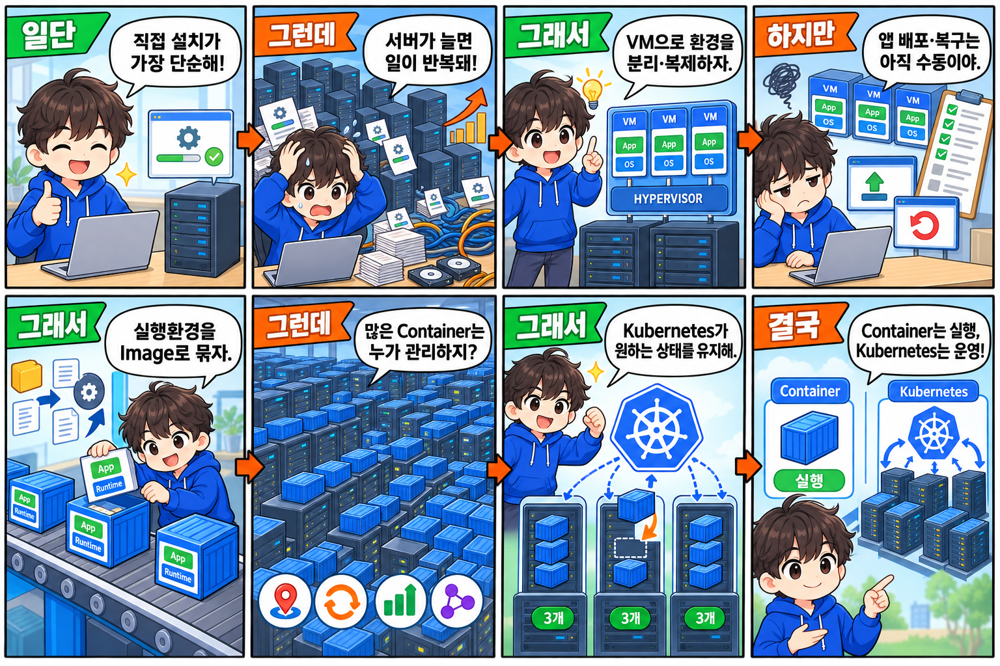

> 애플리케이션이 하나이고 서버가 한 대라면 직접 설치하는 방식이 가장 단순합니다.
> 
> 하지만 서버와 애플리케이션이 많아지면 설치, 복구, 확장, Network와 Storage 연결을 사람이 반복해서 관리해야 합니다.
> 
> VM은 서버와 OS 환경을 분리하고 빠르게 생성하는 데 도움이 됩니다. 하지만 VM을 만들었다고 애플리케이션 배포와 복구가 자동화되는 것은 아닙니다.
> 
> Container는 애플리케이션과 실행환경을 Image로 묶어 어디서든 비슷하게 실행할 수 있게 합니다. 대신 Container가 많아지면 배치, 복구, 확장, 통신을 관리하는 문제가 생깁니다.
> 
> Kubernetes는 바로 그 문제를 다룹니다. 여러 서버를 Cluster로 묶고, 많은 Container를 원하는 개수와 상태로 유지합니다.
> 
> 따라서 Container는 실행 단위이고 Kubernetes는 그 실행 단위를 여러 서버에서 운영하는 제어 플랫폼입니다.

---

## Part 2. Kubernetes의 핵심 동작 원리

# 현장에서 사용할 수 있는 설명 대본

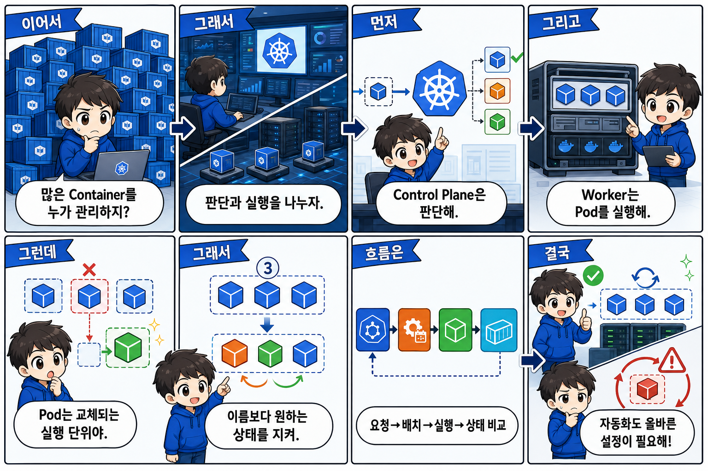

> Part 1에서는 Container가 많아졌을 때 배치와 복구를 누가 관리할 것인지가 문제라고 했습니다. Kubernetes는 이 문제를 판단 영역과 실행 영역으로 나눠 처리합니다.
> 
> Control Plane은 Cluster 전체를 보고 요청을 받고, 어디에 실행할지 결정하고, 원하는 상태와 실제 상태를 맞춥니다. Worker Node는 실제 애플리케이션 Pod를 실행합니다.
> 
> Pod는 고정된 서버가 아닙니다. 삭제되거나 다른 Node에 새로 만들어질 수 있는 실행 단위입니다. Kubernetes가 지키려는 것은 특정 Pod의 생존이 아니라, 예를 들어 Web Pod 세 개가 실행되어야 한다는 원하는 상태입니다.
> 
> API Server는 관리 요청을 받습니다. Scheduler는 새 Pod가 실행될 Worker를 고릅니다. Controller는 원하는 개수와 실제 개수를 계속 비교합니다. ETCD는 Cluster가 기억해야 할 상태를 저장합니다.
> 
> 선택된 Worker에서는 kubelet이 어떤 Pod가 실행되어야 하는지 확인하고, containerd가 실제 Container를 실행합니다.
> 
> 이 구조 덕분에 배치와 복구를 자동화할 수 있지만, 잘못된 Image나 잘못된 자원 설정도 자동으로 계속 시도할 수 있습니다. 따라서 자동화는 올바른 원하는 상태와 정확한 운영 설정을 전제로 합니다.

---

## Part 3. Kubernetes 워크로드와 서비스 제공

# 실제 교육에서 사용할 수 있는 설명 흐름

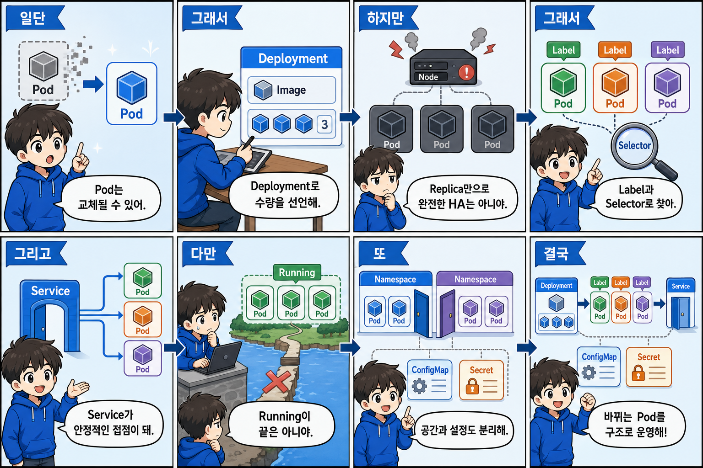

> Part 2에서 Pod는 고정된 서버가 아니라 삭제되고 다시 만들어질 수 있는 실행 단위라고 했습니다. 그래서 운영에서는 개별 Pod를 직접 기준으로 삼지 않습니다.
> 
> Deployment에 어떤 Image를 몇 개 실행할지를 선언합니다. 예를 들어 `web-app:v1`을 세 개 실행하도록 정의하면 Kubernetes는 Web Pod 세 개가 유지되도록 관리합니다.
> 
> 여기서 Replica를 여러 개 두면 하나의 Pod 장애에 대응할 가능성과 처리 능력은 높아집니다. 하지만 세 Pod가 같은 Node에 있거나 같은 Storage와 Network에 의존한다면 Replica 세 개만으로 완전한 고가용성이 되지는 않습니다.
> 
> Pod는 재생성되면서 이름과 IP가 달라질 수 있습니다. 따라서 특정 Pod IP를 고정해서 사용하지 않고, Pod에 `app=web` 같은 Label을 붙이고 Selector로 대상 집합을 찾습니다.
> 
> Service는 Selector에 맞는 Pod 집합 앞에 안정적인 접근점을 제공합니다. Pod는 실제 Container 실행 단위이고 Service는 그 Pod들에 접근하는 논리적 접점입니다.
> 
> 다만 Pod가 Running이거나 Service가 존재한다고 사용자 접속까지 정상이라는 뜻은 아닙니다. 이후 Load Balancer, Ingress, Service, Pod, Application 경로를 각각 확인해야 합니다.
> 
> Namespace는 하나의 Cluster 안에서 Team이나 Application Resource를 논리적으로 구분합니다. Xi'an DKS에서는 KubeSphere Project가 Kubernetes Namespace와 연결되는 운영 단위입니다.
> 
> 마지막으로 Application Image와 환경 설정을 분리할 수 있습니다. 일반 설정은 ConfigMap, Password나 Token, Certificate 같은 민감정보는 Secret으로 관리합니다. 다만 Secret은 이름만으로 완전한 암호화를 보장하지 않으며 RBAC와 ETCD 암호화, 접근 통제가 함께 필요합니다.

---

## Part 4. 외부 사용자가 서비스에 접근하는 과정

# 현장에서 사용할 수 있는 설명 대본

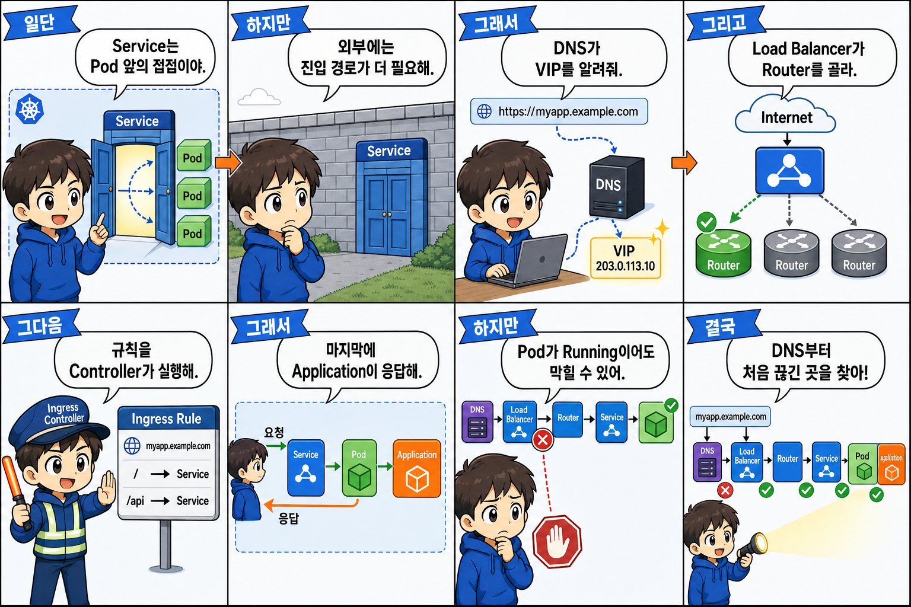

> Part 3에서는 Service가 바뀌는 Pod 집합 앞에 안정적인 접근점을 제공한다고 했습니다. 하지만 외부 사용자가 Domain으로 접속하려면 Service 앞에 외부 진입 경로가 추가로 필요합니다.
> 
> 사용자가 Application Domain을 입력하면 DNS가 Ingress VIP를 알려줍니다. 사용자는 그 VIP로 HTTP 또는 HTTPS 요청을 보냅니다. External Load Balancer는 사용 가능한 Router Node로 요청을 전달합니다.
> 
> Router Node에서는 Ingress Controller가 동작합니다. Ingress는 Domain이나 Path를 어느 Service로 전달할지 정의하는 규칙이고, Ingress Controller는 그 규칙을 실제 Traffic에 적용합니다.
> 
> 요청은 Ingress Controller에서 Kubernetes Service로 전달되고, Service는 Selector에 맞는 Pod로 요청을 보냅니다. 마지막으로 Pod 안의 Application이 응답합니다.
> 
> Load Balancer와 Router를 분리하고 Router를 여러 대 두면 특정 Router 하나에만 의존하는 위험을 줄일 수 있습니다. 대신 DNS, Load Balancer, Router, Ingress, Service, Pod라는 여러 확인 지점이 생깁니다.
> 
> 따라서 Pod가 Running이라는 사실만으로 사용자 서비스가 정상이라고 판단하면 안 됩니다. 사용자가 접속하지 못하면 DNS부터 Application까지 전체 요청 경로 중 어디에서 처음 끊겼는지를 순서대로 확인해야 합니다.

---

## Part 5. Kubernetes 네트워크

# 현장에서 사용할 수 있는 설명 대본

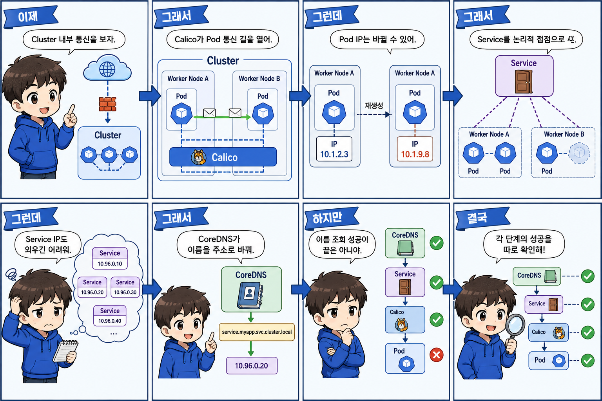

> Part 4에서는 외부 사용자가 Load Balancer와 Ingress를 거쳐 Service와 Pod까지 들어오는 경로를 봤습니다. 이제 Cluster 내부에서 Pod들이 서로 어떻게 찾고 통신하는지 보겠습니다.
> 
> Pod는 여러 Worker Node에 분산될 수 있습니다. 서로 다른 Node의 Pod가 통신하려면 Cluster 내부 Network가 필요합니다. Xi'an DKS에서는 이 Pod Network 기반으로 Calico를 사용합니다. 오늘은 Calico의 세부 Routing 방식보다, Pod가 어느 Worker에 있더라도 통신할 수 있게 해주는 역할만 이해하면 됩니다.
> 
> 하지만 Pod IP는 재생성될 때 바뀔 수 있습니다. 그래서 Application이 특정 Pod IP를 직접 사용하지 않고 Service라는 논리적인 접근점을 사용합니다. Pod Network는 실제 Pod의 주소 영역이고, Service Network는 Service가 제공하는 논리적 접근 주소 영역입니다. 두 범위는 목적이 다르므로 겹치지 않게 설계해야 합니다.
> 
> Service IP도 사람이 모두 기억할 수는 없습니다. CoreDNS는 Kubernetes 내부에서 Service 이름을 주소로 해석합니다. Application은 `backend-service` 같은 이름을 사용하고, CoreDNS가 해당 Service 주소를 찾도록 지원합니다.
> 
> 정리하면 CoreDNS는 이름을 찾고, Service는 안정적인 접근점을 제공하며, Calico는 선택된 Pod까지 실제 통신할 수 있는 Network 기반을 제공합니다. 이름 조회가 성공했다고 실제 Application 연결까지 성공했다는 뜻은 아니므로 각 단계를 따로 확인해야 합니다.

---

## Part 6. 영속 스토리지

# 현장에서 사용할 수 있는 설명 대본

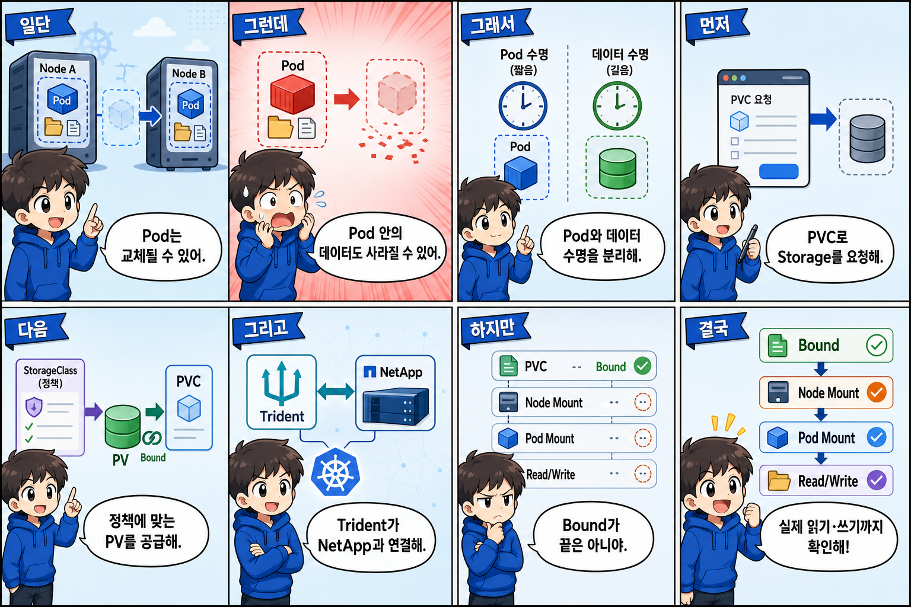

> Kubernetes에서 Pod는 영구적인 서버가 아닙니다. 배포나 장애 처리 과정에서 삭제되고 다른 이름이나 다른 Node에서 새로 만들어질 수 있습니다.
> 
> 따라서 중요한 데이터를 Pod 내부에만 저장하면 Pod가 사라질 때 데이터도 함께 잃을 수 있습니다. Pod는 교체할 수 있어야 하지만, 운영 데이터는 계속 남아 있어야 하므로 두 수명을 분리합니다.
> 
> Application은 특정 NetApp 주소를 직접 지정하지 않고 PVC를 통해 필요한 Storage를 요청합니다. PVC는 요청이고, PV는 공급된 Volume을 Kubernetes에서 표현하는 객체입니다. StorageClass는 어떤 정책으로 Volume을 공급할지를 정의합니다.
> 
> Xi'an DKS에서는 Trident가 Kubernetes와 NetApp Storage를 연결합니다. PVC 요청을 기준으로 NetApp에 Volume을 공급하고 Kubernetes가 사용할 수 있게 연결합니다.
> 
> 하지만 PVC가 Bound됐다고 모든 과정이 끝난 것은 아닙니다. Bound는 PVC와 Volume이 연결됐다는 증거입니다. 그다음 Pod가 배치된 Node에서 Volume이 Mount되어야 하고, Pod와 Container 안에서 실제 파일을 읽고 쓸 수 있어야 합니다.
> 
> 따라서 Storage 성공은 `PVC Bound`만 보는 것이 아니라 `Bound → Node Mount → Pod Mount → Read/Write`의 전체 경로로 판단해야 합니다.

---

## Part 7. 컨테이너 레지스트리와 Harbor

# 현장에서 사용할 수 있는 설명 대본

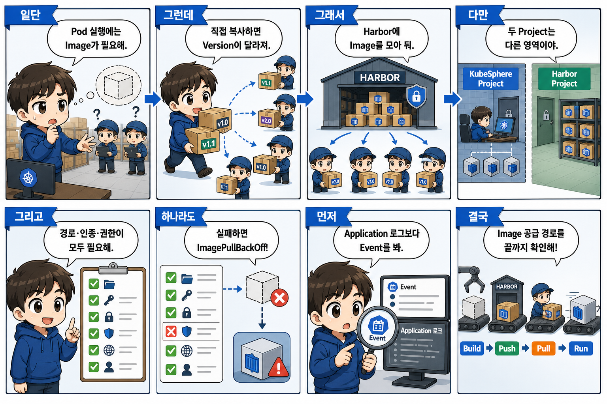

> Kubernetes가 Pod를 실행하려면 먼저 실행할 Container Image를 가져올 수 있어야 합니다. Kubernetes가 Source Code를 직접 Build하는 것이 아니라, 미리 Build된 Image를 Registry에서 가져와 실행합니다.
> 
> Worker마다 Image를 직접 복사할 수도 있지만, Node가 많아지면 Version이 달라지고 재배치할 때마다 다시 전달해야 합니다. 그래서 Image를 중앙 Registry에 저장하고 모든 Worker가 같은 경로에서 Pull하도록 합니다.
> 
> Xi'an DKS에서는 Harbor를 Private Container Registry로 사용합니다. Harbor는 Image를 저장하고, Project와 Repository를 관리하며, 사용자별 Push와 Pull 권한을 관리합니다.
> 
> 여기서 KubeSphere Project와 Harbor Project는 구분해야 합니다. KubeSphere Project는 Kubernetes Namespace와 Workload를 관리하는 영역이고, Harbor Project는 Image Repository와 접근 권한을 관리하는 영역입니다. 이름이 같아도 같은 객체는 아닙니다.
> 
> Private Image를 사용하려면 Image 경로와 Tag가 정확해야 하고, Deployment와 같은 Namespace에 Registry Secret이 있어야 하며, Worker가 Harbor의 인증서를 신뢰하고 Network로 접근할 수 있어야 합니다. Harbor 계정도 해당 Repository를 Pull할 권한이 있어야 합니다.
> 
> 이 중 하나라도 실패하면 `ImagePullBackOff`가 발생할 수 있습니다. 이것은 Application이 실행된 뒤 발생한 문제가 아니라, Application 실행 전에 필요한 Image 공급 경로의 문제일 수 있습니다. 따라서 Application 로그보다 먼저 Pod Event에서 Pull 실패 원인을 확인합니다.
> 
> 전체 경로는 `Image Build → Harbor Push → Deployment에서 Image 지정 → Worker Pull → Container 실행`입니다. 그리고 Pull 성공과 Application 정상, 사용자 응답 성공은 각각 다른 검증 단계입니다.

---

## Part 8. 모니터링

# 현장에서 사용할 수 있는 설명 대본

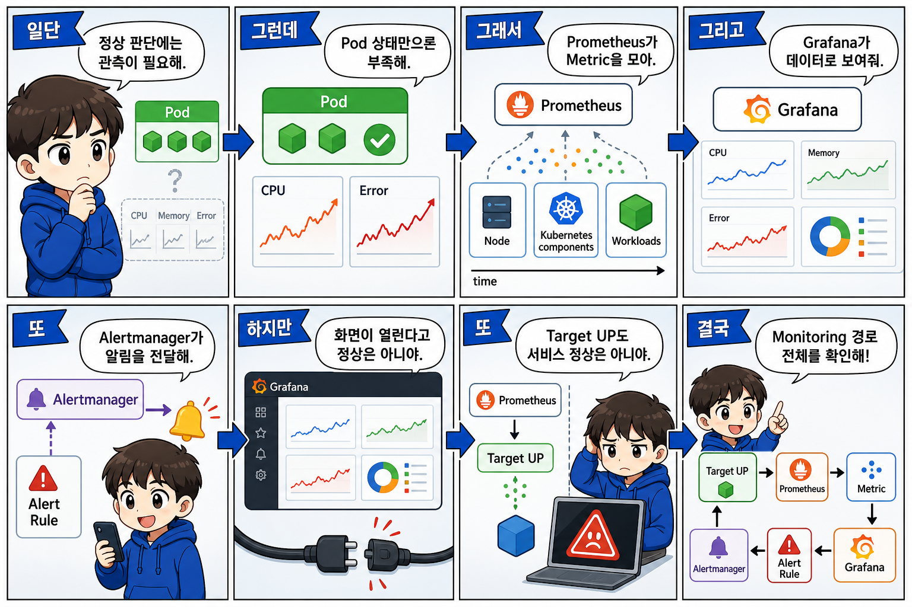

> Kubernetes와 Application이 정상인지 판단하려면 현재 상태를 관측할 수 있어야 합니다. Pod 상태만 보는 것으로는 CPU와 Memory 추세, ETCD 상태, Application 오류 증가와 장애 징후를 충분히 알 수 없습니다.
> 
> Prometheus는 Node, Kubernetes Component와 Workload가 제공하는 Metric을 일정 간격으로 수집하고 시간에 따라 저장합니다. Grafana는 Prometheus에 Query를 보내 이 데이터를 Dashboard로 보여줍니다. Alert 조건은 Prometheus에서 평가되고, 발생한 Alert는 Alertmanager가 정리해서 운영 담당자에게 전달합니다.
> 
> 하지만 Grafana 화면이 열린다는 것과 Monitoring 전체가 정상이라는 것은 다릅니다. Grafana UI는 열리더라도 Data Source가 잘못된 Prometheus를 바라볼 수 있고, Prometheus가 실제 Target을 수집하지 못할 수 있으며, 필요한 Metric이나 Alert Rule이 없을 수도 있습니다.
> 
> 또한 Prometheus Target이 `UP`이라는 것은 Metric 수집에 성공했다는 뜻이지, Application의 모든 기능과 사용자 요청까지 정상이라는 뜻은 아닙니다.
> 
> 따라서 Monitoring은 `대상 → Prometheus 수집 → Metric 저장 → Grafana 조회 → Alert Rule → Alertmanager 전달`의 전체 경로로 확인해야 합니다. 화면의 존재보다 데이터가 실제로 수집되고 올바르게 연결되어 있는지가 중요합니다.

---

## Part 9. DKS 아키텍처

# 현장에서 사용할 수 있는 설명 대본

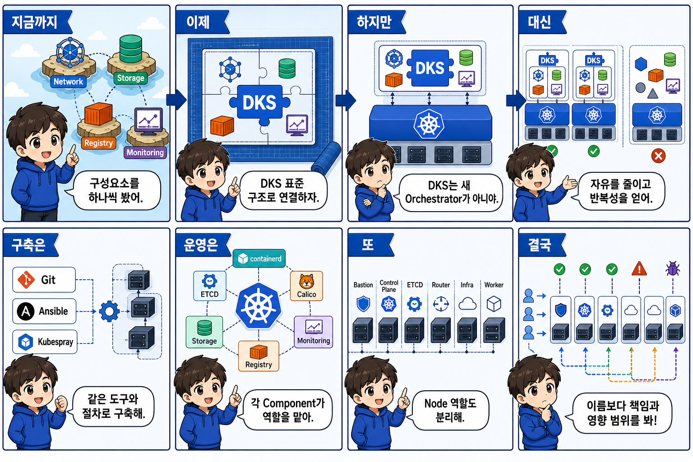

> 지금까지 Kubernetes의 Network, Storage, Registry와 Monitoring을 각각 봤습니다. 이제 이 구성요소들이 DKS에서 어떻게 하나의 표준 구조로 배치되는지 보겠습니다.
> 
> DKS는 Kubernetes를 대체하는 새로운 Orchestrator가 아닙니다. Kubernetes를 기반으로 설치 도구, Node 역할, Network, Storage, Monitoring, Registry와 Multi-Cluster 운영 구조를 일정한 방식으로 구성한 표준 아키텍처입니다.
> 
> Kubernetes를 자유롭게 구성하면 환경에 맞게 최적화할 수 있지만, Cluster마다 구조와 운영 방법이 달라질 수 있습니다. DKS는 선택의 자유를 일부 줄이는 대신 반복 가능한 구축, 공통 운영 절차와 명확한 책임 경계를 얻습니다.
> 
> 구축에는 Git, Ansible과 Kubespray를 사용하고, 운영에는 kubectl과 Helm을 사용합니다. Kubernetes와 containerd가 Workload를 실행하고, ETCD가 Cluster 상태를 저장하며, CoreDNS와 Calico가 내부 DNS와 Pod Network를 제공합니다. Trident는 NetApp을, Prometheus와 Grafana는 Monitoring을, Harbor는 Image 공급을, KubeSphere는 Kubernetes와 Multi-Cluster 운영을 담당합니다.
> 
> DKS는 Node 역할도 나눕니다. Bastion은 설치와 관리의 진입점이고, Control Plane은 Kubernetes API와 Cluster 제어를 담당합니다. External ETCD는 Cluster 상태를 저장하고, Router는 사용자 HTTP와 HTTPS Traffic을 받습니다. Infra에는 Monitoring과 Platform Workload가 배치되고, Worker에는 실제 사용자 Application이 실행됩니다.
> 
> 역할을 나누면 Node와 운영 대상은 늘어나지만, 사용자 Traffic 문제와 Kubernetes API 문제, Platform 부하와 Business Workload 부하를 구분하기 쉬워집니다.
> 
> 따라서 DKS 구조를 볼 때 Node 이름을 외우는 것보다, 각 Node가 어떤 요청과 상태를 책임지고 장애가 났을 때 어느 영역이 영향을 받는지를 이해하는 것이 중요합니다.

---

## Part 10. DKS 설계 방식

# 현장에서 사용할 수 있는 설명 대본

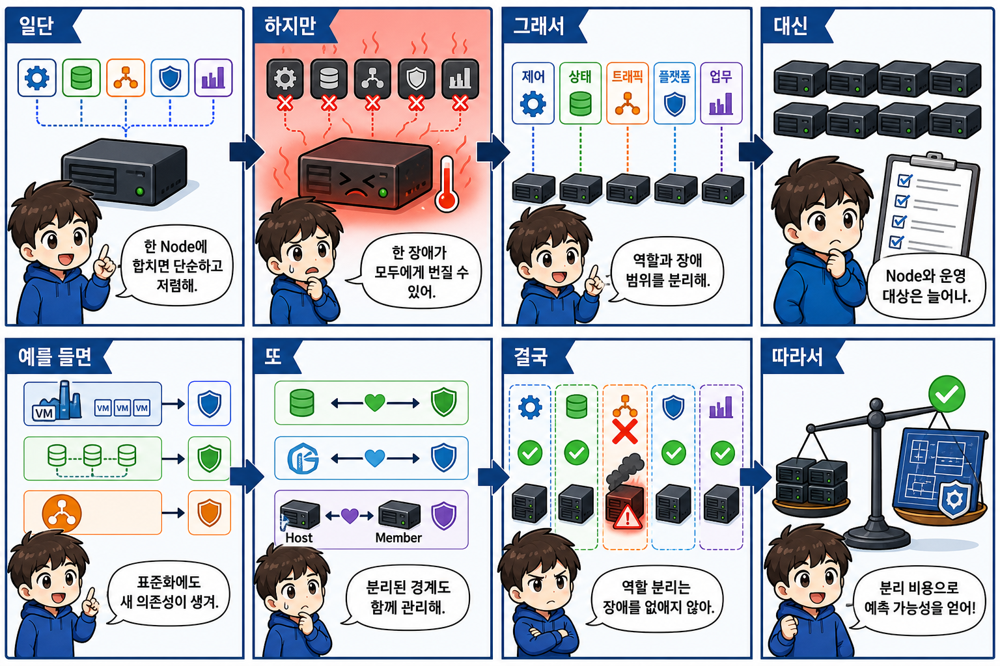

> Part 9에서는 DKS의 구성요소와 Node 역할을 봤습니다. 이제 왜 이렇게 역할을 나누었는지 보겠습니다.
> 
> 모든 기능을 적은 수의 Node에 합치면 비용이 낮고 구조가 단순합니다. 하지만 한 Node의 장애나 Application 부하가 Kubernetes API, ETCD, Ingress와 Monitoring에 동시에 영향을 줄 수 있습니다.
> 
> DKS는 관리, 제어, 상태 저장, 사용자 Traffic, Platform과 Business Workload를 서로 다른 역할로 분리합니다. 역할을 분리하면 Node와 운영 대상은 늘어나지만, 장애가 발생했을 때 어느 영역이 영향을 받았는지 구분하고 각 기능을 독립적으로 용량 관리할 수 있습니다.
> 
> VM 기반 Node는 생성과 교체를 표준화하지만 Virtualization 계층을 함께 운영해야 합니다. External ETCD는 Cluster 상태를 제어 영역과 분리하지만 별도 Node와 Quorum 관리가 필요합니다. External Load Balancer는 특정 Node IP가 아닌 고정 VIP로 요청을 분산하지만 Load Balancer 자체가 새로운 의존성이 됩니다.
> 
> External Storage는 Pod와 데이터 수명을 분리하지만 Storage Network와 Trident, NetApp까지 정상이어야 합니다. Harbor는 Image 공급과 Kubernetes Resource 운영을 분리하지만 인증, 권한과 인증서 관리가 필요합니다. Host와 Member를 분리하면 중앙 관리와 실제 Workload 실행의 장애 범위를 나눌 수 있지만 Cluster 간 연결과 호환성을 관리해야 합니다.
> 
> 따라서 역할 분리는 장애를 없애기 위한 것이 아니라 장애 영향과 운영 책임을 구분하기 위한 선택입니다. DKS는 최소한의 서버로 구성된 가장 단순한 구조가 아니라, 반복 가능한 구축과 예측 가능한 운영을 위해 분리 비용을 받아들인 구조입니다.

---

## Part 12. DKS의 주요 동작 경로

# 현장에서 사용할 수 있는 전체 대본

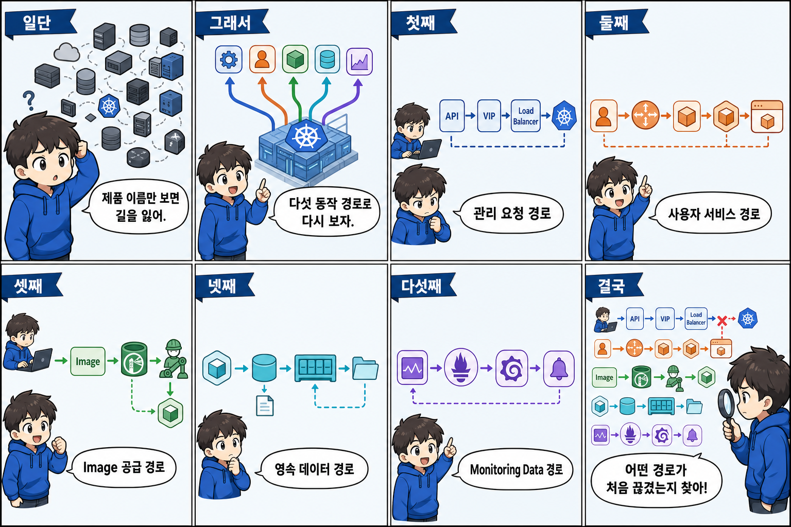

> 지금까지는 Control Plane, Router, Worker, Harbor, Trident, Prometheus 같은 구성요소를 각각 살펴봤습니다. 이제부터는 제품 이름이 아니라 실제 요청과 데이터가 이동하는 경로로 구조를 다시 보겠습니다.
> 
> DKS에서는 크게 다섯 경로를 기억하면 됩니다.
> 
> 첫 번째는 관리 요청 경로입니다. 운영자와 관리도구의 요청이 API VIP와 Load Balancer를 거쳐 Kubernetes API로 전달됩니다. 이 경로가 실패하면 Cluster를 조회하거나 변경하지 못할 수 있지만, 기존 사용자 서비스는 계속 동작할 수도 있습니다.
> 
> 두 번째는 사용자 서비스 요청 경로입니다. 사용자의 요청이 Domain과 Ingress VIP, Load Balancer, Router, Service, Pod를 거쳐 Application에 도달합니다. Pod가 Running이더라도 이 전체 경로 중 하나가 끊기면 사용자는 접속하지 못합니다.
> 
> 세 번째는 Image 공급 경로입니다. Developer나 CI가 Harbor에 Image를 Push하고, Worker의 containerd가 이를 Pull하여 Pod를 실행합니다. 기존 Pod는 정상이어도 새 Pod만 Image Pull에 실패할 수 있습니다.
> 
> 네 번째는 영속 데이터 경로입니다. Pod가 PVC를 사용하고, StorageClass와 Trident를 통해 NetApp Storage를 공급받습니다. 이후 Node에 Mount되고 Container가 실제로 Read와 Write를 수행합니다. PVC가 Bound라는 사실만으로 실제 Storage 사용이 정상이라고 판단하면 안 됩니다.
> 
> 다섯 번째는 Monitoring Data 경로입니다. Prometheus가 Metric을 수집하고 Grafana가 시각화하며, Alert Rule에서 발생한 Alert는 Alertmanager로 전달됩니다. Grafana 화면이 열린다고 모든 Metric과 Alert가 정상이라는 의미는 아닙니다.
> 
> 이 다섯 경로를 기억하는 이유는 장애가 났을 때 모든 구성요소를 무작정 확인하지 않기 위해서입니다. 먼저 어떤 경로의 문제인지 구분하고, 그 경로에서 요청이나 데이터가 실제로 어디까지 도달했는지를 확인해야 합니다.

---

## Part 13. KubeSphere

# 현장에서 사용할 수 있는 설명 대본

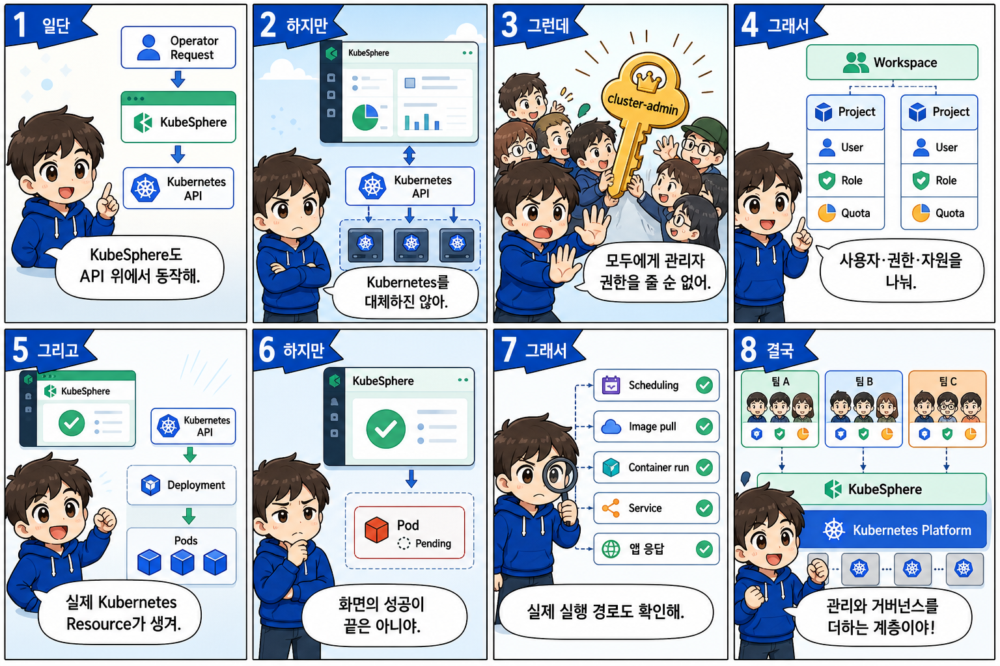

> Part 12에서는 운영자의 관리 요청이 Kubernetes API로 전달되는 경로를 봤습니다. KubeSphere도 이 관리 요청 경로 위에서 동작합니다.
> 
> KubeSphere는 Kubernetes를 대체하는 제품이 아닙니다. Kubernetes API와 실제 Resource를 Web UI와 사용자 관리 구조를 통해 운영하도록 제공하는 관리 계층입니다.
> 
> Kubernetes를 한 명의 숙련된 관리자만 사용한다면 `kubectl`만으로도 운영할 수 있습니다. 하지만 개발팀과 운영팀, 여러 Application 담당자가 함께 사용한다면 모든 사람에게 Cluster 관리자 권한을 줄 수는 없습니다. 누가 어느 Application을 볼 수 있는지, 어떤 작업을 할 수 있는지, Resource를 얼마나 사용할 수 있는지를 나눠야 합니다.
> 
> KubeSphere에서는 Workspace가 여러 Project를 관리하는 상위 운영 영역입니다. Project는 Kubernetes Namespace와 연결되는 Application 운영 단위입니다. User는 실제 사용자이고, Role은 사용자가 수행할 수 있는 작업을 정합니다. Quota는 해당 Project가 사용할 수 있는 CPU와 Memory 등의 상한을 정합니다.
> 
> 사용자가 KubeSphere에서 Workload를 만들면 KubeSphere 내부에만 별도의 Workload가 생기는 것이 아닙니다. Kubernetes API를 통해 실제 Deployment와 Pod 같은 Kubernetes Resource가 만들어집니다.
> 
> 이 구조를 사용하면 Kubernetes를 잘 모르는 사용자도 정해진 범위에서 Application을 운영할 수 있습니다. 대신 KubeSphere 화면만 보고 모든 것이 정상이라고 판단하면 안 됩니다. 화면에서 생성이 성공해도 Pod Scheduling, Image Pull, Container 실행, Service 연결과 Application 응답은 별도로 확인해야 합니다.
> 
> 따라서 KubeSphere는 Kubernetes를 감추는 대체 시스템이 아니라, Kubernetes를 여러 사용자가 안전하게 공유하기 위한 관리와 거버넌스 계층입니다.

---

## Part 14. Multi-Cluster

# 현장에서 사용할 수 있는 설명 대본

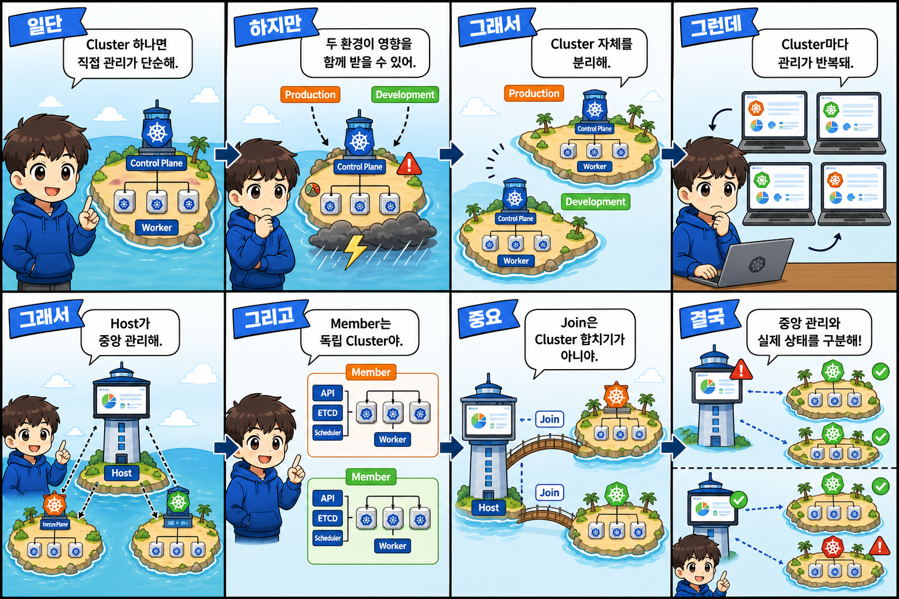

> Kubernetes Cluster가 하나라면 해당 Cluster를 직접 관리하면 됩니다. Control Plane과 사용자, Monitoring 대상도 하나이기 때문에 운영 구조가 단순합니다.
> 
> 하지만 Production과 Development를 하나의 Cluster에 함께 운영하면 Cluster 수준 장애와 변경, Resource 부족의 영향을 함께 받을 수 있습니다. 환경별 장애 범위와 Resource 영향을 분리하려면 Kubernetes Cluster 자체를 나누는 방법을 사용할 수 있습니다.
> 
> Cluster를 나누면 Production과 Development가 각각 독립적인 Control Plane과 ETCD, Worker Resource를 가지게 됩니다. 한 환경의 변경이나 장애가 다른 환경에 바로 영향을 줄 가능성을 줄일 수 있습니다. 대신 운영해야 할 Cluster가 늘고, 사용자와 상태를 Cluster마다 반복해서 관리해야 하는 문제가 생깁니다.
> 
> KubeSphere Multi-Cluster는 이 문제를 Host와 Member 구조로 해결합니다. Host Cluster는 여러 Cluster를 중앙에서 관리하고 관측하는 역할을 합니다. 사용자와 Workspace, Project를 여러 Cluster 관점에서 운영할 수 있게 합니다.
> 
> Member Cluster는 실제 Application Workload를 실행하는 독립 Kubernetes Cluster입니다. 자체 API Server와 ETCD, Scheduler, Worker를 사용하여 자체 Resource를 운영합니다.
> 
> 여기서 가장 중요한 것은 Join의 의미입니다. Member가 Host에 Join된다고 해서 Member의 Node와 ETCD가 Host Cluster 안으로 합쳐지는 것은 아닙니다. Member는 독립된 Kubernetes Cluster로 남아 있고, Host의 중앙 관리와 관측 대상에 편입됩니다.
> 
> 그래서 Host의 중앙 관리 화면에 문제가 생겼다고 모든 Member Application이 반드시 중단되는 것은 아닙니다. 반대로 Host 화면이 정상이어도 특정 Member의 Application에는 장애가 있을 수 있습니다. 중앙 관리 상태와 실제 Member Workload 상태를 구분해서 확인해야 합니다.
> 
> Xi’an에서는 `prd-host-pa01-xas`가 중앙 관리 Host이고, `prd-apps-pa01-xas`와 `dev-apps-pa01-xas`가 각각 운영과 개발 Workload를 실행하는 Member입니다. 이들은 하나의 Cluster가 아니라 중앙 관리 관계로 연결된 세 개의 독립 Cluster입니다.

---

## Part 15. Xi'an DKS 실제 아키텍처

# 현장에서 사용할 수 있는 설명 대본

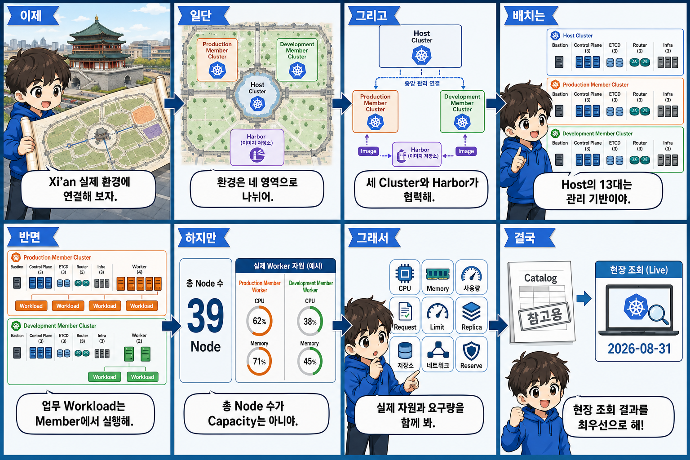

> 지금까지 설명한 Host와 Member 구조를 Xi’an 실제 환경에 연결하겠습니다.
> 
> 현재 Cluster 카탈로그 기준 Xi’an 환경은 네 영역으로 구분됩니다. `prd-host-pa01-xas`는 KubeSphere Multi-Cluster 중앙 관리를 담당하는 Host Cluster입니다. `prd-apps-pa01-xas`는 운영 Application을 실행하는 Production Member이고, `dev-apps-pa01-xas`는 개발 Application을 실행하는 Development Member입니다. `prd-harbor-xas`는 두 Member에 Container Image를 공급하는 Private Registry입니다.
> 
> Host와 두 Member는 하나의 Kubernetes를 나눈 것이 아니라 각각 독립된 Kubernetes Cluster입니다. Host는 두 Member를 관리하고 관측합니다. Harbor는 Production과 Development Worker가 실행할 Image를 공급합니다.
> 
> Node 배치를 보면 각 Kubernetes Cluster에는 Bastion 1대, Control Plane 3대, External ETCD 3대, Router 3대, Infra 3대가 기본적으로 배치되어 있습니다. Host에는 카탈로그 기준 사용자 Business Workload용 Worker가 없습니다. 따라서 Host가 총 13대라고 해서 운영 Application을 많이 실행하는 Cluster라고 해석하면 안 됩니다.
> 
> Production Member에는 Worker 4대가 있고 실제 운영 Application은 이 Worker 영역에서 실행됩니다. Development Member에는 Worker 2대가 있으며 개발 Workload를 실행합니다. 두 Member는 자체 Kubernetes Resource와 Network, Worker Capacity를 각각 관리합니다.
> 
> 이 표는 역할 배치를 나타냅니다. 총 Node 수가 실제 Application Capacity를 직접 의미하지는 않습니다. Worker CPU와 Memory, 현재 사용량, Application Request와 Limit, Replica 수, Storage와 Network 요구량, 장애 대비 Reserve를 함께 확인해야 합니다.
> 
> 또한 오늘 보여드리는 이름과 수량은 현재 Cluster 카탈로그 기준입니다. 이번 출장에서 실제로 신규 구축할 Member의 identity와 현재 상태는 2026년 8월 31일 현장 조회에서 다시 확정하며, 실제 조회 결과를 교재 예시보다 우선합니다.

---
