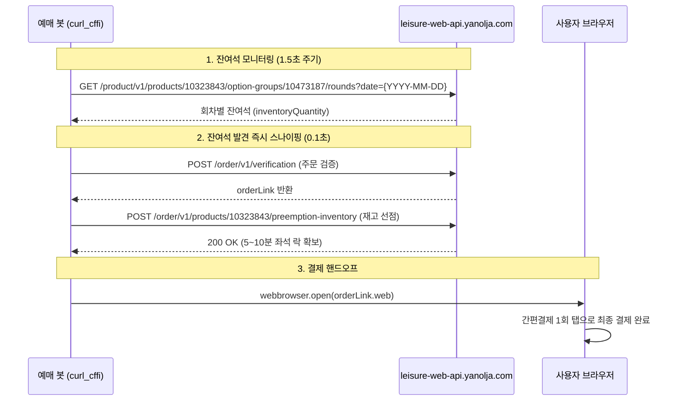

# 야놀자 화담숲 티켓 자동 예매 기술 분석 및 자동화 가이드

- **대상 상품**: 2026 화담숲 입장권 (`productId: 10323843`)
- **타깃 URL**: `https://leisure-web.yanolja.com/leisure/10323843`
- **백엔드 API 베이스**: `https://leisure-web-api.yanolja.com`

---

## 1. 아키텍처 개요 및 핵심 결론

1. **REST API 기반의 0.1초 선점 가능**:
   - 무거운 브라우저 자동화(Selenium, Puppeteer, Camoufox 등)로 DOM을 클릭할 필요가 전혀 없음.
   - 주문 검증(`verification`)과 재고 선점(`preemption-inventory`) API 2회 호출로 좌석 선점(Lock)이 완료됨.
2. **카모폭스(Camoufox) 불필요**:
   - Cloudflare JSD 및 핑거프린팅은 Python의 `curl_cffi` (Chrome 최신 TLS/JA3/JA4 지문 모사) 하나로 충분히 우회 가능.
   - 선점 직후 반환되는 `orderLink.web` URL을 기본 브라우저로 띄워 사용자가 5분 내 간편결제(카카오/토스 등)로 1회 승인하는 **하이브리드 방식**이 가장 빠르고 안전함.

---

## 2. 인증 및 사전 요구 조건

- **상품 특성**: `isMemberOnly: true` (회원 전용), `isIdentityVerificationRequired: true` (본인인증 필수)
- **필수 사전 작업**:
  - 정상 야놀자 계정 로그인 및 **KCB PASS 본인확인(CI)** 연동 완료 (미완료 시 `leisure-web-api-1807` 에러 발생).
  - 웹 브라우저에서 로그인 후 세션 쿠키 획득.

### 필수 HTTP 헤더 및 쿠키
```http
# 필수 헤더
Access-Token: 442A472D4B6150645367566B59703373367639792442264528482B4D62516554
platform: Web
Content-Type: application/json
Origin: https://leisure-web.yanolja.com
Referer: https://leisure-web.yanolja.com/leisure/10323843
User-Agent: Mozilla/5.0 (Windows NT 10.0; Win64; x64) AppleWebKit/537.36 (KHTML, like Gecko) Chrome/128.0.0.0 Safari/537.36

# 필수 쿠키
ywt: <야놀자 Web Token, 회원 인증 세션>
cgntId: <AWS Cognito Identity 식별자>
__cf_bm: <Cloudflare Bot Management 토큰>
```

---

## 3. 예매 단계별 API 상세 규격



### (1) 날짜별 판매 상태 확인
- **Endpoint**: `GET /product/v1/products/10323843/option-groups/10473187/schedules?startDate=2026-09-15&endDate=2026-10-22`
- **화담숲 그룹 ID**: `10473187`
- **응답 확인**: `scheduleStatusCode === "IN_SALE"`

### (2) 회차(시간대)별 실시간 잔여석 조회
- **Endpoint**: `GET /product/v1/products/10323843/option-groups/10473187/rounds?date=2026-09-16`
- **응답 구조**:
  ```json
  [
    {
      "time": "09:00",
      "roundStatusCode": "IN_SALE",
      "inventoryQuantity": 384,
      "isInventoryDisplay": true
    },
    {
      "time": "09:20",
      "roundStatusCode": "IN_SALE",
      "inventoryQuantity": 389,
      "isInventoryDisplay": true
    }
  ]
  ```

### (3) 권종별 Variant ID 확인
- **옵션 ID**: 성인/경로/청소년 권종 목록 (`10643310`)
- **API**: `GET /product/v1/products/10323843/option-groups/10473187/options/10643310/option-item-variants?date=2026-09-16&time=09:00&productOptionItemIds=14194034`
- **주요 Variant ID**:
  - `15180042`: 입장권 성인 / 일반 (11,000원)

### (4) 주문 검증 (Order Verification)
- **Endpoint**: `POST /order/v1/verification`
- **Payload**:
  ```json
  {
    "productId": 10323843,
    "orderGroupId": null,
    "variants": [
      {
        "variantId": 15180042,
        "quantity": 1,
        "date": "2026-09-16",
        "time": "09:00"
      }
    ]
  }
  ```
- **성공 응답**: `body.isVerified === true` 및 `body.orderLink.web` 획득

### (5) 재고 선점 (Preemption Inventory) - 실시간 락 확보
- **Endpoint**: `POST /order/v1/products/10323843/preemption-inventory`
- **Payload**:
  ```json
  {
    "orderGroupId": null,
    "waitingToken": null,
    "waitingTokenRequestId": null,
    "variants": [
      {
        "variantId": 15180042,
        "quantity": 1,
        "date": "2026-09-16",
        "time": "09:00"
      }
    ]
  }
  ```
- **주의 에러 코드**:
  - `leisure-web-api-1805`: `SOLD_OUT` (이미 매진됨 -> 다음 타깃 시간대로 즉시 재시도)
  - `leisure-web-api-1807`: 본인인증 미완료 계정
  - `leisure-web-api-2105`: 대기열 진입 필요 (`waitingToken` 요구)

---

## 4. 권장 봇 구현 코드 예시 (Python + `curl_cffi`)

```python
import time
import webbrowser
from curl_cffi import requests

# 1. 설정 정보
PRODUCT_ID = 10323843
OPTION_GROUP_ID = 10473187
VARIANT_ID = 15180042  # 성인 일반
TARGET_DATE = "2026-09-16"
TARGET_TIME = "09:00"
QUANTITY = 2

# 브라우저 F12에서 복사한 쿠키
COOKIES = {
    "ywt": "YOUR_YWT_TOKEN",
    "cgntId": "YOUR_CGNT_ID",
    "__cf_bm": "YOUR_CF_BM",
}

HEADERS = {
    "platform": "Web",
    "Access-Token": "442A472D4B6150645367566B59703373367639792442264528482B4D62516554",
    "Origin": "https://leisure-web.yanolja.com",
    "Referer": "https://leisure-web.yanolja.com/",
}

session = requests.Session(impersonate="chrome120")
session.headers.update(HEADERS)
session.cookies.update(COOKIES)

def check_and_reserve():
    rounds_url = f"https://leisure-web-api.yanolja.com/product/v1/products/{PRODUCT_ID}/option-groups/{OPTION_GROUP_ID}/rounds?date={TARGET_DATE}"
    
    # 1. 잔여석 확인
    res = session.get(rounds_url).json()
    rounds = res.get("body", [])
    target = next((r for r in rounds if r.get("time") == TARGET_TIME), None)
    
    if not target or target.get("inventoryQuantity", 0) < QUANTITY:
        print(f"[{TARGET_TIME}] 잔여석 부족 (남은 수량: {target.get('inventoryQuantity') if target else 0})")
        return False

    print(f"[{TARGET_TIME}] 좌석 발견! 선점 시도 중...")
    
    variants_payload = [{
        "variantId": VARIANT_ID,
        "quantity": QUANTITY,
        "date": TARGET_DATE,
        "time": TARGET_TIME
    }]
    
    # 2. 주문 검증
    verify_url = "https://leisure-web-api.yanolja.com/order/v1/verification"
    verify_res = session.post(verify_url, json={
        "productId": PRODUCT_ID,
        "orderGroupId": None,
        "variants": variants_payload
    }).json()
    
    if not verify_res.get("body", {}).get("isVerified"):
        print("주문 검증 실패:", verify_res)
        return False
        
    order_link = verify_res["body"]["orderLink"]["web"]

    # 3. 재고 선점 (Preemption)
    preempt_url = f"https://leisure-web-api.yanolja.com/order/v1/products/{PRODUCT_ID}/preemption-inventory"
    preempt_res = session.post(preempt_url, json={
        "waitingToken": None,
        "waitingTokenRequestId": None,
        "orderGroupId": None,
        "variants": variants_payload
    }).json()

    if "body" in preempt_res and isinstance(preempt_res["body"], dict) and "code" in preempt_res["body"]:
        print("선점 실패:", preempt_res["body"].get("message"))
        return False

    print("🎉 선점 성공! 5분 내 결제창으로 이동합니다.")
    webbrowser.open(order_link)
    return True

if __name__ == "__main__":
    while True:
        try:
            if check_and_reserve():
                break
        except Exception as e:
            print("에러 발생:", e)
        time.sleep(1.5)  # WAF 안전 주기
```

---

## 5. 결론 및 주의사항

1. **취소표 모니터링 주기**: 1.5초 ~ 2.5초 간격 권장 (500ms 미만 초고속 폴링은 Cloudflare 캡차 트리거 위험).
2. **세션 갱신**: `__cf_bm` 쿠키는 30분, `ywt`는 장시간 유지되므로 시작 전 웹 브라우저에서 1회 정상 로그인 후 값을 갱신하여 사용할 것.
3. **결제 마감**: 선점 완료 후 결제 페이지 진입 시 약 5~10분간의 유예 시간(TTL)이 주어지므로 브라우저에서 편하게 간편결제를 진행하면 됨.
