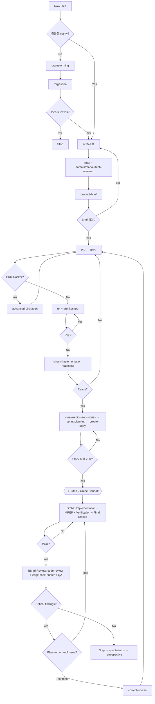

# BMad 스킬 분류 및 파이프라인

> [!quote] BMad = **뭘 만들지 결정** (기획) → Orche = **그걸 안전하게 구현** (구현) → BMad = **검수 및 회고**

---

## 카테고리 목록

| # | 카테고리 | 스킬 수 | 설명 |
|---|----------|--------|------|
| `_bmad/00-cross-cutting-enablement/00-index` | 13 | 전체 파이프라인 보조 인프라 |
| `_bmad/10-discovery-evidence/10-index` | 7 | 아이디어 검증, 리서치 |
| `_bmad/20-product-contract/20-index` | 3 | 요구사항 계약화 |
| `_bmad/30-experience-architecture/30-index` | 2 | UX, 시스템 불변식 |
| `_bmad/40-breakdown-planning/40-index` | 4 | 구현 단위 분할, 준비도 |
| `_bmad/50-build-handoff/50-index` | 3 | Orche 핸드오프 경계 |
| `_bmad/60-verification-review-learning/60-index` | 10 | 코드 리뷰, QA, 회고 |
| `_bmad/99-deprecated-aliases/99-index` | 4 | 통합형으로 대체됨 |

---

## 파이프라인

### 단계 요약

| 단계 | 카테고리 | 게이트 |
|------|----------|--------|
| 0. 컨텍스트 부트스트랩 | `_bmad/00-cross-cutting-enablement/00-index` | 프로젝트 컨텍스트 충분? |
| 1. 발견/검증 | `_bmad/10-discovery-evidence/10-index` | 기회가 정의할 가치 있음? |
| 2. 제품 정의 | `_bmad/20-product-contract/20-index` | 요구사항 명확? |
| 3. 설계 | `_bmad/30-experience-architecture/30-index` | 불변식 확정? 모순 없음? |
| 4. 분할/준비 | `_bmad/40-breakdown-planning/40-index` | Story가 Orche에 실행 가능? |
| 5. 핸드오프 | ← **BMad→Orche 전환점** → | Story 단위 핸드오프 |
| 6. Orche 구현 | Orche: impl + MREP + verif + smoke | Acceptance pass? |
| 7. BMad 검수/회고 | `_bmad/60-verification-review-learning/60-index` | Critical findings? |

---

## BMad → Orche 핸드오프 조건

> [!warning] Orche가 받아야 할 최소 단위는 **PRD가 아니라 Story**

**핸드오프 패키지:**

1. Story file (bmad-create-story 산출물)
2. Linked PRD FR IDs
3. SPEC capabilities / constraints
4. Architecture ADs (해당 story 관련)
5. UX flow references
6. Acceptance criteria
7. Test expectations
8. Known non-goals
9. 예상 영향 파일
10. Verification 명령어
11. Definition of Done

**Orche에 전달 지침:**

> Implement story `<id>` using the attached BMad story package. Treat PRD, SPEC, architecture spine, and UX spec as binding planning artifacts. Do not reinterpret product scope. If implementation reveals a planning contradiction, stop and report as a planning-blocker. Run MREP, verification, and final smoke before returning. Return implementation summary, changed files, verification results, unresolved risks, and any planning feedback.

---

## 병렬 조합 (Parallel Subagent Bundles)

> [!quote] **"Parallelize lenses, not ownership."** 여러 스킬이 같은 입력을 critique하되, 단 하나의 synthesis pass만이 source of truth를 변경한다.

| Bundle | 조합 | 대상 |
|--------|------|------|
| **Hardening** | adversarial + edge-case + editorial-structure | PRD, architecture, story, spec |
| **Product validation** | forge-idea + prfaq + brainstorming + spec | raw idea, product bet |
| **Implementation review** | code-review + checkpoint + qa-e2e | Orche/dev 구현 후 |
| **Planning readiness** | check-readiness + edge-case + adversarial + editorial-structure | Orche 핸드오프 전 |
| **Brownfield understanding** | document-project + architecture + spec + adversarial | unknown repo 진입 |

자세한 조합 설명은 `_bmad/60-verification-review-learning/60-index#병렬 조합 가이드` 참조.

---

## 판단 규칙

- **BMad final status ≠ Orche write approval.** Orche는 자체 DDD governance + scope packet으로 구현 권한을 별도 획득
- **Orche는 BMad 산출물을 직접 수정 금지.** 계획 변경이 필요하면 BMad update run으로 되돌림
- **구현 중 planning drift 발견:** Orche `post_task_audit`에 기록 → 필요시 BMad correct-course → 필요시 scope packet revision
